## Introduction

A couple of months back, I tried to pen down my learnings on distributed training in [this post](https://debnsuma.github.io/my-blog/posts/distributed-training-from-scratch/), where we discussed the fundamentals, from single-GPU bottlenecks to Data Parallelism and the ZeRO optimization stages. We explored how **memory constraints** limit model sizes on single GPUs and how sharding strategies help overcome these limitations.

Now, in this blog, we'll take a **deep dive into Fully Sharded Data Parallelism (FSDP)**. We'll walk through a complete training iteration step-by-step using a concrete example with 4 GPUs, tracing exactly what happens to our model parameters, gradients, and optimizer states at each stage. By the end, you'll have a crystal-clear mental model of how FSDP achieves its remarkable memory efficiency.

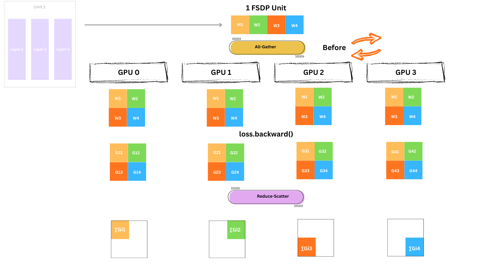

Once we have a solid understanding of FSDP internals, we'll put this knowledge into practice using PyTorch's FSDP and Ray Train. We'll start by training a Vision Transformer on FashionMNIST, and then move on to fine-tuning the 1.7B parameter [Qwen3-TTS](https://github.com/QwenLM/Qwen3-TTS) model, recently released by Alibaba and available on Hugging Face, to clone our own voice.

::: {.callout-note title="Prerequisites"}
This post builds on concepts from my previous blog on distributed training. Make sure you're familiar with:

- Static and dynamic memory constraints while training a model (parameters, gradients, optimizer states, activations, etc.)
- `ZeRO-1`, `ZeRO-2`, and `ZeRO-3` sharding strategies
- Communication primitives: `All-Reduce`, `All-Gather`, `Reduce-Scatter`

If any of these are unfamiliar, I recommend reading the [distributed training fundamentals post](https://debnsuma.github.io/my-blog/posts/distributed-training-from-scratch/) first.
:::

## Why FSDP?

In my previous post, we explored how **ZeRO** (Zero Redundancy Optimizer) progressively shards model state across GPUs:

| Strategy | What's Sharded | Memory per GPU |
|:---------|:---------------|:--------------:|
| **DDP** | Nothing (full model copy on each GPU) | $16\Psi$ |
| **ZeRO-1** | Optimizer states | $4\Psi + \frac{12\Psi}{N_d}$ |
| **ZeRO-2** | Optimizer states + Gradients | $2\Psi + \frac{14\Psi}{N_d}$ |
| **ZeRO-3 / FSDP** | Optimizer states + Gradients + Parameters | $\frac{16\Psi}{N_d}$ |

**`FSDP`** is PyTorch’s native implementation of fully sharded data parallel training, closely following the **`ZeRO-3`** stage. FSDP shards *all* model states, `parameters`, `gradients`, and `optimizer states`, across all data parallel workers, thereby achieving the theoretical minimum per-GPU memory usage for these tensors. 

But how does it actually *work*? When `parameters` are scattered across different GPUs, how does each GPU run a forward pass that needs the *entire* model parameters? Before diving into FSDP, let's understand why the "obvious" solution to training large models across multiple GPUs fails miserably.

Suppose we have a model that doesn't fit on a single GPU, but fits when split across 4 GPUs. The naive approach is **pipeline-style sequential execution**: place layers 1-3 on GPU0, layers 4-6 on GPU1, layers 7-9 on GPU2, and layers 10-12 on GPU3, assuming the model is a Transformer-style model with 12 layers (for example). The forward pass and backward pass pipelines look like this:

For a single batch, only one GPU is active at a time during the forward pass (`T1` to `T4`), leaving the others idle.

<p align="center">
  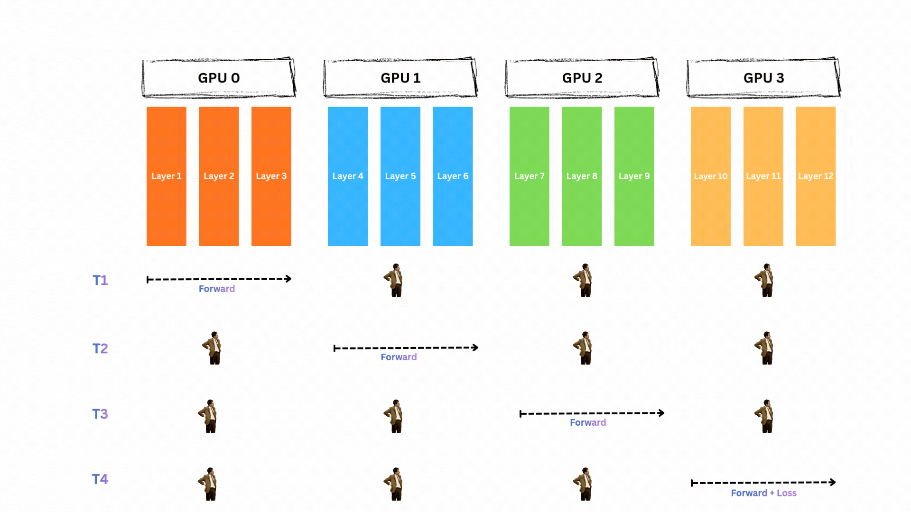
</p>

The same is true for the backward pass (`T5` to `T8`).

<p align="center">
  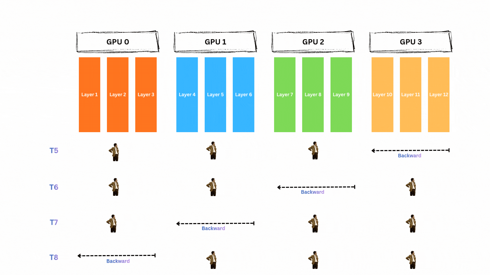
</p>

**Massive GPU Idle Time**

Now, this is really bad. If we look closely, we will see that GPU0 waits for **6 time steps** before it can do anything! Each GPU is sitting idle approximately **75% of the time**. We've split our model among GPUs, but most of the time each GPU is just waiting around doing nothing. **This is a massive waste of compute resources**.

::: {.callout-note}
You might wonder: Can't we **start Batch 2's forward pass while Batch 1 is still propagating**? 

Unfortunately, No. We cannot begin the next forward pass until the current batch's weights are updated. GPU0 must wait for the entire forward-backward cycle to complete before processing the next batch.
:::

**FSDP solves this problem elegantly**, enabling all GPUs to work simultaneously on different batches while still training a single coherent model. FSDP accomplishes this by combining two orthogonal splitting strategies to achieve both memory efficiency and high GPU utilization:

- **Vertical partitioning**: Organizing the model into `units`
- **Horizontal sharding**: Sharding the model `parameters`, `gradients`, and `optimizer states` across all GPUs

## Our Running Example

Let's set up a concrete scenario that we'll trace throughout this entire walkthrough. The focus here is to understand the internals of FSDP, not the model training itself or the actual accuracy of the model. 

### The Model

So, we'll use a simple `Transformer-style` model with `12 layers`, and `4 GPUs`, each with `16 GB` of memory.

<p align="center">
  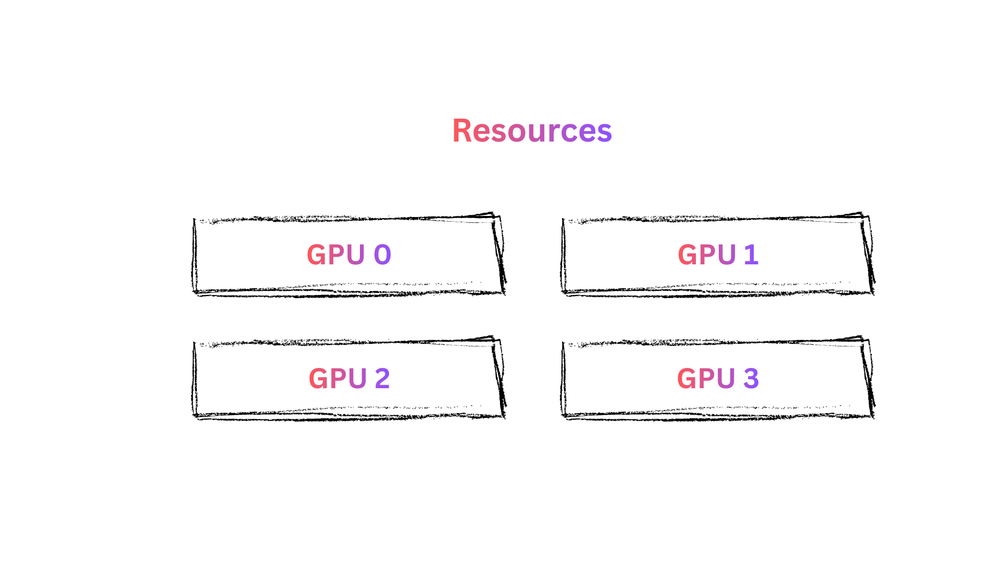
</p>


The model has the following memory requirements (roughly):

| Component | Memory Required |
|:----------|:--------------:|
| Model Parameters (MP) | 8 GB |
| Gradients (GRD) | 8 GB |
| Optimizer State (OS) | 16 GB |
| **Total Static Memory** | 32 GB |

::: {.callout-note title="Why 16 GB for Optimizer State?"}
Here we are considering the `Adam` optimizer. The optimizer state (`OS`) maintains **two FP32 tensors** per parameter: the first moment (mean of gradients, $m$) and the second moment (uncentered variance, $v$). For 8 GB of FP32 parameters, that's $8 + 8 = 16$ GB for optimizer states.
:::

### The Hardware

We have **4 GPUs, each with 16 GB of memory**.

**The problem is clear:** 32 GB of static memory doesn't fit on any single 16 GB GPU. But with 4 GPUs, we have 64 GB total, more than enough if we can distribute the load effectively. 

<p align="center">
  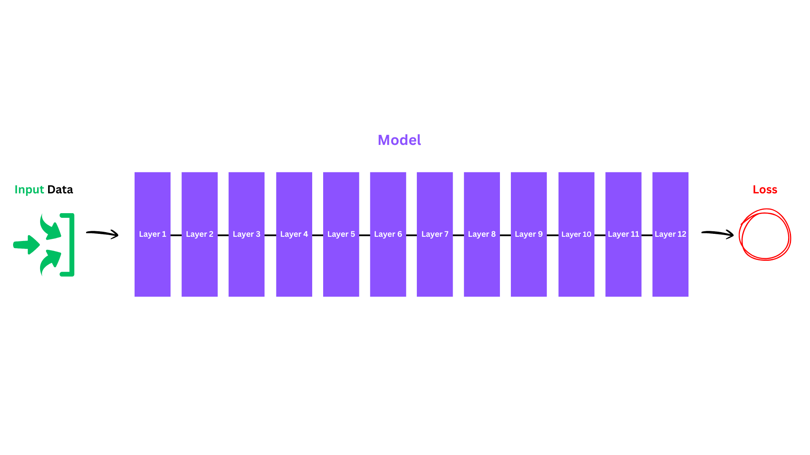
</p>

So, we can somehow train the model on 4 GPUs, if we can figure out a way to distribute the load effectively. 

And remember, we're not considering the activations here, which are usually much larger than the model parameters and gradients. These activations fall under what we call [**Dynamic Memory Constraints**](https://debnsuma.github.io/my-blog/posts/distributed-training-from-scratch/#dynamic-memory). 

For context, throughout the rest of this post you can treat the input data as the activations too; it's just that the activation for the 1st layer is called `input`. Not a big deal, but just to be clear.

Let's see how we can distribute and perform the training of the model effectively on 4 GPUs. As we know, when it comes to GPUs, there are two things that consume most of the memory: parameters and activations (including the input data). So, let's handle the dataset first.

### The Dataset

We split our training data into **4 different mini-batches**, one for each GPU:

<p align="center">
  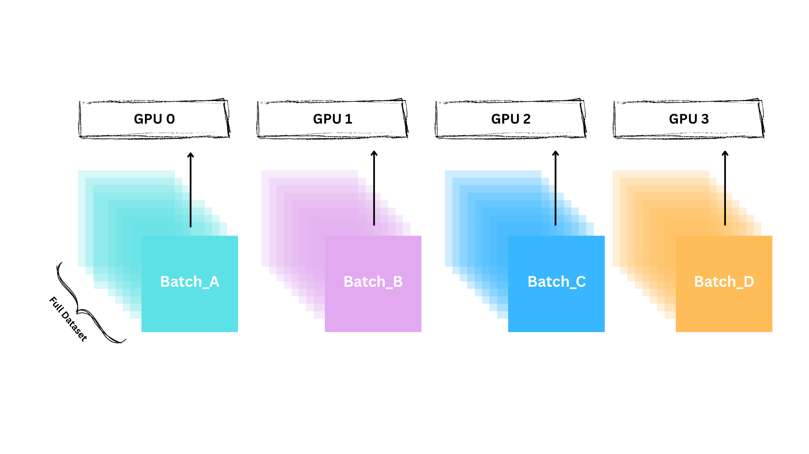
</p>


Each GPU will process its own batch **simultaneously**, using the **same model weights**. This is still data parallelism at its core, the key difference is **how** we store and manage those weights.

## FSDP's Two-Dimensional Splitting Strategy

FSDP combines two orthogonal splitting strategies to achieve both memory efficiency and high GPU utilization.

### Vertical Partitioning (Units)

Here we organize the model's layers into **units**, with each unit managing a specific range of layers. So, considering our model has 12 layers, we can organize it into 4 units, each unit managing 3 layers.

<p align="center">
  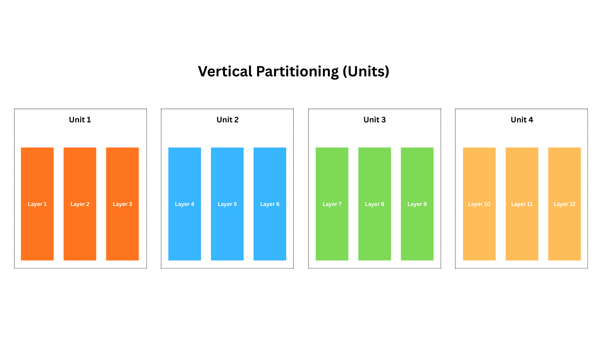
</p>

This is purely `organizational`, it determines the granularity at which **FSDP will gather and release parameters during computation**. We can choose to have more or less units, depending on the model size and the number of GPUs. 

::: {.callout-note title="Units ≠ GPUs"}
In FSDP, defining **units** (vertical partitions of layers) is a modeling choice to control parameter loading, checkpointing, and granularity of sharding; it does **not** need to match the number of GPUs, and often does not. There is **no technical requirement** for the count or boundaries of units to correspond to your device topology. 

Units are simply logical groupings for parameter management and do not dictate how parameters are sharded across GPUs, the sharding is handled separately and horizontally. You can have any number of units regardless of your GPU count.
:::


### Horizontal Sharding

Here's where FSDP differs fundamentally from the naive approach. Instead of assigning different layers to different GPUs, we **shard each entity (parameters, gradients, optimizer states) horizontally across ALL GPUs**.

**Before Sharding** (would need `32GB` per GPU):

<p align="center">
  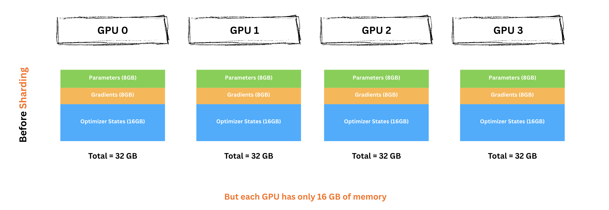
</p>

**After Sharding** (only `8GB` per GPU):

<p align="center">
  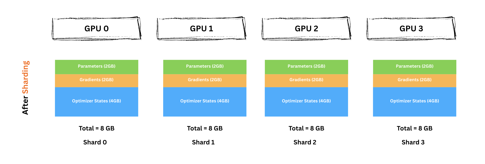
</p>

::: {.callout-important title="Critical Insight"}
Each shard contains a **horizontal slice from ALL layers**, not just `one unit's` layers. 

For example, `GPU0's` shard has the first `1/4` of parameters from layers `1, 2, 3, 4, 5, 6, 7, 8, 9, 10, 11, and 12`. This is fundamentally different from the naive approach where GPU0 would have `all` parameters from layers `1-3` only.
:::

This horizontal sharding is what allows every GPU to participate in processing *every* layer of the model.

<p align="center">
  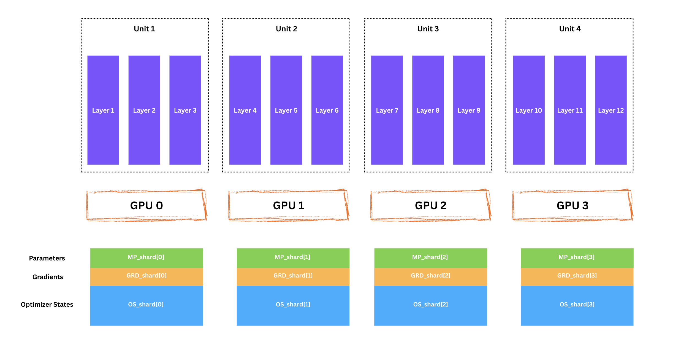
</p>

## What Exactly Gets Sharded in FSDP?

Now that we've seen how FSDP splits the model both vertically (units) and horizontally (across GPUs), it's important to clarify: *what* are we actually sharding?

Under FSDP's default and most memory-efficient mode, `FULL_SHARD`, we shard all the three entities (model parameters, gradients, optimizer state) across all GPUs. This is the critical difference that lets you scale to larger models than would ever fit on a single device. 

Here are a few notational conventions we'll use moving forward (for clarity in diagrams and explanations):

- **Shard**: A single partitioned chunk of parameters, gradients, or optimizer state, held by one specific GPU
- **Unit**: A logical grouping of one or more layers (the result of our vertical split)
- **ACT**: Activations calculated during the forward pass (and kept for backward)
- **$\text{MEM}_{\text{total}}$**: Total memory needed for parameters + gradients + optimizer state (e.g., 32 GB in our example scenario)

With those fundamentals in place, let's see how FSDP actually operates step by step.

## Step-by-Step FSDP Walkthrough

Now let's trace through one complete training iteration (forward pass and backward pass). 

### Phase 0: Initial Setup

Before training begins, FSDP performs two setup operations:

**Step 0.1: Split the Dataset**

Each GPU gets assigned a different mini-batch of the dataset:

<p align="center">
  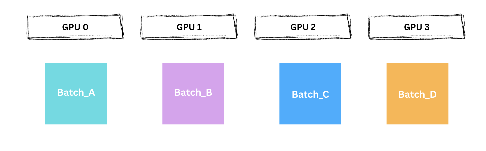
</p>

**Step 0.2: Shard the Model**

Then we divide each entity into 4 shards and distribute them, as we have seen in the previous section:

**Initial State After Sharding**:

<p align="center">
  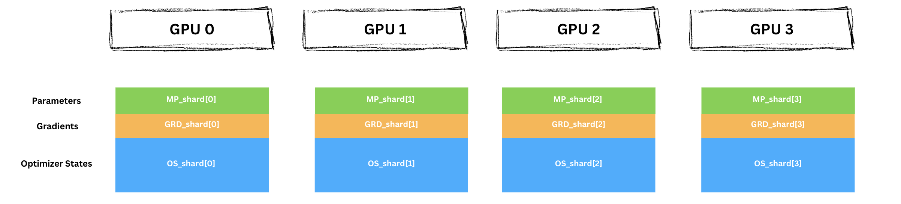
</p>


::: {.callout-note}
At this stage, the GRD (gradient) shards are simply **placeholders**, they have been allocated on each GPU, but do **not** contain any meaningful data yet. 

No gradients have been calculated at this point because the forward and backward passes haven't started. The actual gradient values will only be computed and filled in during the backward pass, once loss values are propagated backward through the network.
:::

### Phase 1: Forward Pass

Recall that a "unit" is a logical grouping of one or more layers (from the vertical split earlier). In the forward pass, each unit is processed one after another, but all 4 GPUs operate **in parallel** on their respective mini-batches during each unit's turn. We have the following now in **`each GPU`**:

- Its own shard of the `model parameters` for the **Unit 1** (layers 1-3)
- Its own shard of the `optimizer state` for the **Unit 1** 
- Its own shard of the `gradients` for the **Unit 1** (placeholders)
- Its own mini-batch of the `dataset` 

<p align="center">
  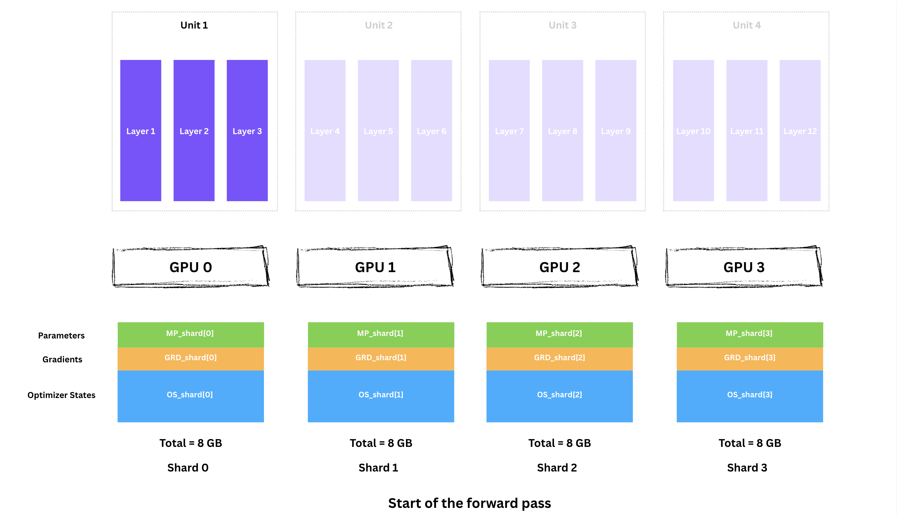
</p>

#### Step 1.1: All-Gather Parameters for Unit 1

Before we can run layers 1-3, each GPU needs the **complete parameters** for **Unit 1**. Since these parameters are sharded across all GPUs, we perform an **All-Gather** operation:

<p align="center">
  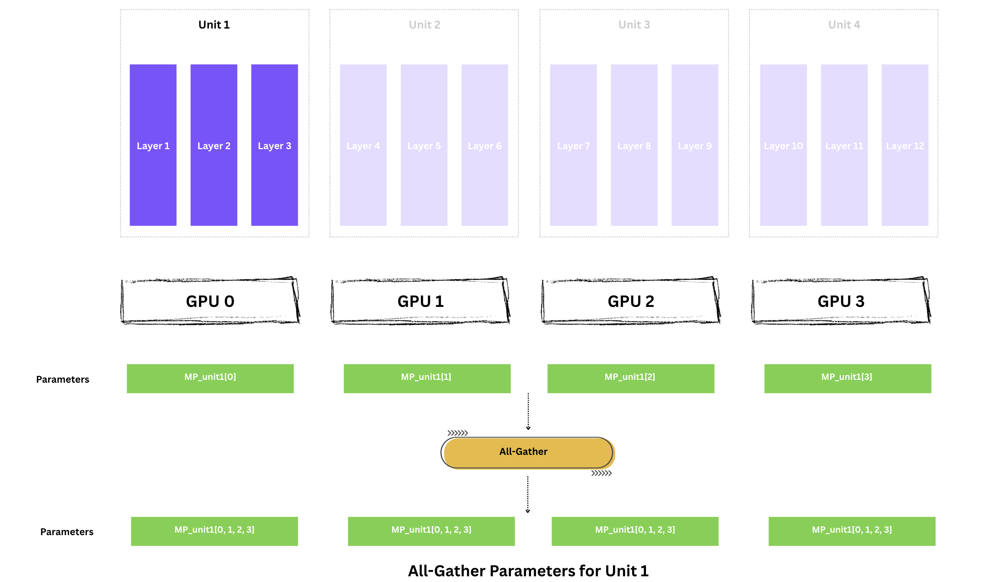
</p>

Each GPU now temporarily holds the complete **Unit 1** parameters. The key word here is **temporarily**,we'll discard the borrowed shards after use.


#### Step 1.2: Forward Pass on Unit 1 (All GPUs in Parallel!)

Now, **all 4 GPUs simultaneously** run the forward pass on **layers 1-3** (for **Unit 1**), each using its own mini-batch but the same model weights.

::: {.callout-tip title="This is the magic of FSDP"}
All 4 GPUs are working simultaneously! Same `model weights`, different `data`, different `activations`.
:::

#### Step 1.3: Save Activations

Each GPU stores its computed activations, these are needed later for gradient computation during backward pass.

<p align="center">
  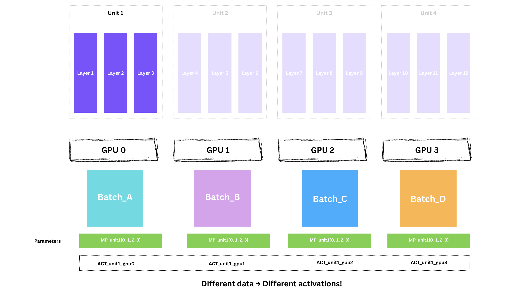
</p>

#### Step 1.4: Reshard (Free Temporary Memory)

Now that the forward pass for **Unit 1** is complete, we can **delete the borrowed parameter shards** to free up GPU memory, keeping only our owned shard.

<p align="center">
  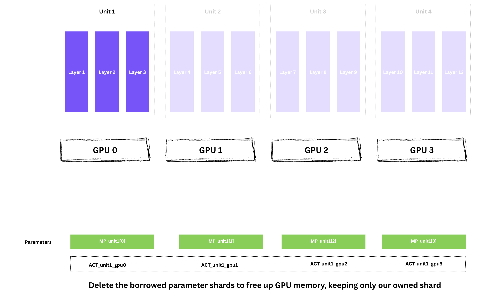
</p>

Memory usage drops back down, but we've retained the **`activations`** we need for backward.

#### Step 1.5: Repeat for Units 2, 3, and 4

The same **All-Gather** → **Forward** → **Save ACT** → **Reshard** cycle repeats for each of the remaining `units` (Unit 2, 3, and 4):

<p align="center">
  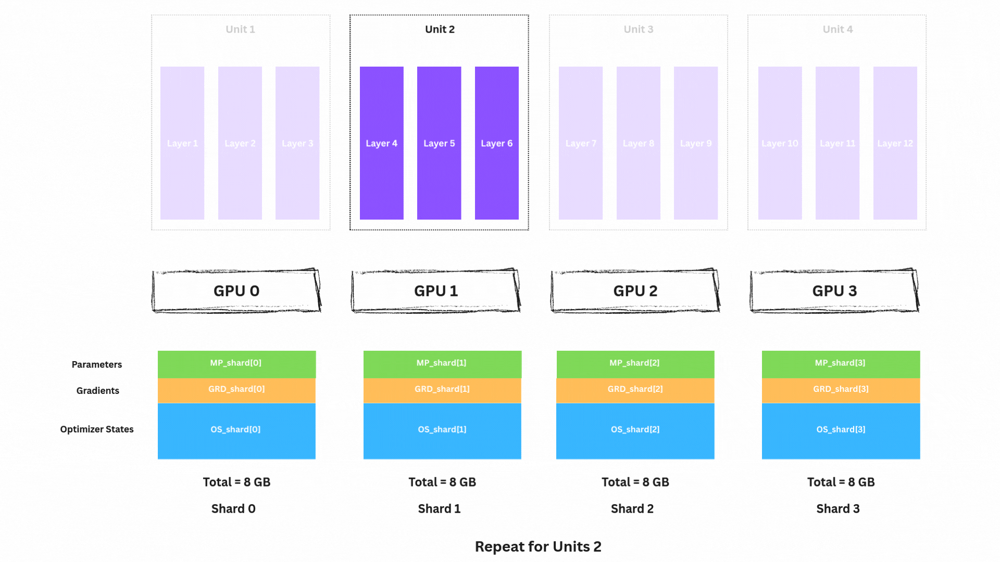
</p>

#### Step 1.6: Compute Loss

Each GPU computes the loss for its respective batch (mini-batch).

**End of Forward Pass State:**

So at this point, each GPU now holds:

- Its original 1/4 shard of ALL model parameters
- Activations from ALL units (`ACT_unit1`, `ACT_unit2`, `ACT_unit3`, `ACT_unit4`)
- Its computed loss value
- Placeholder gradient shards (not yet filled)

<p align="center">
  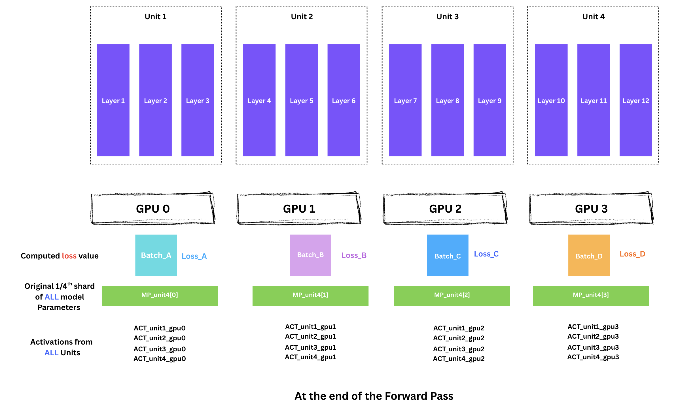
</p>

### Phase 2: Backward Pass

Now it's time to run everything in reverse – we're going to calculate gradients and send them back through the network, so our model can learn! 
We'll start from the last set of layers (`Unit 4`) and work our way backward to the first set of layers (`Unit 1`).

#### Step 2.1: All-Gather Parameters for Unit 4

Before starting the backward pass, we need to gather the full parameters for the `Unit 4` again, as we did in the forward pass.

<p align="center">
  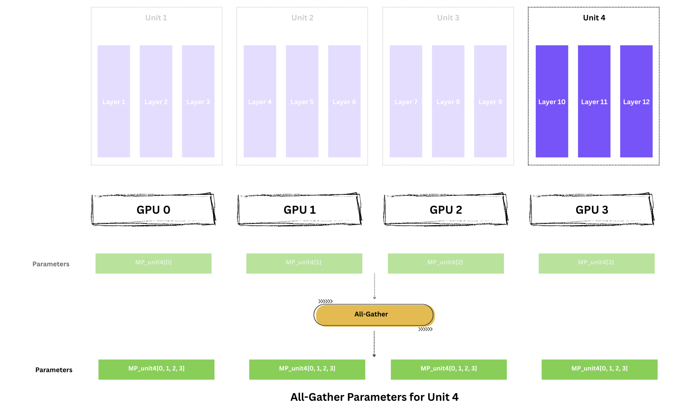
</p>

::: {.callout-note title="No Need to All-Gather for Unit 4"}
Good news: for Unit 4, we **already** have all the full parameters (`MP_unit4`) on every GPU from the forward pass, so there’s nothing new to do here for this step! Each GPU kept a full copy of Unit 4’s weights after the forward pass because they were just used.

But after we move to earlier units (`Unit 3`, `Unit 2`, and `Unit 1`), the full parameters will need to be re-assembled on each GPU again (using All-Gather), just like we did during the forward pass. That’s because, after each unit’s step is finished, we typically "reshard" and return to just holding a shard to save memory.
:::


#### Step 2.2: Compute Local Gradients for Unit 4

Each GPU computes gradients based on **its own batch's loss** and **its own activations**. 

At this point, each GPU has computed a **local gradient** based on only its portion of the data. 

<p align="center">
  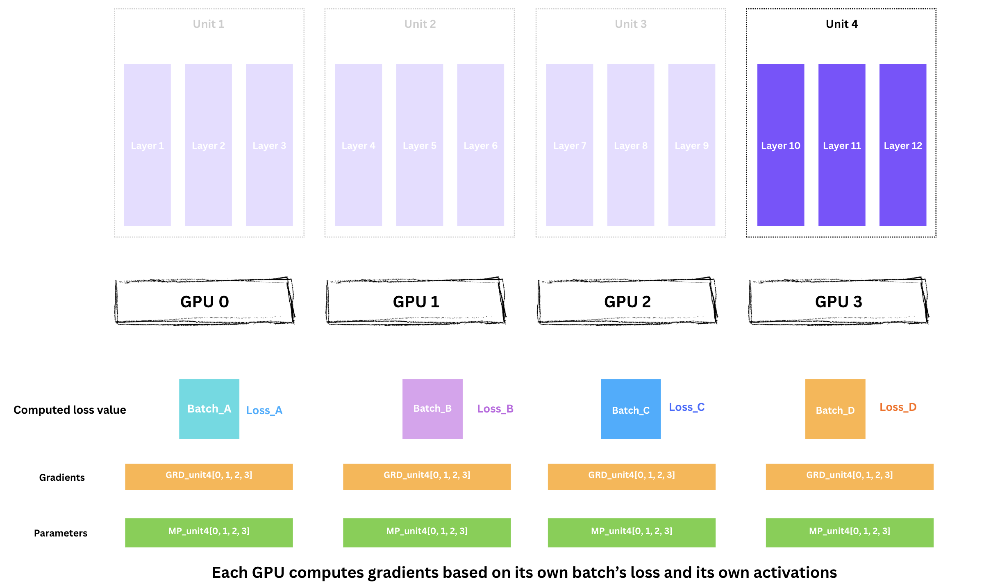
</p>

But for proper optimization, we need the **global gradient** (sum of all local gradients). So, we need to **reduce** the gradients across all GPUs.

#### Step 2.3: Reduce-Scatter Gradients (The Key Operation!)

This is where the magic happens. We use a **Reduce-Scatter** operation to:

1. **Reduce** (sum) all gradients across GPUs
2. **Scatter** the result so each GPU gets only its `responsible shard`

<p align="center">
  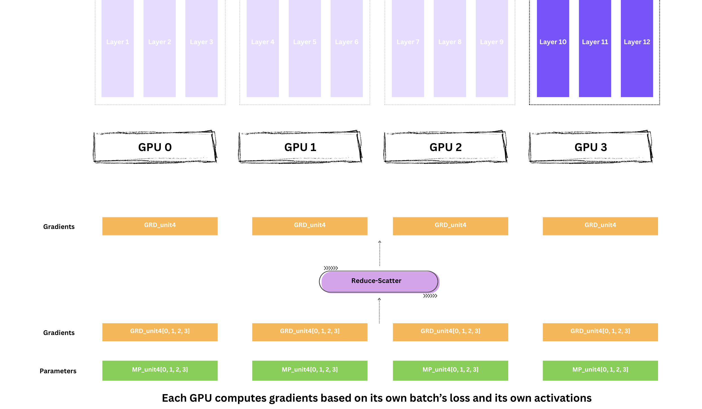
</p>


::: {.callout-note title="Why Reduce-Scatter instead of All-Reduce?"}
In DDP, we use **All-Reduce** which gives every GPU the *full* summed gradient. But in FSDP, each GPU only *needs* the gradient for parameters it owns. 

**Reduce-Scatter** is more efficient, it produces the same sum but distributes it, **saving both memory and communication bandwidth**.
:::

#### Step 2.4: Free Memory

After reduce-scatter, we can release:

- The temporary gathered `MP_unit4` (keep only owned shard)
- The `ACT_unit4` (no longer needed)

#### Step 2.5: Repeat for Units 3, 2, and 1

Working backward through the network, for each of the remaining units (Unit 3, 2, and 1):

- Unit 3: **All-Gather** `MP_unit3` → **Backward** → **Reduce-Scatter** `GRD` → **Free** `ACT_unit3`
- Unit 2: **All-Gather** `MP_unit2` → **Backward** → **Reduce-Scatter** `GRD` → **Free** `ACT_unit2`
- Unit 1: **All-Gather** `MP_unit1` → **Backward** → **Reduce-Scatter** `GRD` → **Free** `ACT_unit1`

**End of Backward Pass State:**

Each GPU now holds:
- Its 1/4 shard of model parameters (`MP_shard`)
- Its 1/4 shard of ACCUMULATED gradients (`GRD_shard`) ← Ready for optimization!
- Its 1/4 shard of optimizer state (`OS_shard`)
- All activations have been freed!

### Phase 3: Optimizer Step

Now comes the beautiful part: **each GPU can update its parameters independently**.

#### Step 3.1: Local Optimizer Update

Each GPU has everything it needs to update its portion of the model:

- Its parameter shard
- The accumulated gradient for that shard (summed across all batches)
- Its optimizer state shard

<p align="center">
  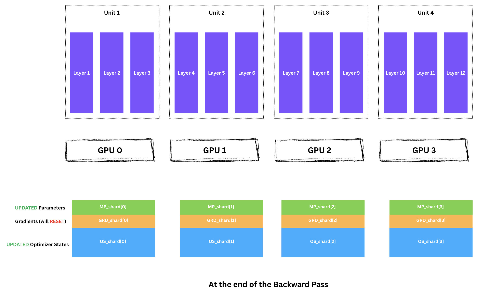
</p>

::: {.callout-tip title="No Communication Needed!"}
Each GPU updates only its shard using only data it already has. This is perfectly parallel and requires zero inter-GPU communication.
:::

#### Step 3.2: Ready for Next Batch

We're back to our initial state, but with updated parameters and we can fetch the next set of batches.

<p align="center">
  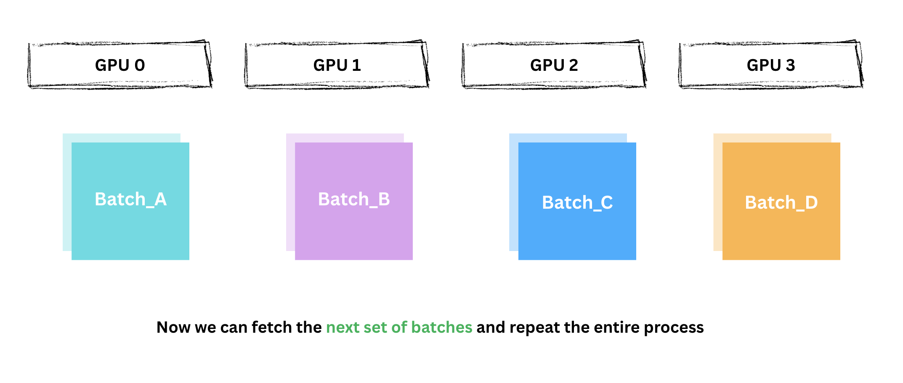
</p>

And then we can repeat the entire process for all the batches in the dataset.

<p align="center">
  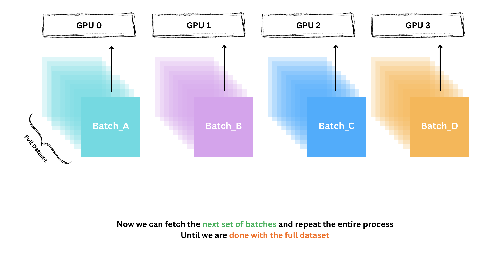
</p>

So, to summarize, this is what happens during one full training iteration with FSDP:

<p align="center">
  
</p>

## Memory Analysis: The Numbers

Let's crunch the numbers for our 4-GPU example to really see the impact that FSDP makes on memory efficiency.

### Without FSDP (DDP)

With classic Data Parallelism (DDP), each GPU holds a `full copy` of the model, its gradients, and the optimizer state:

$$\mathcal{M}_{\text{DDP}} = \text{MP} + \text{GRD} + \text{OS} = 8 + 8 + 16 = 32 \text{ GB per GPU}$$

Here:
- **MP** = Model parameters (8 GB)
- **GRD** = Gradients (8 GB)
- **OS** = Optimizer state (16 GB)

So, **each GPU would need a whopping 32 GB** just for model training.

**Result**: Won't fit on 16 GB GPUs! Most consumer and even many data center GPUs would just run out of memory immediately.

### With FSDP (4 GPUs)

With FSDP, the memory requirements are slashed, `parameters`, `gradients`, and `optimizer states` are sharded across all GPUs.

Each GPU needs:

$$\mathcal{M}_{\text{FSDP}} = \frac{\text{MP} + \text{GRD} + \text{OS}}{N_d} = \frac{32}{4} = 8 \text{ GB per GPU}$$

Where $N_d = 4$ is the number of GPUs in our example.

Now, each GPU only stores a `quarter` of the parameters, gradients, and optimizer states at any time.

**Result**: Fits comfortably on 16 GB GPUs! FSDP enables you to train models twice as large on the same hardware or the same model with much larger batch sizes.

But there is no free lunch, we need to pay the price in communication overhead.

### Communication Cost

For each training iteration:

| Phase | Operation | Data Volume |
|:------|:----------|:------------|
| Forward (per unit) | All-Gather MP | $\Psi_{\text{unit}}$ |
| Backward (per unit) | All-Gather MP | $\Psi_{\text{unit}}$ |
| Backward (per unit) | Reduce-Scatter GRD | $\Psi_{\text{unit}}$ |

Total communication per iteration: approximately $3\Psi$ (where $\Psi$ is total parameters)

::: {.callout-tip title="Prefetching Optimization"}
In practice, FSDP overlaps communication with computation. While computing forward pass on Unit $n$, it can start all-gathering parameters for Unit $n+1$ in the background. This significantly reduces the effective communication overhead.
:::

# Implementing FSDP with PyTorch and Ray Train

Now that we have a solid understanding of *how* FSDP works, let's implement it. The implementation is fairly straightforward. 

We'll use [**PyTorch FSDP2**](https://docs.pytorch.org/docs/stable/distributed.fsdp.fully_shard.html) with [**Ray Train**](https://docs.ray.io/en/latest/train/train.html) to train a Vision Transformer on FashionMNIST dataset.

If you are new to **Ray Train**, you can check out my previous post [here](https://debnsuma.github.io/my-blog/posts/distributed-training-from-scratch/#introduction-to-ray---unified-ai-compute-engine).

## FSDP2: What's New and Why Does It Matter?

PyTorch's Fully Sharded Data Parallel (FSDP) module has undergone a significant evolution in its second major version, often called **FSDP2**. This new version introduces architectural, usability, and performance improvements over the original FSDP design, now sometimes retroactively referred to as **FSDP1**.

Let's examine the main improvements in detail:

| Aspect | FSDP1 | FSDP2 |
|:-------|:------|:------|
| **Parameter Storage** | Uses a large FlatParameter tensor (concatenates all params per group for sharding) | Each parameter is sharded independently across ranks (per-parameter sharding) |
| **Sharding Unit** | Flattened groups of parameters, requiring explicit grouping | Individual parameters; native granularity for any param tensor |
| **DTensor Support** | Experimental and limited; not natively exposed | Native, built-in DTensor integration (for multi-dimensional and hybrid sharding) |
| **State Dict Handling** | Loading/saving often requires cross-worker communication to reconstruct full tensors | Can save/load fully sharded state dicts without collective communication, supporting parallel check/restore and streaming |
| **Frozen Parameters** | Difficult to manage; groups must be updated if freezing layers | Frozen (non-trainable) parameters are naturally skipped and don't require extra grouping steps |
| **Selective Wrapping and Nested Structure** | Rigid or error-prone; cannot always wrap at arbitrary module boundaries | Fine-grained, easy wrapping at any module, submodule, or parameter level |

In FSDP2, the core insight is that each parameter tensor is partitioned (typically along the first dimension, dim-0) and distributed across all participating GPUs ("ranks"). This approach eliminates the need to flatten and concatenate parameters into a single tensor per sharding group, which simplifies parameter management, improves compatibility with a wider variety of models, and makes integration with other sharding strategies trivial.

## Prerequisite: Setting Up a Ray Cluster

Before getting into the code, we need to first have a Ray cluster up and running. I strongly recommend using [Anyscale](https://www.anyscale.com/) as it provides an easy way to launch and manage Ray clusters with GPU workers.

Here is how you can get started, for detailed instructions, you can refer to [GitHub Repository](https://github.com/debnsuma/vhol-ray-train?tab=readme-ov-file#getting-started-with-anyscale). You can also check out the [Anyscale documentation](https://docs.anyscale.com/get-started) for more details.

But in brief, here's how you can get started:

**Here's how you can get started:**

1. **Create an Anyscale Account:**  
   First, sign up at [https://www.anyscale.com/](https://www.anyscale.com/).

2. **Provision a Ray Cluster on Anyscale:**  
   - After logging in, start a new project and create a new Ray cluster.
   - Make sure the cluster configuration includes:
     - One masternode (head node)
     - Two or more worker nodes with GPUs (such as NVIDIA V100, A100, T4, L4, H100, etc.) For this tutorial, you may like to use L4 based GPU workers.
3. **Open the Workspace**  
   - Once the cluster is ready, open the workspace. You can do this by clicking on the `Workspace` button in the Anyscale dashboard.
   - Clone the [GitHub repository](https://github.com/debnsuma/vhol-ray-train) and install the dependencies.

     ```bash
     git clone https://github.com/debnsuma/vhol-ray-train.git
     cd vhol-ray-train
     pip install -r requirements.txt
     ```

## Setting Up the Environment

```python
import os
os.environ["RAY_TRAIN_V2_ENABLED"] = "1"

import tempfile
import uuid
import torch
import ray

print(f"PyTorch version: {torch.__version__}")
print(f"Ray version: {ray.__version__}")
```

```bash
PyTorch version: 2.10.0+cu128
Ray version: 2.53.0
```

## Step 1: Define the Model

We'll use a **Vision Transformer (ViT)** for this tutorial. ViT has clear, repeatable block structures (transformer encoder blocks) that map perfectly to our **units** concept from the theory section. But you can use any model of your choice.

```python
from torchvision.models import VisionTransformer
from torchvision.datasets import FashionMNIST
from torchvision.transforms import ToTensor, Normalize, Compose

def init_model():
    """Initialize Vision Transformer for FashionMNIST (28x28 grayscale, 10 classes)."""
    model = VisionTransformer(
        image_size=28, patch_size=7, num_layers=10, num_heads=2,
        hidden_dim=128, mlp_dim=128, num_classes=10,
    )
    # Modify for grayscale input
    model.conv_proj = torch.nn.Conv2d(1, 128, kernel_size=7, stride=7)
    return model

# Verify model
test_model = init_model()
print(f"Model parameters: {sum(p.numel() for p in test_model.parameters()):,}")
del test_model
```

```
Model parameters: 1,006,090
```

## Step 2: Apply FSDP2 Sharding

Now we implement the sharding strategy we discussed earlier. Each encoder block becomes a **unit** that we shard individually:

```python
from torch.distributed.fsdp import fully_shard
from torch.distributed.device_mesh import init_device_mesh
import ray.train

def shard_model(model):
    """Apply FSDP2 sharding to the model."""
    world_size = ray.train.get_context().get_world_size()

    # Create device mesh for data parallelism
    mesh = init_device_mesh("cuda", (world_size,), mesh_dim_names=("dp",))

    # Shard each encoder block individually
    for block in model.encoder.layers.children():
        fully_shard(block, mesh=mesh, reshard_after_forward=True)

    # Shard the root model
    fully_shard(model, mesh=mesh, reshard_after_forward=True)
```

::: {.callout-note title="reshard_after_forward Trade-off"}
Setting `reshard_after_forward=True` implements the memory optimization we discussed earlier, i.e. parameters are freed after forward pass and re-gathered during backward. This reduces peak memory but increases communication.
:::

::: {.callout-tip title="Optional: Advanced Policies"}
For memory-constrained scenarios, you can add:

- **CPU Offloading**: `CPUOffloadPolicy()` - Offloads parameters to CPU when not in use
- **Mixed Precision**: `MixedPrecisionPolicy(param_dtype=torch.float16)` - Reduces memory with FP16. For modern GPUs (A100, H100), prefer BF16 over FP16. BF16 has the same exponent range as FP32, reducing overflow/underflow issues and eliminating the need for loss scaling in most cases.

```python
from torch.distributed.fsdp import CPUOffloadPolicy, MixedPrecisionPolicy

fully_shard(block, 
            mesh=mesh, 
            reshard_after_forward=True,
            offload_policy=CPUOffloadPolicy(),
            mp_policy=MixedPrecisionPolicy(param_dtype=torch.float16))
```
:::

## Step 3: Distributed Checkpointing

Now let's tackle checkpointing for sharded models. Conventional checkpointing approaches (e.g., `torch.save(model.state_dict())`) require gathering all model parameters on rank 0, which is infeasible for large, sharded models due to excessive memory usage and communication overhead. 

PyTorch Distributed Checkpoint (DCP) solves this by enabling efficient, scalable checkpointing across all workers. Its key features:

- **Parallel I/O**: Each worker saves only its portion (shard) of the model and optimizer state in parallel, no need to gather everything to a single process.
- **Automatic Resharding**: When resuming, DCP automatically reshuffles states if the number of workers changes between save and load. This means you can resume training with a different world size (e.g., after a node failure or scale-up).
- **Full Optimizer State**: DCP can checkpoint both the model and the full optimizer state, enabling robust training resumption and fault tolerance.

This class provides a wrapper for PyTorch Distributed Checkpoint (DCP) to save and load model and optimizer state together.
```python
from torch.distributed.checkpoint.state_dict import get_state_dict, set_state_dict, get_model_state_dict, StateDictOptions
from torch.distributed.checkpoint.stateful import Stateful
import torch.distributed.checkpoint as dcp

class AppState(Stateful):
    """Wrapper for DCP checkpointing."""
    def __init__(self, model, optimizer=None, epoch=None):
        self.model, self.optimizer, self.epoch = model, optimizer, epoch

    def state_dict(self):
        model_sd, optim_sd = get_state_dict(self.model, self.optimizer)
        return {"model": model_sd, "optim": optim_sd, "epoch": self.epoch}

    def load_state_dict(self, state_dict):
        set_state_dict(self.model, self.optimizer,
                      model_state_dict=state_dict["model"],
                      optim_state_dict=state_dict["optim"])
        self.epoch = state_dict.get("epoch")
```

This function loads a DCP checkpoint, restoring model, optimizer, and epoch for training resumption and DCP's automatic resharding.
```python
def load_checkpoint(model, optimizer, ckpt):
    """Load FSDP checkpoint (handles resharding automatically)."""
    with ckpt.as_directory() as ckpt_dir:
        app_state = AppState(model, optimizer)
        dcp.load(state_dict={"app": app_state}, checkpoint_id=ckpt_dir)
    return app_state.epoch
```

This function saves the model and optimizer state as a distributed checkpoint, and reports training metrics to Ray.
```python
def save_checkpoint(model, optimizer, metrics, epoch):
    """Save FSDP checkpoint and report metrics."""
    with tempfile.TemporaryDirectory() as tmp_dir:
        dcp.save(state_dict={"app": AppState(model, optimizer, epoch)}, checkpoint_id=tmp_dir)
        ray.train.report(metrics, checkpoint=ray.train.Checkpoint.from_directory(tmp_dir))
```

This function collects sharded model weights onto rank 0 and saves a full PyTorch model checkpoint for inference use. 
```python
def save_model_for_inference(model, world_rank):
    """Consolidate sharded model for inference (rank 0 saves full model)."""
    with tempfile.TemporaryDirectory() as tmp_dir:
        model_sd = get_model_state_dict(model, options=StateDictOptions(full_state_dict=True, cpu_offload=True))
        ckpt = None
        if world_rank == 0:
            torch.save(model_sd, os.path.join(tmp_dir, "full-model.pt"))
            ckpt = ray.train.Checkpoint.from_directory(tmp_dir)
        ray.train.report({}, checkpoint=ckpt, checkpoint_dir_name="full_model")
```

::: {.callout-note title="Model Consolidation for Inference"}
The `save_model_for_inference` function all-gathers weights to rank 0 and saves a standard PyTorch checkpoint. This consolidated model can be loaded without FSDP for inference.
:::

## Step 4: The Training Function

Let's now implement the training function. This function is executed on each Ray worker and orchestrates the end-to-end FSDP training lifecycle.

Pay special attention to:

- **Checkpoint handling:** This supports training resumption and fault-tolerance, and is critical for distributed workflows.
- **Model sharding:** The `shard_model(model)` call prepares your model for FSDP wrapping.
- **Data loading:** Note the use of `ray.train.torch.prepare_data_loader` to ensure efficient data sharding and distribution across workers.
- **Reporting and model saving:** Notice how checkpoints are reported with metrics for Ray dashboard and final model weights are consolidated for inference post-training.

Each of these ensures that distributed training runs robustly, can be resumed after interruptions, and produces a standard model for inference.

```python
import ray.train.torch
from torch.nn import CrossEntropyLoss
from torch.optim import Adam
from torch.utils.data import DataLoader

def train_func(config):
    """FSDP2 training function."""
    # Model setup
    model = init_model()
    device = ray.train.torch.get_device()
    torch.cuda.set_device(device)
    model.to(device)
    shard_model(model)  # Prepares your model for FSDP sharding and distributed execution

    # Training setup
    criterion = CrossEntropyLoss()
    optimizer = Adam(model.parameters(), lr=config.get('lr', 0.001))

    # Resume from checkpoint if available
    start_epoch = 0
    if ray.train.get_checkpoint():
        # Checkpoint loading lets you resume or recover from failures safely
        start_epoch = load_checkpoint(model, optimizer, ray.train.get_checkpoint()) + 1

    # Data loading
    transform = Compose([ToTensor(), Normalize((0.5,), (0.5,))])
    train_data = FashionMNIST(root=tempfile.gettempdir(), train=True, download=True, transform=transform)
    train_loader = DataLoader(train_data, batch_size=config.get('batch_size', 64), shuffle=True)
    train_loader = ray.train.torch.prepare_data_loader(train_loader)  # Ensures distributed sharding of samples

    # Context
    world_rank = ray.train.get_context().get_world_rank()

    # Training loop
    for epoch in range(start_epoch, config.get('epochs', 1)):
        # Ensures good shuffling across epochs in a distributed setting
        if ray.train.get_context().get_world_size() > 1:
            train_loader.sampler.set_epoch(epoch)

        total_loss, num_batches = 0.0, 0
        for images, labels in train_loader:
            outputs = model(images)
            loss = criterion(outputs, labels)
            optimizer.zero_grad()
            loss.backward()
            optimizer.step()
            total_loss += loss.item()
            num_batches += 1

        avg_loss = total_loss / num_batches
        # Checkpoint saving is key: it enables Ray's fault-tolerance and progress tracking
        save_checkpoint(model, optimizer, {"loss": avg_loss, "epoch": epoch}, epoch)
        if world_rank == 0:
            print(f"Epoch {epoch}: loss={avg_loss:.4f}")

    # Consolidate and save the full model for downstream inference (run only on rank 0)
    save_model_for_inference(model, world_rank)
```

## Step 5: Launch Distributed Training

Let's now launch the distributed training. 

Ray Train's `TorchTrainer` handles worker spawning, process group initialization, and checkpoint coordination. 

You may like to pay special attention to:

- Each experiment gets a **unique name** for later tracking and artifact separation.
- **The ScalingConfig** sets the number of distributed workers and enables GPU use.
- **The RunConfig** configures where Ray will persist checkpoints and outputs.

```python
import ray.train.torch
import uuid

# Configuration
experiment_name = f"fsdp_{uuid.uuid4().hex[:8]}"
scaling_config = ray.train.ScalingConfig(num_workers=2, use_gpu=True)
run_config = ray.train.RunConfig(storage_path="/mnt/cluster_storage/", name=experiment_name)
train_config = {"epochs": 1, "lr": 0.001, "batch_size": 64}

print(f"Experiment: {experiment_name}")
```

Now let's launch the training:

```python
# Create and run trainer
trainer = ray.train.torch.TorchTrainer(
    train_loop_per_worker=train_func,
    scaling_config=scaling_config,
    train_loop_config=train_config,
    run_config=run_config,
)
result = trainer.fit()
print(f"Training complete! Checkpoint: {result.checkpoint}")
```

Training output:

```bash
Experiment: fsdp_b2f564ce
(RayTrainWorker) Epoch 0: loss=0.7410

Training complete! Checkpoint: Checkpoint(filesystem=local, path=/mnt/cluster_storage/fsdp_b2f564ce/full_model)
```

::: {.callout-note title="Parameter-Efficient Fine-Tuning"}
In this example, we're fine-tuning the **entire model** using full parameter updates. If you'd like to use parameter-efficient fine-tuning methods like **LoRA** or **QLoRA**, you can easily integrate them here as well, the distributed FSDP training pipeline will largely remain the same. Just wrap or modify your model, optimizer, and training loop as needed, and use Ray Train as shown.
:::

## Step 6: Inspect Training Artifacts

Before we move on to the next step, let's inspect the training artifacts.

- `checkpoint_*/` - Epoch checkpoints with distributed shards
- `full_model/` - Consolidated model for inference

```python
# List artifacts
storage_path = f"/mnt/cluster_storage/{experiment_name}/"
print(f"Artifacts in {storage_path}:")
for item in sorted(os.listdir(storage_path)):
    print(f"  {item}/" if os.path.isdir(os.path.join(storage_path, item)) else f"  {item}")
```

```bash
Artifacts in /mnt/cluster_storage/fsdp_b2f564ce/:
  .validate_storage_marker
  checkpoint_2026-02-02_06-52-14.180406/
  checkpoint_manager_snapshot.json
  full_model/
```

## Step 7: Load Model for Inference

Now let's load the model for inference. The consolidated model (`full-model.pt`) is a standard PyTorch checkpoint that works without FSDP2:

```python
# Load model for inference
model_path = f"/mnt/cluster_storage/{experiment_name}/full_model/full-model.pt"
inference_model = init_model()
inference_model.load_state_dict(torch.load(model_path, map_location='cpu', weights_only=True))
inference_model.eval()
print("Model loaded.")
```

```python
# Test inference
test_data = FashionMNIST(root="/tmp", train=False, download=True,
                         transform=Compose([ToTensor(), Normalize((0.5,), (0.5,))]))
with torch.no_grad():
    sample = test_data.data[0].reshape(1, 1, 28, 28).float()
    output = inference_model(sample)
print(f"Inference output shape: {output.shape}")
```

```
Inference output shape: torch.Size([1, 10])
```

# DeepSpeed: An Alternative to FSDP2

When it comes to large-scale model training, there are several strategies that help distribute computation and memory efficiently across multiple GPUs or nodes. **DeepSpeed**, an open-source library developed by Microsoft, is designed from the ground up to make distributed training fast, scalable, and easy to use for gigantic models. 

It offers efficient training optimizations such as **ZeRO**, advanced optimizers, and mixed precision, enabling researchers and practitioners to train models that would otherwise not fit in GPU memory.

While FSDP2 is PyTorch's native solution for sharded training, DeepSpeed stands out as another popular and feature-rich framework for distributed training. Let's introduce it briefly and show how it compares.

## Key Differences from FSDP2

| Aspect | FSDP2 | DeepSpeed |
|:-------|:------|:----------|
| Setup | `fully_shard(model, ...)` | `deepspeed.initialize(model, config)` |
| Optimizer | User creates separately | Managed by DeepSpeed |
| Backward | `loss.backward()` | `model.backward(loss)` |
| Config | Python API | JSON/dict config |

We already discussed the **ZeRO** stages in the previous [post](https://debnsuma.github.io/my-blog/posts/distributed-training-from-scratch/#zero-zero-redundancy-optimizer). DeepSpeed implements the same ZeRO stages as FSDP2, but makes it easier to configure them via a simple configuration file.

## How DeepSpeed Works

It's designed as a plug-in replacement for the standard PyTorch training loop, making it very approachable for most PyTorch users.

In contrast to FSDP2 (which is all Python API), DeepSpeed intentionally uses a `user-friendly configuration file` to define its distributed behavior and optimization strategies. Here's a simple example of such a configuration programmatically defined in code (but you can also put this in a JSON):

```python
def get_deepspeed_config(batch_size=64, lr=0.001):
    """A minimal DeepSpeed ZeRO Stage 2 config"""
    return {
        "optimizer": {
            "type": "Adam",
            "params": {"lr": lr, "betas": [0.9, 0.999], "eps": 1e-8},
        },
        "fp16": {"enabled": False},  # Change to True to enable mixed precision
        "zero_optimization": {
            "stage": 2,  # ZeRO Stage 2 for optimizer and gradient state partitioning
            "allgather_bucket_size": 2e8,
            "reduce_bucket_size": 2e8,
            "overlap_comm": True,
            "contiguous_gradients": True,
        },
        "train_micro_batch_size_per_gpu": batch_size,
        "gradient_accumulation_steps": 1,
        "gradient_clipping": 1.0,
        "steps_per_print": 1000,
    }
```
You just pass this dictionary (or the path to a config JSON) into DeepSpeed, no complex code rewrite needed! If you want mixed precision, NVMe offload, or other advanced features, you just add keys to this config. You can read much more on [DeepSpeed’s official Getting Started guide](https://www.deepspeed.ai/getting-started/), which includes example configs, performance tips, and other features like ZeRO stage 3 and offloading to NVMe for truly massive models.

## DeepSpeed Training Function

Getting started with DeepSpeed is very similar to PyTorch. The two main steps are:

1. **Initialize your model with DeepSpeed:**  
   This wraps it into a `model engine` that handles distributed parallelism, memory optimizations (like ZeRO), optimizer state, and learning rate scheduling.
2. **Use the DeepSpeed engine in the training loop:**  
   - `model_engine.backward(loss)` replaces the usual `loss.backward()`
   - `model_engine.step()` replaces the usual `optimizer.step()`

Let's see how the training function looks like:

```python
def train_func(config):
    """DeepSpeed training function (modeled after PyTorch, but much easier for scale)."""
    import deepspeed

    # Setup model and DeepSpeed engine
    model = init_model()
    ds_config = get_deepspeed_config(batch_size=config.get('batch_size', 64), lr=config.get('lr', 0.001))
    model_engine, optimizer, _, _ = deepspeed.initialize(
        model=model, config=ds_config, model_parameters=model.parameters()
    )
    device = model_engine.device

    criterion = CrossEntropyLoss()

    # Distributed sampler and dataloader (just like PyTorch DDP)
    transform = Compose([ToTensor(), Normalize((0.5,), (0.5,))])
    train_data = FashionMNIST(root=tempfile.gettempdir(), train=True, download=True, transform=transform)
    sampler = torch.utils.data.DistributedSampler(
        train_data,
        num_replicas=ray.train.get_context().get_world_size(),
        rank=ray.train.get_context().get_world_rank(),
        shuffle=True,
    )
    train_loader = DataLoader(train_data, batch_size=config.get('batch_size', 64), sampler=sampler)

    # Training loop
    for epoch in range(config.get('epochs', 1)):
        sampler.set_epoch(epoch)
        total_loss, num_batches = 0.0, 0

        for images, labels in train_loader:
            images, labels = images.to(device), labels.to(device)

            # Forward/backward/step handled by DeepSpeed
            outputs = model_engine(images)
            loss = criterion(outputs, labels)
            model_engine.backward(loss)
            model_engine.step()

            total_loss += loss.item()
            num_batches += 1

        avg_loss = total_loss / num_batches
        print(f"Epoch {epoch}: loss={avg_loss:.4f}")
```

# Project: Fine-tuning Qwen3-TTS (Voice Cloning)

Now that we've covered FSDP and distributed training concepts, let's put everything together with a real-world application that's genuinely exciting: **fine-tuning a 1.7B parameter text-to-speech model to clone your own voice**.

This section walks through building a voice cloning system using [Qwen3-TTS](https://github.com/QwenLM/Qwen3-TTS) from Alibaba, applying the FSDP and Ray Train techniques we've learned.

## What is Qwen3-TTS?

Qwen3-TTS is an open-source text-to-speech model with 1.7B parameters. It uses a unique architecture:

- **Text encoder**: Processes input text into hidden representations
- **Speaker encoder**: Extracts voice characteristics (x-vector embeddings)
- **Audio decoder**: Generates discrete audio codes (12Hz, 16 codebooks)
- **Vocoder**: Converts audio codes to waveforms

<p align="center">
  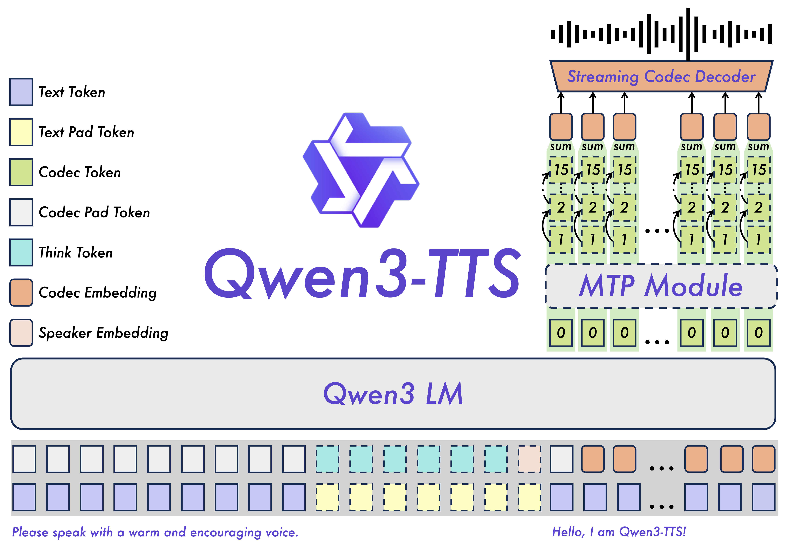
</p>

The model can perform **zero-shot voice cloning**, generating speech in any voice given just a reference audio sample. But with fine-tuning, we can make it **much** better at matching a specific voice.

## Qwen3-TTS Voice Cloning with Ray Distributed Training

This project demonstrates how to build a custom voice using Qwen3-TTS, leveraging distributed training with Ray Train for scalable, fault-tolerant fine-tuning. The aim is to clone your unique voice by adapting the [Qwen3-TTS-12Hz-1.7B-Base](https://github.com/QwenLM/Qwen3-TTS) model using your audio recordings. In this case, I have cloned my own voice :) All I did was I downloaded 3-4 hrs of audio recording of my voice and transcribed it using Whisper.

**Goal:** Fine-tune Qwen3-TTS with your own speech samples to create a personalized, high-quality voice clone.

### Pipeline

The workflow follows these main stages:

1. **Raw Audio Files**  
2. **Data Processing (Ray Data):** Distributed segmenting/transcription of your audio into training samples  
3. **Audio Code Extraction:** Convert processed audio into suitable feature codes for the TTS model  
4. **SFT Training (Ray Train):** Distributed fine-tuning using Ray Train, adapting the model to your voice  
5. **Inference:** Generate custom speech from text inputs


<p align="center">
  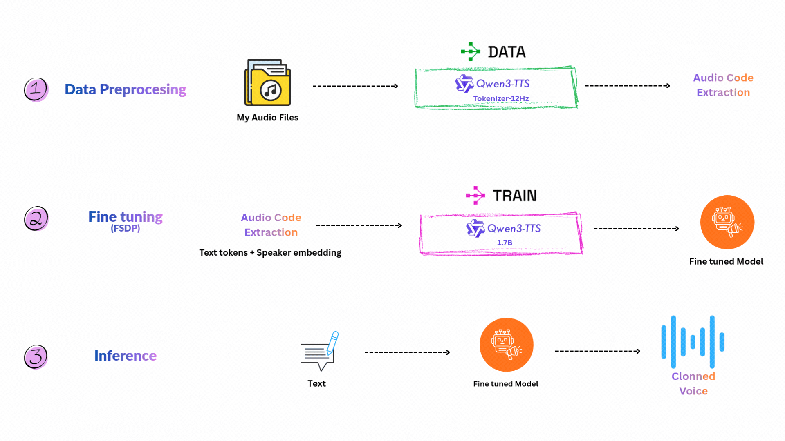
</p>


### Step 1: Data Processing

To begin, we transform your recorded audio files into usable training segments, distributing the workload efficiently with `Ray`.

```python
import ray
import whisper
import numpy as np

@ray.remote(num_gpus=0.5)  # Use GPU for Whisper
def process_audio_ray(audio_path: str, output_dir: str, config: dict):
    """Process a single audio file on a Ray worker."""
    import soundfile as sf

    # Load audio at 16kHz for Whisper transcription
    audio_16k, _ = sf.read(audio_path)

    # Transcribe with Whisper
    model = whisper.load_model("base")
    result = model.transcribe(audio_16k, language="en", word_timestamps=True)

    # Segment based on Whisper's detected segments
    segments = []
    for seg in result["segments"]:
        if 1.0 < (seg["end"] - seg["start"]) < 15.0:  # Keep 1-15 second segments
            segments.append({
                "audio": audio_16k[int(seg["start"]*16000):int(seg["end"]*16000)],
                "text": seg["text"].strip()
            })

    # Save segments as individual WAV files
    results = []
    for i, seg in enumerate(segments):
        seg_path = f"{output_dir}/{Path(audio_path).stem}_seg{i:04d}.wav"
        sf.write(seg_path, seg["audio"], 24000)  # Qwen3-TTS expects 24kHz
        results.append({"audio": seg_path, "text": seg["text"]})

    return results
```
We can now process your recorded **WAV** files in parallel using `Ray` by passing each file to the `process_audio_ray` remote function. 

```python
# Process all audio files in parallel
audio_files = list(Path("data/").glob("*.wav"))
futures = [process_audio_ray.remote(str(f), "output/wav/", config) for f in audio_files]
all_segments = ray.get(futures)
```

The output is a JSONL file where each line contains an `audio` path and its `text` transcript:

```json
{"audio": "output/wav/recording_seg0001.wav", "text": "Hello, this is my voice."}
{"audio": "output/wav/recording_seg0002.wav", "text": "I'm recording samples for training."}
```

### Step 2: Extract Audio Codes

Qwen3-TTS doesn't work with raw audio waveforms. Instead, it uses `discrete audio codes`, a compressed representation that captures the essential acoustic information:

```python
from qwen_tts import Qwen3TTSModel

# Load the tokenizer model
tokenizer_model = Qwen3TTSModel.from_pretrained(
    "Qwen/Qwen3-TTS-Tokenizer-12Hz",
    device_map="cuda:0",
    dtype=torch.bfloat16,
)

def extract_audio_codes(audio_path: str) -> list:
    """Convert audio waveform to discrete codes."""
    import librosa

    # Load audio at 24kHz
    audio, sr = librosa.load(audio_path, sr=24000, mono=True)

    # Extract codes: [time_steps, 16 codebooks]
    with torch.no_grad():
        codes = tokenizer_model.encode_audio(audio, sr=24000)

    return codes.tolist()
```

For a 10-second clip: 10 × 12Hz = 120 time steps × 16 channels = **1,920 tokens**.

### Step 3: The Training Function

Here's the core training function that runs on each Ray worker. This is where all our FSDP knowledge comes together:

```python
import ray.train.torch
from ray import train as ray_train

def train_func(config: dict):
    """Qwen3-TTS fine-tuning with speaker embedding conditioning."""
    import torch
    from qwen_tts import Qwen3TTSModel
    from torch.utils.data import DataLoader, DistributedSampler

    # Setup distributed context
    rank = ray_train.get_context().get_world_rank()
    world_size = ray_train.get_context().get_world_size()
    local_rank = ray_train.get_context().get_local_rank()

    device = torch.device(f"cuda:{local_rank}")
    torch.cuda.set_device(device)

    print(f"Worker {rank}/{world_size} starting on {device}")

    # Load pre-trained model
    wrapper = Qwen3TTSModel.from_pretrained(
        "Qwen/Qwen3-TTS-12Hz-1.7B-Base",
        device_map=f"cuda:{local_rank}",
        dtype=torch.bfloat16,
    )
    model = wrapper.model
    talker = model.talker

    # Freeze most parameters, only train the talker (audio generation)
    for param in model.parameters():
        param.requires_grad = False
    for param in talker.parameters():
        param.requires_grad = True

    trainable = sum(p.numel() for p in model.parameters() if p.requires_grad)
    print(f"Trainable parameters: {trainable:,}")

    # Extract speaker embedding from reference audio (our voice signature)
    import librosa
    ref_audio, sr = librosa.load(config["ref_audio"], sr=24000, mono=True)
    with torch.no_grad():
        speaker_embedding = model.extract_speaker_embedding(ref_audio, sr=24000)
        speaker_embedding = speaker_embedding.to(device).to(torch.bfloat16)

    # Setup data loading with DistributedSampler
    dataset = TTSDataset(config["train_jsonl"])
    sampler = DistributedSampler(dataset, num_replicas=world_size, rank=rank)
    dataloader = DataLoader(dataset, batch_size=config["batch_size"], sampler=sampler)

    # Optimizer with cosine schedule
    optimizer = torch.optim.AdamW(
        [p for p in model.parameters() if p.requires_grad],
        lr=config["learning_rate"],
        weight_decay=0.01,
    )

    # Training loop
    for epoch in range(config["num_epochs"]):
        sampler.set_epoch(epoch)
        epoch_loss = 0.0

        for batch_idx, batch in enumerate(dataloader):
            # Tokenize text
            text_inputs = wrapper.processor.tokenizer(
                batch["text"], padding=True, return_tensors="pt"
            ).to(device)

            # Get audio codes [batch, time, 16]
            audio_codes = torch.tensor(batch["audio_codes"]).to(device)

            # Get text embeddings and add speaker conditioning
            with torch.no_grad():
                text_embeds = talker.get_text_embeddings()(text_inputs["input_ids"])
                text_embeds = talker.text_projection(text_embeds)

            # Forward pass with speaker-conditioned hidden states
            loss = torch.tensor(0.0, device=device)
            for t in range(min(audio_codes.shape[1], 100)):
                codec_ids = audio_codes[:, t, :]

                # Condition on speaker embedding
                text_hidden = text_embeds[:, min(t, text_embeds.shape[1]-1), :]
                talker_hidden = text_hidden + 0.1 * speaker_embedding

                # Compute loss on audio code predictions
                _, step_loss = talker.forward_sub_talker_finetune(
                    codec_ids=codec_ids,
                    talker_hidden_states=talker_hidden.to(torch.bfloat16)
                )
                if step_loss is not None:
                    loss = loss + step_loss

            # Backward pass
            loss = loss / config["gradient_accumulation_steps"]
            loss.backward()

            if (batch_idx + 1) % config["gradient_accumulation_steps"] == 0:
                torch.nn.utils.clip_grad_norm_(
                    [p for p in model.parameters() if p.requires_grad], 1.0
                )
                optimizer.step()
                optimizer.zero_grad()

            epoch_loss += loss.item()

        # Report metrics to Ray Train
        avg_loss = epoch_loss / len(dataloader)
        ray_train.report({"loss": avg_loss, "epoch": epoch})

        if rank == 0:
            print(f"Epoch {epoch}: loss={avg_loss:.4f}")
```

::: {.callout-note title="Speaker Embedding Conditioning"}
The key to voice cloning is the **speaker embedding**. We extract an x-vector from our reference audio that captures our voice's unique characteristics (pitch, timbre, speaking style). 

During training, we add this embedding to the text hidden states, teaching the model to generate audio codes that sound like *ourselves*.
:::

### Step 4: Launch Distributed Training

Now we launch training across multiple GPUs with Ray Train, like we did in the previous examples:

```python
from ray.train.torch import TorchTrainer
from ray.train import ScalingConfig, RunConfig

# Training configuration
train_config = {
    "train_jsonl": "output/train_with_codes.jsonl",
    "ref_audio": "output/wav/reference.wav",
    "batch_size": 2,
    "learning_rate": 1e-5,
    "num_epochs": 10,
    "gradient_accumulation_steps": 4,
}

# Scale across 4 GPUs
scaling_config = ScalingConfig(
    num_workers=4,
    use_gpu=True,
    resources_per_worker={"CPU": 4, "GPU": 1}
)

run_config = RunConfig(
    name="qwen_tts_voice_clone",
    storage_path="/mnt/cluster_storage/",
)

# Launch training
trainer = TorchTrainer(
    train_func,
    train_loop_config=train_config,
    scaling_config=scaling_config,
    run_config=run_config,
)

print("Starting voice cloning training...")
result = trainer.fit()
print(f"Training complete! Checkpoint: {result.checkpoint}")
```

Expected training output:

```
Worker 0/4 starting on cuda:0
Worker 1/4 starting on cuda:1
Worker 2/4 starting on cuda:2
Worker 3/4 starting on cuda:3
Trainable parameters: 847,234,560
Epoch 0: loss=2.4521
Epoch 1: loss=1.8734
Epoch 2: loss=1.5289
...
Epoch 9: loss=0.8142
Training complete!
```

### Step 5: Generate Speech with Your Voice

After training, we can generate speech in our cloned voice:

```python
import torch
from qwen_tts import Qwen3TTSModel

# Load base model
wrapper = Qwen3TTSModel.from_pretrained(
    "Qwen/Qwen3-TTS-12Hz-1.7B-Base",
    device_map="cuda:0",
    dtype=torch.bfloat16,
)

# Load fine-tuned weights
checkpoint = torch.load("final_model/model.pt", map_location="cuda:0")
wrapper.model.load_state_dict(checkpoint["model_state_dict"], strict=False)
wrapper.model.eval()

# Generate speech
text = "Hello! This is my cloned voice speaking. Pretty cool, right?"

with torch.no_grad():
    wavs, sr = wrapper.generate_voice_clone(
        text=text,
        language="english",
        ref_audio=("reference.wav", 24000),
        x_vector_only_mode=True,
    )

# Save output
import soundfile as sf
sf.write("my_voice_output.wav", wavs[0].cpu().numpy(), sr)
print("Generated speech saved to my_voice_output.wav")
```

Here is one of the samples generated by the fine-tuned model (first 10 seconds of the audio):

🔊 [This is my voice generated by the fine-tuned model](assets/myaudio.wav)

# Conclusion

In this post, we took a deep dive into Fully Sharded Data Parallel (FSDP) and explored how it can be leveraged, together with Ray Train, to address the challenges of large-scale deep learning. We started by examining why traditional, sequential training approaches fail to fully utilize available GPU resources and why they quickly become infeasible as model sizes grow. Through hands-on segments, we learned how FSDP partitions model parameters both vertically (across layers or units) and horizontally (across GPUs), enabling the efficient training of massive models through smart sharding and communication.

Along the way, we broke down what actually happens during one full training iteration with FSDP: parameters are gathered from all devices for computation, then resharded, followed by the distributed backpropagation and optimizer steps. Building on these foundations, we put theory into practice: first by training a vision transformer with production-quality, distributed code, then by scaling up to a real-world application, cloning a unique voice by fine-tuning a 1.7-billion parameter text-to-speech model.

FSDP makes a crucial tradeoff: it reduces memory usage by sharding parameters, at the cost of more communication between devices. Thanks to techniques like overlapping computation and communication, this overhead is manageable, allowing us to train much larger models than before.

Distributed training engines like FSDP and Ray Train unlock capabilities that were, until recently, reserved for only the largest research labs. The fine-tuned voice cloning model we built demonstrates the practical power of training large models at scale. Although the model was not all that large by today's standards, it was a good starting point to understand the basics of distributed training and FSDP. 

# References

- Anyscale and Ray
  - [Getting Started with Ray on Anyscale](https://console.anyscale.com/register/v2)
  - [Ray Train Specialization Learning Path](https://courses.anyscale.com/bundles/ray-train-special)

- Distributed Training 
  - [Distributed Training Fundamentals: From Single GPU to Clusters](https://debnsuma.github.io/my-blog/posts/distributed-training-from-scratch/)
  - [Fully Sharded Data Parallelism (FSDP) Blog by Bar Rozenman](https://www.barrozenman.com/blog/fsdp/)
  - [Advanced Large Language Models [IIT Delhi]](https://lcs2.in/llm2501)
  - [TinyML and Efficient Deep Learning Computing [MIT]](https://hanlab.mit.edu/courses/2024-fall-65940)
  - [Training LLMs on GPU Clusters](https://huggingface.co/spaces/nanotron/ultrascale-playbook?section=high-level_overview)
  - [CS231N Lecture 11, Large Scale Distributed Training](https://www.youtube.com/watch?v=9MvD-XsowsE&t=1068s)

- GPU/System Engineering
  - [AI Systems Performance Engineering](https://www.amazon.com/Systems-Performance-Engineering-Optimizing-Inference/dp/B0F47689K8/) 
  - [Supercomputing for AI](https://jorditorresbcn.github.io/supercomputing-for-ai-book/)
  - [GPU Engineering](https://gpuengineering.com/)

- LLM and Advance Deep Learning
  - [The School of AI](https://theschoolof.ai/)
  - [Understanding Deep Learning](https://udlbook.github.io/udlbook/)
  - [Building LLMs from scratch](https://www.youtube.com/playlist?list=PLPTV0NXA_ZSgsLAr8YCgCwhPIJNNtexWu)

- Ray, PyTorch and DeepSpeed
  - [Ray Train Documentation](https://docs.ray.io/en/latest/train/train.html)
  - [PyTorch FSDP2 Documentation](https://docs.pytorch.org/docs/stable/distributed.fsdp.fully_shard.html)
  - [Ray Data Documentation](https://docs.ray.io/en/latest/train/user-guides/data-loading-preprocessing.html)
  - [DeepSpeed Documentation](https://www.deepspeed.ai/)
  - [DeepSpeed Getting Started Guide](https://www.deepspeed.ai/getting-started/)

