## Introduction

In my previous posts, we spent a lot of time learning how to train large models *across* many GPUs. We started with the [fundamentals of distributed training](https://debnsuma.github.io/my-blog/posts/distributed-training-from-scratch/), where we did the memory math that explains why a single GPU runs out of breath, and then took a [deep dive into FSDP](https://debnsuma.github.io/my-blog/posts/fsdp-ray-train/), where we sharded parameters, gradients, and optimizer states across a cluster.

But somewhere along that journey, a natural question comes up: when we fine-tune a model, do we really need to update *all* of its weights ? The model already knows English, grammar, world knowledge, and how to write code. We are usually just teaching it a new *behavior*, follow this format, redact this document, speak in this tone. Do we really need to move **8 billion parameters** to do that ?

In this post, we'll answer that question from first principles. We will **build our way up from raw bits to a production fine-tuning workflow**, and by the end, you'll have a crystal-clear mental model of how modern parameter-efficient fine-tuning actually works. Here is the journey:


<p align="center">
  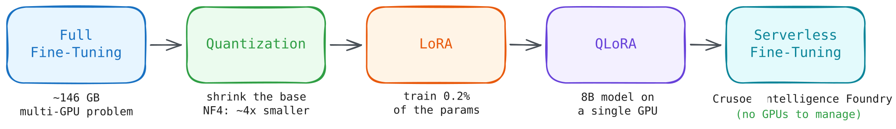
</p>


- First, we'll do the **memory accounting** for full fine-tuning and see why it's a multi-GPU problem (and connect it back to what we learned in the distributed training post).
- Then we'll shrink the model itself with **quantization**, writing an 8-bit quantizer by hand before we trust a library to do it on our behalf.
- Next, we'll build **LoRA (Low-Rank Adaptation)** from scratch in PyTorch, train it, and *prove* mathematically with SVD (Singular Value Decomposition) that the update really is low-rank.
- We'll combine the two ideas into **QLoRA** and fine-tune a real model end to end with Hugging Face `peft`.
- And finally, we'll put all of this understanding to work on a real project: fine-tuning **Qwen3-8B into a PII redaction engine** using **Crusoe's Serverless Fine-Tuning**, deploying it, and we will compare it to a general-purpose **70B** model on the same task.

All the code in this post lives in this repo: [here](https://github.com/debnsuma/fine-tuning-lora). You can run the first two notebooks on any single NVIDIA GPU, and the final project runs on Crusoe's serverless platform (we'll see how later).

::: {.callout-note title="Prerequisites"}
This post is designed to be self-contained, but it helps if you are familiar with:

- The basics of how a neural network trains (forward pass, loss, backward pass, optimizer step)
- What parameters, gradients, and optimizer states are, and roughly how Transformers are structured
- A little bit of matrix multiplication (we will go over some basics)

If you'd like a refresher on the memory side of training, the [static and dynamic memory sections](https://debnsuma.github.io/my-blog/posts/distributed-training-from-scratch/#bottlenecks-in-single-gpu-training) of my distributed training post cover it in detail.
:::

## Why Fine-Tune at All ?

Before we touch a single matrix, let's ask the obvious question: with models as capable as they are today, why would we fine-tune at all ? We have prompting, and we have RAG. Aren't those enough ?

They often are! A good way to think about it:

| Approach | What it changes | Best for |
|:---|:---|:---|
| **Prompting** | Nothing, we just ask nicely | Quick experiments, general tasks |
| **RAG** | What the model *sees* (context) | Injecting fresh or private *knowledge* |
| **Fine-tuning** | What the model *is* (weights) | Teaching a consistent *behavior*, format, or style |

The rule of thumb I find most useful: **RAG changes what the model knows, fine-tuning changes how the model behaves.** If our problem is "the model doesn't know about our internal documents", that's RAG. If our problem is "the model won't reliably produce this exact structured output, in this exact style, every single time", that's fine-tuning. And as we'll see at the very end of this post, a small fine-tuned model can beat a model **~9x its size** on exactly this kind of behavioral task.

Fine-tuning itself comes in a few flavors, depending on what signal we train on:

::: {.text-center}
```{mermaid}
%%| fig-width: 6.5
%%{init: {"theme": "base", "themeVariables": {"fontFamily": "sans-serif", "lineColor": "#868e96"}}}%%
flowchart TD
    A(["Pre-training<br/>trillions of tokens"]) --> B("Base model")
    B --> C("<b>Supervised / instruction</b><br/><b>fine-tuning (SFT)</b><br/>this post!")
    B -.-> D("Continued pre-training<br/>(domain adaptation)")
    C --> E("Preference tuning<br/>(DPO / RLHF)")
    C ==> F(["Assistant / task model"])
    E ==> F
    classDef blue fill:#e7f5ff,stroke:#1971c2,stroke-width:2px,color:#1971c2
    classDef green fill:#ebfbee,stroke:#2f9e44,stroke-width:3px,color:#2f9e44
    classDef gray fill:#f8f9fa,stroke:#adb5bd,stroke-width:2px,color:#868e96
    classDef violet fill:#f3f0ff,stroke:#6741d9,stroke-width:2px,color:#6741d9
    classDef teal fill:#e3fafc,stroke:#0c8599,stroke-width:3px,color:#0c8599
    class A,B blue
    class C green
    class D gray
    class E violet
    class F teal
```
:::

In this post we'll focus on **supervised fine-tuning (SFT)**: we show the model pairs of *(prompt, desired response)* and nudge its weights so that the desired response becomes more likely. The training loop is exactly the one we know, next-token prediction with cross-entropy loss, just on our curated examples instead of the open internet:

<p align="center">
  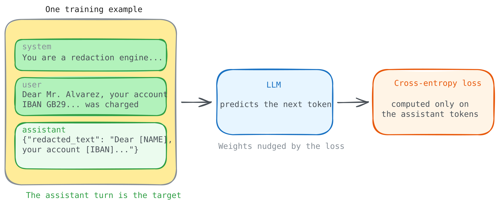
</p>

The *algorithm* is nothing new. The problem, as always, is memory.

## The Real Cost of Full Fine-Tuning

Let's do the same exercise we did in the [distributed training post](https://debnsuma.github.io/my-blog/posts/distributed-training-from-scratch/#static-memory), but for fine-tuning a modern 8B model, say [Qwen3-8B](https://huggingface.co/Qwen/Qwen3-8B). Here, $\Psi$ is the number of parameters, and with standard **mixed-precision training + Adam**, every parameter costs us:

$$
\mathcal{M}_{\text{static}} = \underbrace{2\Psi}_{\text{weights (BF16)}} + \underbrace{2\Psi}_{\text{gradients (BF16)}} + \underbrace{4\Psi + 4\Psi + 4\Psi}_{\text{optimizer states (FP32 master + momentum + variance)}} = 16\Psi
$$

Where:

- $2\Psi$: the model weights in BF16 (2 bytes per parameter)
- $2\Psi$: one gradient per parameter, also BF16
- $12\Psi$: optimizer states, `Adam` keeps three FP32 tensors per parameter (a master copy of the weights, the first moment for momentum, and the second moment for variance), at 4 bytes each

For `Qwen3-8B`, where $\Psi = 8 \times 10^9$:

| Component | Precision | Size |
|:---|:---:|---:|
| **Model weights** | BF16 | 16 GB |
| **Gradients** | BF16 | 16 GB |
| **Optimizer states** | FP32 | 96 GB |
| **Activations** (with checkpointing) | BF16 | ~18 GB |
| **Total** | | **~146 GB** |

<p align="center">
  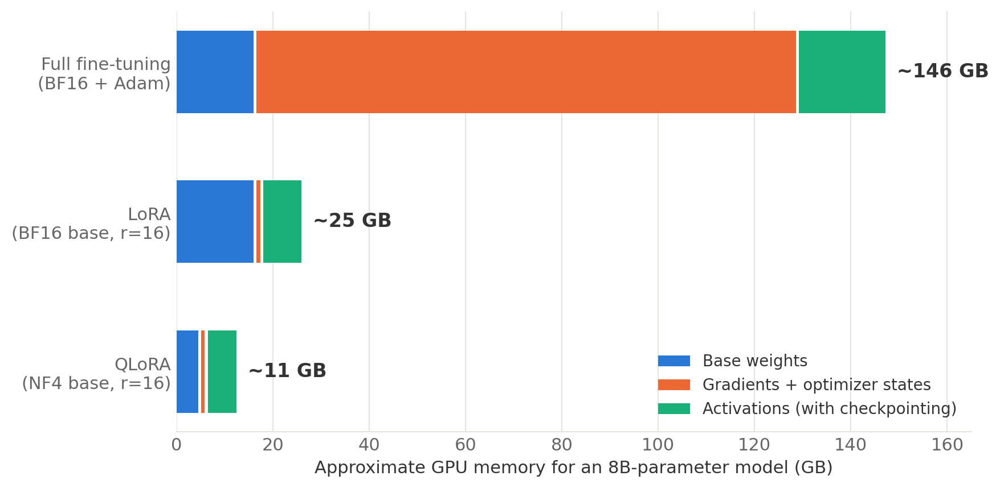
</p>

Now, this is really bad. An 80 GB H100 cannot even hold the *optimizer states*, let alone the rest. To fully fine-tune this "small" 8B model, we'd need some form of distributed training (from the [last post](https://debnsuma.github.io/my-blog/posts/distributed-training-from-scratch/#bottlenecks-in-single-gpu-training)): multiple GPUs, sharding, collective communication, the works.

::: {.callout-note}
The **weights themselves are only ~11% of the bill**. The other ~89% is *training overhead*, gradients, optimizer states, and activations. We're paying a 9x tax on top of the thing we actually care about.
:::

And here's the thing: that giant orange block in the chart above exists to update **all 8 billion parameters**. But do we *need* to update all of them ? This single question splits into two ideas, and they map directly onto the next two sections:

1. **Can we make the frozen part smaller ?** → That's `quantization` (fewer bits per parameter).
2. **Can we make the trainable part smaller ?** → That's `LoRA` (fewer trainable parameters).

Let's take them one at a time, building each from scratch before reaching for a library.

# Quantization: Doing More with Fewer Bits

Our first lever is to shrink the memory cost of every parameter we keep. To do that, we need to briefly look at how numbers are actually stored in a computer, and in a GPU in particular.

## How Numbers Live in Memory

Every parameter in our model is a `floating-point` number, and a `floating-point` number is just a fixed budget of bits split three ways: 

- **sign** (*positive* or *negative*), 
- **exponent** (the *range*, how big or small the number can get), and 
- **mantissa** (the *precision*, how finely we can distinguish nearby numbers).

<p align="center">
  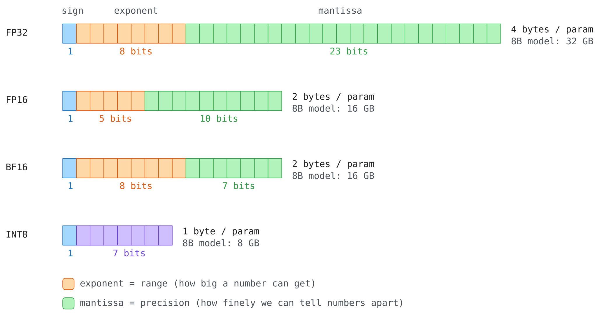
</p>

The three formats we meet in training differ only in how they spend this budget:

| Format | Bits | Exponent | Mantissa | Max value | Personality |
|:---|:---:|:---:|:---:|---:|:---|
| **FP32** | 32 | 8 | 23 | ~3.4e38 | The gold standard, big range *and* fine precision |
| **FP16** | 16 | 5 | 10 | **65,504** | Precise but *fragile*, tiny range |
| **BF16** | 16 | 8 | 7 | ~3.4e38 | FP32's range, chunky precision |

: {tbl-colwidths="[12,7,12,12,15,42]"}

That FP16 max value of **65,504** is not a footnote, it's a landmine.

```python
x = torch.tensor(60000.0, dtype=torch.float16)
print(x * 2)          # 120000 > 65504, past FP16's ceiling
```

**Output:**

```bash
tensor(inf, dtype=torch.float16)
```
Now try the same with BF16:

```python
x = torch.tensor(60000.0, dtype=torch.bfloat16)
print(x * 2)          #  BF16 has FP32's exponent range
```

**Output:**

```bash
tensor(119808., dtype=torch.bfloat16)
```
Wait, 60000 × 2 is 120000, so where did **119808** come from ? This one number demonstrates both sides of the trade. With only 7 mantissa bits, BF16 can't represent 60000 exactly: the nearest values it *can* store at that magnitude are 256 apart, so 60000 gets rounded down to 59904 the moment we create the tensor. Doubling that gives 119808. So BF16 survived the multiplication that killed FP16 (range), but it couldn't even hold our input exactly (precision).

And that's precisely the trade we want for training. FP16 silently overflows to `inf`, and one `inf` in a forward pass poisons everything downstream (this is exactly why FP16 training needs `loss scaling`, while BF16 mostly doesn't). A rounding error of 96 in 60000, on the other hand, is the kind of small, well-behaved noise neural networks shrug off. This is why **BF16 has become the default training dtype** on modern GPUs, it trades precision we can usually afford to lose for range we absolutely cannot.

::: {.callout-note title="Mixed precision is NOT quantization"}
It's easy to conflate the two, both involve "using fewer bits". **Mixed precision** (`torch.autocast`) keeps the weights in FP32 but runs the math in BF16 where it's safe, it's a speed optimization. We can verify this ourselves:

```python
import time
import torch.nn as nn

class TinyModel(nn.Module):
    def __init__(self):
        super().__init__()
        self.a = nn.Linear(2000, 2000)
        self.b = nn.Linear(2000, 2000)

    def forward(self, x):
        return self.b(self.a(x))

def timeit_forward(model, x, n=200):
    torch.cuda.synchronize()
    start = time.time()
    for _ in range(n):
        model(x)
    torch.cuda.synchronize()
    return (time.time() - start) / n * 1e6

model = TinyModel().to("cuda")                      # weights stay FP32 the whole time
x = torch.randn(2000, 2000, device="cuda")

print(f"Plain FP32 forward pass: {timeit_forward(model, x):.0f} microseconds")

with torch.autocast(device_type="cuda", dtype=torch.bfloat16):
    print(f"FP32 model under BF16 autocast: {timeit_forward(model, x):.0f} microseconds")

print(f"Model weights are still: {model.a.weight.dtype}")
```

**Output:**

```bash
Plain FP32 forward pass:        1645 microseconds
FP32 model under BF16 autocast:  996 microseconds
Model weights are still:        torch.float32
```

The weights never changed, only the compute did. **Quantization**, which we do next, changes the *storage format of the weights themselves*, it's a *memory* optimization. LoRA fine-tuning will end up using both.
:::

## What Quantization Actually Does

The core idea of quantization is simple: **snap every weight to the nearest point on a coarse grid, and remember the grid.**

<p align="center">
  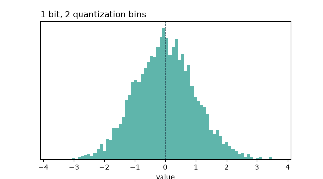
</p>

Let's build the standard **absmax INT8** quantizer by hand. An INT8 holds integers from $-128$ to $127$; we use the symmetric range [$-127$, $127$] so one positive scale covers both sides. The recipe: find the biggest weight (in absolute value), stretch it to 127, and scale everything else proportionally:

$$
\text{scale} = \frac{\max(|W|)}{127}, \qquad W_{\text{int8}} = \text{round}\left(\frac{W}{\text{scale}}\right)
$$

Where:

- $\max(|W|)$: the largest magnitude in the tensor (the "loudest" weight)
- $\text{scale}$: the single FP32 number we must remember to undo the mapping
- $W_{\text{int8}}$: the weights, now 1 byte each instead of 4

Let's run it on a real weight matrix and check the damage:

```python
def quantize_absmax_int8(x):
    scale = x.abs().max() / 127
    q = torch.clamp(torch.round(x / scale), -127, 127).to(torch.int8)
    return q, scale

def dequantize(q, scale):
    return q.to(torch.float32) * scale

weight = torch.randn(768, 768)
q, scale = quantize_absmax_int8(weight)
restored = dequantize(q, scale)

error = (weight - restored).pow(2).mean().item()
print("Original size (in bytes):", weight.numel() * weight.element_size())
print("Quantized size (in bytes):", q.numel() * q.element_size())
print("Mean Squared Error:", error)
```

**Output:**

```bash
Original size (in bytes):  2359296
Quantized size (in bytes): 589824
Mean Squared Error:        0.00011198947322554886
```

**4x smaller, with an error in the 4th decimal place.** The weights we get back are not identical, quantization is lossy, we literally threw away bits, but neural networks turn out to be remarkably tolerant of this kind of uniform, small noise.

## The Outlier Problem

The absmax scheme has one structural weakness: the scale is computed from the **single largest magnitude** in the tensor. If one row of the matrix is much larger than the rest, that one row forces the scale up for every other value too, and the resolution available to the majority of the weights collapses.

This matters because real transformer weight matrices contain exactly this kind of outlier, systematically: [Dettmers et al., 2022](https://arxiv.org/abs/2208.07339) found that a small number of feature dimensions in large models carry disproportionately large values, and built `LLM.int8()` around that observation.

We can measure the effect directly. Let's take our weight matrix, scale one row by 50x to simulate an outlier channel, and quantize it two ways:

a) with a single scale for the whole tensor (`per-tensor`)
b) with a separate scale per row (`per-channel`)

```python
def quantize_per_channel(x):
    scale = x.abs().amax(dim=1, keepdim=True) / 127
    q = torch.clamp(torch.round(x / scale), -127, 127).to(torch.int8)
    return q, scale

def dequantize_per_channel(q, scale):
    return q.to(torch.float32) * scale

weight_with_outlier = weight.clone()
weight_with_outlier[3] *= 50          # one row now behaves like an outlier channel

q_tensor, scale_tensor = quantize_absmax_int8(weight_with_outlier)
q_channel, scale_channel = quantize_per_channel(weight_with_outlier)

error_tensor = (weight_with_outlier - dequantize(q_tensor, scale_tensor)).pow(2).mean().item()
error_channel = (weight_with_outlier - dequantize_per_channel(q_channel, scale_channel)).pow(2).mean().item()

print("per tensor scale, mean squared error:", error_tensor)
print("per channel scale, mean squared error:", error_channel)
```

**Output:**

```bash
per tensor scale, mean squared error: 0.21627412736415863
per channel scale, mean squared error: 0.00033763001556508243
```

<p align="center">
  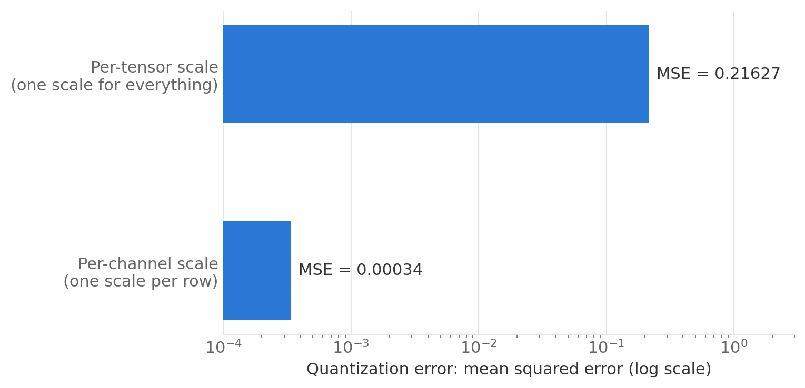
</p>

One outlier row barely affects the per-channel result, because that row gets its own scale, but it inflates the error for every other row under a single per-tensor scale, by **~640x** here. This is why production quantization schemes use per-channel or per-block scales (one scale per small group of values) instead of one scale for an entire weight matrix: an outlier can then only affect its own block.

## Going to 4 Bits: NF4

INT8 gave us 4x over FP32. Can we be greedier and go to **4 bits**, just **16 distinct values** per weight ? With 16 levels, where we place them suddenly matters a lot. A grid that ignores the data distribution, whether uniform (INT4) or floating-point (FP4), wastes levels where almost no weights live.

But we know something about neural network weights: they are approximately **normally distributed**, most weights are near zero, few are large. The **NF4 (NormalFloat4)** format, introduced in the [QLoRA paper (Dettmers et al., 2023)](https://arxiv.org/abs/2305.14314), places its 16 levels at the quantiles of a Gaussian, so each bin between levels catches an equal share of the weights: dense levels near zero where the crowd is, sparse levels in the tails:

<p align="center">
  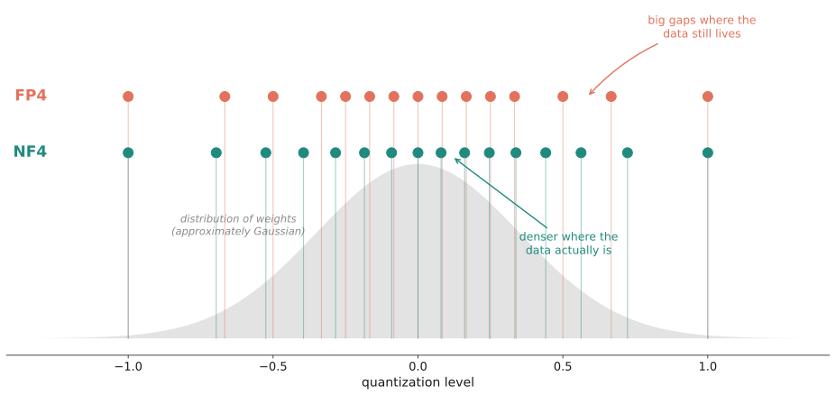
</p>

::: {.callout-tip title="Double Quantization: compressing the compression"}
Block-wise quantization has a hidden cost: every block of 64 weights needs its own FP32 scale, that's $32/64 = 0.5$ extra bits per parameter. The QLoRA authors' fix is delightfully recursive: **quantize the scales themselves** (`double quantization`), saving about **0.4 bits per parameter**. When you have 8 billion parameters, 0.4 bits each is ~400 MB, real money.
:::

## Quantizing a Real Model

In practice we don't write these kernels ourselves: [bitsandbytes](https://github.com/bitsandbytes-foundation/bitsandbytes) implements block-wise NF4 quantization (including double quantization) and integrates directly with Hugging Face `transformers`. Loading a model in NF4 is a single config object, and this exact config is the one we'll reuse for QLoRA later, so it's worth reading line by line. Let's load our test model, [Qwen2.5-0.5B](https://huggingface.co/Qwen/Qwen2.5-0.5B), both ways and measure what we saved:


```python
import torch
from transformers import AutoModelForCausalLM, BitsAndBytesConfig

BASE_MODEL = "Qwen/Qwen2.5-0.5B"

model_bf16 = AutoModelForCausalLM.from_pretrained(BASE_MODEL, dtype=torch.bfloat16).to("cuda")
memory_bf16 = torch.cuda.memory_allocated() / 1e6
print(f"BF16 memory used: {memory_bf16:.0f} MB")

del model_bf16
torch.cuda.empty_cache()

bnb_config = BitsAndBytesConfig(
    load_in_4bit=True,                      # 1. store weights in 4-bit
    bnb_4bit_quant_type="nf4",              # 2. use NF4, not FP4 (default is fp4!)
    bnb_4bit_use_double_quant=True,         # 3. quantize the quantization constants
    bnb_4bit_compute_dtype=torch.bfloat16,  # 4. dequantize to BF16 for the actual math
)

model_4bit = AutoModelForCausalLM.from_pretrained(
    BASE_MODEL,
    quantization_config=bnb_config,
    dtype=torch.bfloat16,          # dtype for the layers that do NOT get quantized
    device_map={"": 0},
)
memory_4bit = torch.cuda.memory_allocated() / 1e6

print(f"4 bit memory used: {memory_4bit:.0f} MB")
print(f"Reduction: {memory_bf16 / memory_4bit:.2f}x")
```

**Output:**

```
BF16 memory used: 1453 MB
4 bit memory used: 643 MB
Reduction: 2.26x
```

The most important line in the `bnb_config` is `bnb_4bit_compute_dtype=torch.bfloat16`. 4-bit is a **storage** format, not a compute format, no GPU multiplies NF4 numbers directly. Each layer dequantizes its weights to BF16 on the fly, does the matmul in BF16, and throws the BF16 copy away. We pay some compute (typically a 10–30% slowdown) to save a lot of memory.

::: {.callout-note title="Wait, why only 2x and not 4x ?"}
Good catch! If we peek inside, only the `nn.Linear` layers became 4-bit:

```python
print(model_4bit.model.layers[0].self_attn.q_proj)
```

**Output:**
```bash
Linear4bit(in_features=896, out_features=896, bias=True)
```

The embedding table and output head stay in BF16, and on a *small* 0.5B model those make up a big share of the parameters. On an 8B+ model, linear layers dominate and the reduction gets much closer to the ideal ~4x. A nice reminder that memory math always depends on the *shape* of the model, not just its size.
:::

So we can now store the linear layers, the bulk of any large model, in a quarter of the memory. But storage was only half the bill, if we fine-tune this model the old way, the gradients and optimizer states come roaring back at full size. Fewer *bits* per parameter is not enough. We need fewer *trainable parameters*. Enter LoRA.

# LoRA: The Low-Rank Idea

Now that we have some intuition for quantization, we've handled what we store. Time to go after the bigger prize, what we train, and that brings us to LoRA, the core topic of this post. We'll start with the odd empirical discovery that made it thinkable in the first place, derive the method step by step, and then build, train, and dissect an adapter of our own, until nothing about the `peft` library feels like magic anymore.

## A Strange Discovery: Intrinsic Dimensionality

LoRA didn't fall out of the sky. It grew out of a genuinely weird empirical discovery about neural networks.

In 2018, [Li et al.](https://arxiv.org/abs/1804.08838) tried something odd: instead of training a network in its full parameter space, they froze the network and only allowed updates inside a small *random* subspace of dimension $d$. Then they asked: how big does $d$ need to be before the network trains almost as well as normal ? The answer was shockingly small, they called it the **intrinsic dimension** of the task.

Two years later, [Aghajanyan et al.](https://arxiv.org/abs/2012.13255) ran the same experiment on *fine-tuning* pretrained language models. They show that, for many natural language understanding (NLU) tasks, you can recover most of full fine-tuning performance while optimizing in a space with only hundreds to low thousands of degrees of freedom, even if the model has hundreds of millions of trainable weights. They concluded that fine-tuning updates behave like they live in a small subspace, and that subspace tends to shrink as models scale. 

<p align="center">
  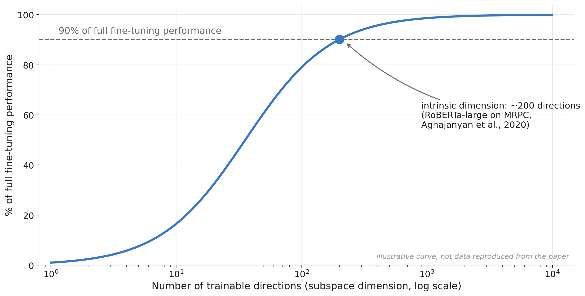
</p>

And here is the real data from the paper, two tasks, four models, accuracy against subspace dimension $d$, where each dotted horizontal line marks 90% of that model's full fine-tuning performance:

<p align="center">
  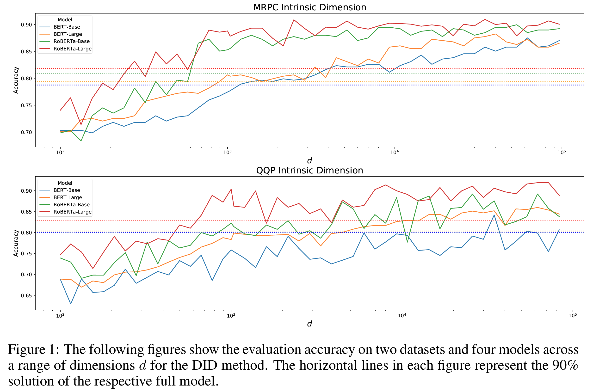
</p>
<p align="center"><em>Figure 1 from <a href="https://arxiv.org/abs/2012.13255">Aghajanyan et al., 2020</a></em></p>

::: {.callout-note}
Look at where each curve crosses its dotted line in the figure above: RoBERTa-Large (red) gets there at a far smaller $d$ than BERT-Base (blue). That's the part that still amazes me: **the bigger the pretrained model, the *lower* its intrinsic dimension.** Pre-training doesn't just teach the model facts, it builds such good general-purpose features that adapting to a new task becomes a *simpler* problem, not a harder one. The 8B model isn't 16x harder to fine-tune than a 0.5B model, in this sense, it's *easier*.
:::

So fine-tuning lives in a low-dimensional subspace. The obvious next question: instead of updating a giant weight matrix and hoping the update is simple, can we *force* the update to be simple by construction ?

## The LoRA Hypothesis

That's exactly what [LoRA (Hu et al., 2021)](https://arxiv.org/abs/2106.09685) does. To see how, let's look at what fine-tuning fundamentally *is*. Every gradient descent step nudges the weights:

$$
W \leftarrow W - \eta \frac{\partial J}{\partial W}
$$

That subtracted term is a weight update. Accumulate every step of a fine-tuning run, and we can always write the final weights as the pretrained weights plus one update matrix:

$$
W' = W_0 + \Delta W
$$

Now comes the shift in perspective. We don't have to fold $\Delta W$ *into* $W_0$ at all, matrix multiplication distributes over addition, so the pretrained weights can stay untouched while the update rides alongside as its own matrix:

$$
(W_0 + \Delta W)x = W_0 x + \Delta W x
$$

By itself, this rearrangement changes nothing, $\Delta W$ still has the full $d \times k$ shape, and a second matrix as large as the first is no cheaper to train or store. But it isolates the thing we actually need to learn ($\Delta W$) from the thing we already have ($W_0$), and that's the opening the intrinsic dimensionality result walks through. Full fine-tuning lets $\Delta W$ be *anything*, a full $d \times k$ matrix. LoRA's hypothesis: since the change we need is intrinsically low-dimensional, let's constrain $\Delta W$ to be a **low-rank** matrix, the product of two thin matrices:

$$
W' = W_0 + BA, \qquad B \in \mathbb{R}^{d \times r},\; A \in \mathbb{R}^{r \times k},\; r \ll \min(d, k)
$$

Where:

- $W_0$: the pretrained weights, completely **frozen** (no gradients, no optimizer states!)
- $A$: a thin matrix that projects the input *down* into $r$ dimensions
- $B$: a thin matrix that projects back *up* to the output dimension
- $r$: the **rank**, our knob for how expressive the update can be

<p align="center">
  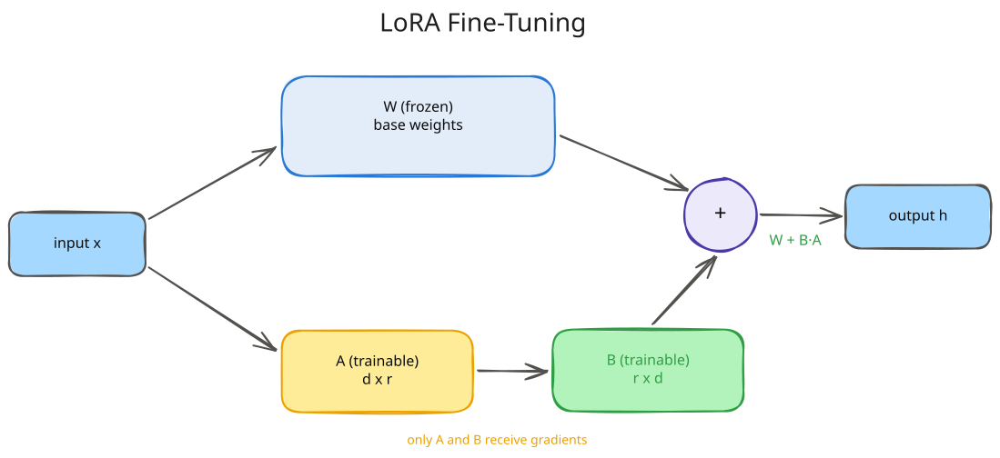
</p>

Why is this such a big deal ? Let's count parameters for one typical attention projection in an 8B-class model, a $4096 \times 4096$ matrix:

| What we train | Parameters | Share |
|:---|---:|---:|
| Full $\Delta W$ ($4096 \times 4096$) | 16,777,216 | 100% |
| LoRA, $r=64$ | 524,288 | 3.1% |
| LoRA, $r=8$ ($4096 \times 8 + 8 \times 4096$) | 65,536 | **0.39%** |
| LoRA, $r=1$ (one column + one row!) | 8,192 | 0.05% |

The parameter count went from $d \times k$ to $r \times (d + k)$, it now grows *linearly* with the matrix size instead of quadratically. And it's worth pausing on that last row: at $r=1$, $A$ is literally a single row and $B$ a single column.

For one of GPT-3 175B's actual $12288 \times 12288$ attention projections (~151M parameters), $r=1$ means ~24.5K parameters, **~6100x smaller**, and as we'll see in a moment, the LoRA paper found that even rank 1 is surprisingly competitive. And remember from our memory math: gradients and optimizer states are proportional to *trainable* parameters. Shrink the trainable set by 250x, and Adam's 12-bytes-per-parameter tax shrinks by 250x too. 

That giant orange block from our memory chart, the 112 GB of gradients and optimizer states, almost vanishes.

## Scaling and Initialization

Two small details in the LoRA recipe carry a lot of weight (pun intended). The actual forward pass is:

$$
h = W_0 x + \frac{\alpha}{r} \, BAx
$$

Where:

- $\frac{\alpha}{r}$: a fixed scaling factor; $\alpha$ is a hyperparameter (a common heuristic is $\alpha = 2r$)
- Dividing by $r$ keeps the update's magnitude roughly stable if we change the rank, so $\alpha$ and the learning rate don't have to be re-tuned for every $r$ (consistent with [Schulman et al., 2025](https://thinkingmachines.ai/blog/lora/), who find the optimal learning rate shifts less than 2x across ranks 4 to 512)

And the initialization is sneaky-clever:

- $A$ starts as **small random Gaussian** noise
- $B$ starts as **exactly zero**

Which means at step 0, $BA = 0$, and the model is *bit-for-bit identical* to the pretrained model. Fine-tuning starts from a perfect no-op and gradually grows a change. No cliff, no cold start, no risk of scrambling the model before the first gradient step.

Why not initialize *both* matrices to zero ? Because then nothing would ever train: the gradient of $A$ flows through $B$, so a zero $B$ means a zero gradient for $A$, forever. One of the two must start non-zero, and LoRA picks $A$. It doesn't matter that $A$ is full of random values, because $B$ is zero, so nothing $A$ produces reaches the output anyway. 

## Building LoRA from Scratch

Enough theory, let's build it. Here is a complete LoRA layer in plain PyTorch, no `peft`, no tricks (from [`02_lora_and_qlora.ipynb`](https://github.com/debnsuma/fine-tuning-lora/blob/main/01-into-lora-fine-tuning/02_lora_and_qlora.ipynb)). 

We'll wrap a $768 \times 768$ linear layer with a rank-8 adapter and count what's actually trainable:

```python
class LoRALinear(nn.Module):
    def __init__(self, base_linear, rank=4, alpha=8):
        super().__init__()
        self.base = base_linear
        self.base.weight.requires_grad_(False)           # 1. freeze the pretrained weights
        if self.base.bias is not None:
            self.base.bias.requires_grad_(False)

        in_features = base_linear.in_features
        out_features = base_linear.out_features
        self.scaling = alpha / rank                      # 2. the alpha/r scaling factor

        # 3. A: small random init, B: zeros  =>  BA = 0 at step 0
        self.lora_A = nn.Parameter(torch.randn(rank, in_features) * 0.01)
        self.lora_B = nn.Parameter(torch.zeros(out_features, rank))

    def forward(self, x):
        base_out = self.base(x)                          # 4. frozen path
        lora_out = (x @ self.lora_A.T) @ self.lora_B.T   # 5. low-rank detour
        return base_out + self.scaling * lora_out        # 6. sum the two paths

base_layer = nn.Linear(768, 768)
lora_layer = LoRALinear(base_layer, rank=8, alpha=16)

total_params = sum(p.numel() for p in lora_layer.parameters())
trainable_params = sum(p.numel() for p in lora_layer.parameters() if p.requires_grad)

print("total parameters:", total_params)
print("trainable parameters:", trainable_params)
print("trainable share:", round(trainable_params / total_params * 100, 2), "percent")
```

**Output:**

```bash
total parameters: 602880
trainable parameters: 12288
trainable share: 2.04 percent
```

That's the whole thing. And since `lora_B` starts at zero, the wrapped layer should behave identically to the plain frozen layer before any training happens. Check that directly:

```python
x = torch.randn(4, 768)
with torch.no_grad():
    difference = (lora_layer(x) - base_layer(x)).abs().max()

print("max difference before training:", difference.item())
```

**Output:**

```bash
max difference before training: 0.0
```

Two things worth noticing here:

- **We didn't *replace* the layer.** We added a parallel low-rank detour around it, the frozen path still does all the heavy lifting.
- That `max difference before training: 0.0` is the zero-init guarantee we just discussed, our wrapped layer is *provably* identical to the original before training starts. Not approximately identical, *exactly*: $B$ is true zeros, so the detour contributes nothing at all.

## Training Our Adapter

Now let's train it. We'll set up a toy problem where we *know* the answer: create a "target" layer whose weights differ from our base layer by a **rank-4** perturbation, and see if our rank-8 adapter (which has more than enough capacity) can learn that difference. Notice that the optimizer receives only $A$ and $B$, the base layer never sees it:

```python
torch.manual_seed(0)

# The task's ideal update really is low rank: a rank 4 change on top of the
# frozen weight, which the rank 8 adapter has more than enough capacity for.
true_rank = 4
low_rank_update = torch.randn(768, true_rank) @ torch.randn(true_rank, 768) * 0.1

target_layer = nn.Linear(768, 768)
with torch.no_grad():
    target_layer.weight.copy_(base_layer.weight + low_rank_update)
    target_layer.bias.copy_(base_layer.bias)

optimizer = torch.optim.Adam([lora_layer.lora_A, lora_layer.lora_B], lr=1e-2)

losses = []
for step in range(300):
    x = torch.randn(32, 768)
    target = target_layer(x).detach()

    prediction = lora_layer(x)
    loss = ((prediction - target) ** 2).mean()

    optimizer.zero_grad()
    loss.backward()
    optimizer.step()

    losses.append(loss.item())
    if step % 50 == 0:
        print(f"step {step}, loss {loss.item():.4f}")
```

**Output:**

```bash
step 0, loss 23.9552
step 50, loss 8.6610
step 100, loss 1.4803
step 150, loss 0.3001
step 200, loss 0.0901
step 250, loss 0.0301
```

<p align="center">
  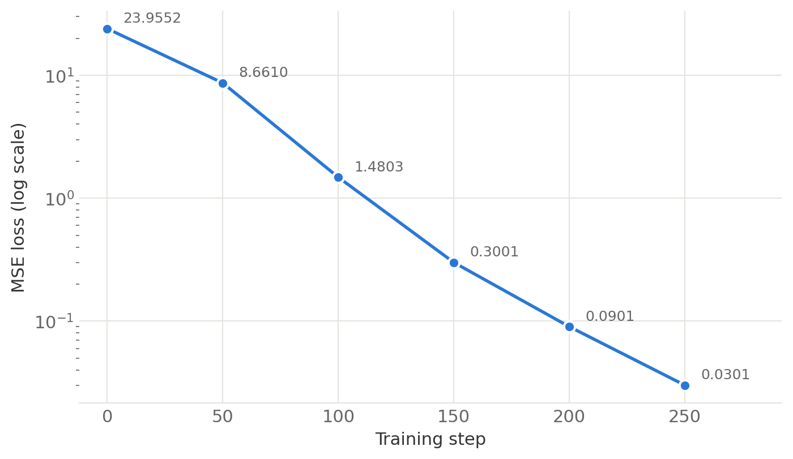
</p>

And on data the adapter has never seen:

```python
x_eval = torch.randn(256, 768)
with torch.no_grad():
    eval_loss = ((lora_layer(x_eval) - target_layer(x_eval)) ** 2).mean()

print("evaluation loss on unseen data:", eval_loss.item())
```

**Output:**

```bash
evaluation loss on unseen data: 0.01526715513318777
```

The loss falls by **three orders of magnitude**, and generalizes to unseen inputs, while 98% of the parameters never moved.

## Core Principle: Singular Value Decomposition (SVD)

How do we *know* the learned update is really low-rank ? The tool for answering that is the **Singular Value Decomposition (SVD)**, and it's worth a short detour, because it is the mathematical backbone of everything low-rank in this post. Any matrix $M$ can be factored as:

$$
M = U \Sigma V^T
$$

Where:

- $U$ and $V$: orthogonal matrices, they reorient space but don't stretch it
- $\Sigma$: a diagonal matrix whose entries, sorted largest to smallest, are the **singular values**

The singular values have a concrete geometric meaning: each one tells us how much the matrix stretches space along one particular direction. A singular value of 40 means some direction gets stretched 40x when we multiply by $M$. A singular value of 0 means inputs along that direction get crushed to nothing, they contribute no information to the output. A matrix's **rank** is exactly the count of non-zero singular values, the number of directions that survive.

Now, `lora_B @ lora_A` is a $768 \times 768$ matrix, the same shape as a full weight update, but it was built from a $(768, 8)$ and an $(8, 768)$ matrix. Multiplying through two skinny matrices like that can only ever produce 8 independent directions, no matter how large the resulting matrix looks, so it cannot have rank higher than 8. [`torch.linalg.matrix_rank`](https://docs.pytorch.org/docs/stable/generated/torch.linalg.matrix_rank.html) confirms this directly by counting singular values above a small threshold:

```python
with torch.no_grad():
    composite_update = lora_layer.lora_B @ lora_layer.lora_A

rank = torch.linalg.matrix_rank(composite_update)
singular_values = torch.linalg.svdvals(composite_update)   # used for the plot below

print("rank of the trained update:", rank.item())
```

**Output:**

```bash
rank of the trained update: 8
```

And plotting the singular values shows why: at most 8 of them can be meaningfully non-zero, everything else has nowhere to come from and gets crushed to numerical noise.

<p align="center">
  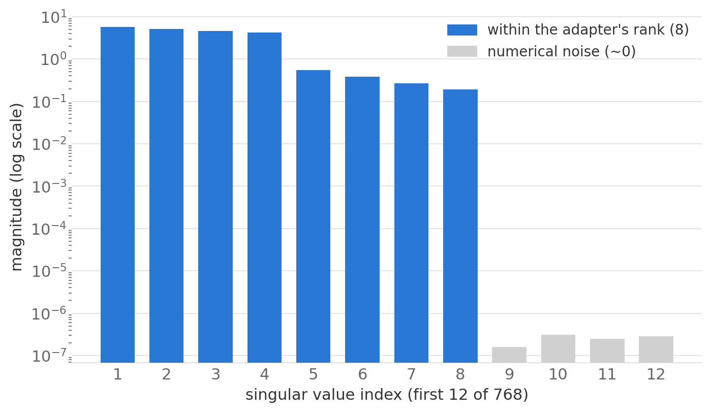
</p>

Watching this evolve *during* training makes the point concrete: the spectrum starts flat at zero (nothing learned yet) and, step by step, exactly **four** singular values pull away from the rest, the true rank of the update this particular toy task needed. The other four stay small (unused adapter capacity), and everything beyond the adapter's rank is numerical noise.

<p align="center">
  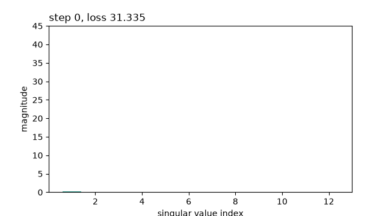
</p>

::: {.callout-tip title="This is the magic of LoRA"}
We didn't approximate the update *after* training (like classical SVD compression would). We **constrained the search space before training**, and gradient descent found the best answer *inside the box*. The intrinsic dimensionality research is why the box is almost always big enough.
:::

## Patching a Real Model

Our toy layer works. Scaling up to a real LLM is just a tree walk: find every module whose name we target, here the four attention projections, and swap in a `LoRALinear`. The full cell (loading [Qwen2.5-0.5B](https://huggingface.co/Qwen/Qwen2.5-0.5B) in BF16, freezing every parameter, and verifying the outputs) is in the [notebook](https://github.com/debnsuma/fine-tuning-lora/blob/main/01-into-lora-fine-tuning/02_lora_and_qlora.ipynb), the interesting part is just this:

```python
def apply_lora(model, target_names, rank=8, alpha=16):
    for module in model.modules():
        for child_name, child in list(module.named_children()):
            if child_name in target_names and isinstance(child, nn.Linear):
                setattr(module, child_name, LoRALinear(child, rank=rank, alpha=alpha))

apply_lora(model, target_names=["q_proj", "k_proj", "v_proj", "o_proj"], rank=8, alpha=16)
```

**Output:**

```bash
total parameters: 495114112
trainable parameters: 1081344
trainable share: 0.2184 percent
max logit difference after wrapping: 0.0
```

Read that `trainable parameters` line again: on a real 0.5B model, we are training **0.22% of the parameters**. And the last line is our zero-init guarantee scaled up, wrapping every attention layer in the model changed its outputs by exactly nothing. 

## Merging: The Free Lunch at Inference

One more property makes LoRA special among adapter methods. Because the detour is just an additive matrix, after training we can **fold it back into the base weights** with a single addition:

$$
W_{\text{merged}} = W_0 + \frac{\alpha}{r} BA
$$

```python
with torch.no_grad():
    merged_weight = base_layer.weight + lora_layer.scaling * (lora_layer.lora_B @ lora_layer.lora_A)

merged_layer = nn.Linear(768, 768)
with torch.no_grad():
    merged_layer.weight.copy_(merged_weight)
    merged_layer.bias.copy_(base_layer.bias)

x = torch.randn(4, 768)
with torch.no_grad():
    difference = (merged_layer(x) - lora_layer(x)).abs().max()

print("max difference between merged and adapter form:", difference.item())
```

**Output:**

```bash
max difference between merged and adapter form: 1.049041748046875e-05
```

The merged model is a plain `nn.Linear` again, same architecture, same speed, **zero extra inference latency**. Compare that with adapter methods that insert new layers (permanent inference tax) and you see why LoRA won.

And if we *don't* merge, we get a different superpower: the adapter is tiny and portable. The LoRA paper reports that for GPT-3 175B, a fine-tuning checkpoint shrinks from **~350 GB to ~35 MB**, a **10,000x** reduction.

To appreciate why this number changed the industry, put yourself in the shoes of anyone serving fine-tuned models for many teams or customers (we'll be on the customer side of exactly this arrangement in the finale). Without LoRA, every fine-tune is a complete private copy of the model, hundreds of gigabytes that must sit on disk, and ideally on warm GPUs, whether or not that fine-tune ever receives traffic. A thousand fine-tunes, a thousand copies. With LoRA, the picture inverts:

<p align="center">
  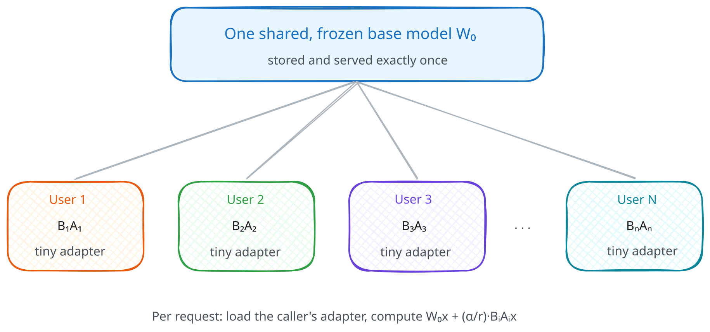
</p>

One central frozen $W_0$ serves everyone, and each customer owns only their tiny $(B_i, A_i)$ pair, typically tens to a couple hundred megabytes that cost almost nothing to store while idle. 

## Which Layers Should We Adapt ?

The original paper adapted only the attention query and value projections ($W_q$, $W_v$), and that recipe is still widely repeated. The evidence has moved on, and it's worth being blunt about it:

- The [QLoRA paper](https://arxiv.org/abs/2305.14314) found adapting **all linear layers** was needed to match full fine-tuning.
- [Thinking Machines' "LoRA Without Regret"](https://thinkingmachines.ai/blog/lora/) (2025) found **attention-only LoRA significantly underperforms**, even at matched parameter counts, while MLP-only performs about as well as MLP+attention.

Their training curves make the second point hard to argue with, on both a dense model and a sparse MoE, the attention-only run (red) sits clearly above everything else, while MLP-only is indistinguishable from adapting everything:

<p align="center">
  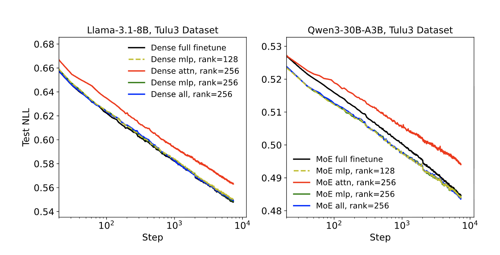
</p>
<p align="center"><em>Figure 4 from <a href="https://thinkingmachines.ai/blog/lora/">Schulman et al., 2025</a></em></p>

Interestingly, a related lesson, that adapting *more matrices at low rank* beats adapting *one matrix at high rank*, was hiding in the original paper all along. Here is a slice of its rank-sweep on GPT-3 (validation accuracy on WikiSQL, [Table 6 of Hu et al.](https://arxiv.org/abs/2106.09685)):

| Weight types adapted | $r=1$ | $r=8$ | $r=64$ |
|:---|:---:|:---:|:---:|
| $W_q$ only | 68.8 | 70.4 | 70.0 |
| $W_q, W_v$ | 73.4 | 73.8 | 73.5 |
| $W_q, W_k, W_v, W_o$ | **74.1** | 74.0 | 73.9 |


Compare the corners: adapting **all four attention matrices at rank 1** (74.1) beats adapting **$W_q$ alone at rank 64** (70.0) by a wide margin. Spreading a small parameter budget across *more* matrices wins over concentrating it in one expressive update. 

And notice how little rank matters once the coverage is right: on the two multi-matrix rows, $r=1$ is within noise of $r=64$, while on the $W_q$-only row rank still visibly helps, exactly what you'd expect if *which matrices you adapt*, not rank, is the binding constraint.

::: {.callout-important title="Critical Insight"}
`q_proj + v_proj only` is the *historical* recipe, not the *recommended* one. 

The modern default is simple: **adapt every linear layer** (in `peft`, `target_modules="all-linear"`). If you have to trim the budget, drop the attention adapters and keep the MLP ones, not the other way around, attention-only is the one configuration the evidence consistently argues against.
:::

## When LoRA Fails

There is no free lunch, so let's be honest about where the low-rank box is too small. [Biderman et al., 2024, "LoRA Learns Less and Forgets Less"](https://arxiv.org/abs/2405.09673) ran a careful head-to-head:

<p align="center">
  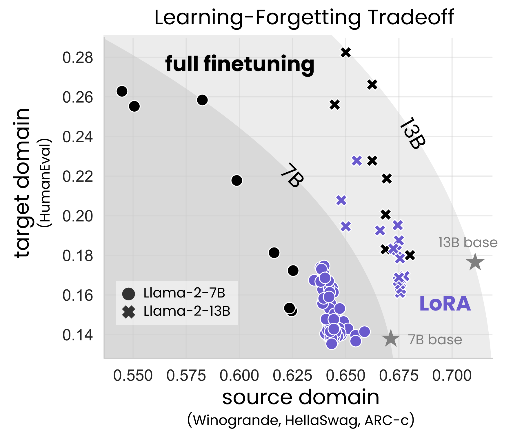
</p>
<p align="center"><em>Figure from <a href="https://arxiv.org/abs/2405.09673">Biderman et al., 2024</a></em></p>

Read it as a tradeoff frontier: up means more learned (target domain), right means more retained (source domain). Full fine-tuning's points climb high but drift left, LoRA's cluster hugs the right edge near the base models but stays low. 

The picture that emerges:

| Setting | What the paper found  |
|:---|:---|
| **Instruction tuning** (~100K examples) | LoRA ≈ full fine-tuning. This is the regime most of us live in. |
| **Continued pre-training** (~billions of tokens) | LoRA **substantially underperforms**: full fine-tuning's weight changes have 10–100x higher rank than any practical adapter can represent. |
| **Forgetting** | LoRA **forgets less** of the base model's abilities, the constraint that limits learning also acts as a regularizer. |

The mental model I like: LoRA is perfect for teaching a behavior (a format, a style, a task), and wrong for teaching a body of knowledge (a new language, a whole domain corpus). Behaviors are low-rank, knowledge is not.

# QLoRA: LoRA Meets Quantization

We now have two independent tricks:

- **Quantization** shrinks the *frozen* parameters (fewer bits each)
- **LoRA** shrinks the *trainable* parameters (fewer of them)

Notice they attack different parts of the memory bill, which means we can stack them. That stack has a name: **[QLoRA (Dettmers et al., 2023)](https://arxiv.org/abs/2305.14314)**.

## The Insight

Each lever keeps its own job. 

- `Quantization` handles the frozen base: store it in **NF4**, dequantize each layer to BF16 on the fly for compute. 
- `LoRA` handles the trainable part: adapters stay in **BF16**, small enough that their optimizer states are pocket change. 

The only new engineering is the seam between them: gradients must flow *through* the quantized frozen layers but only *into* the adapters.

<p align="center">
  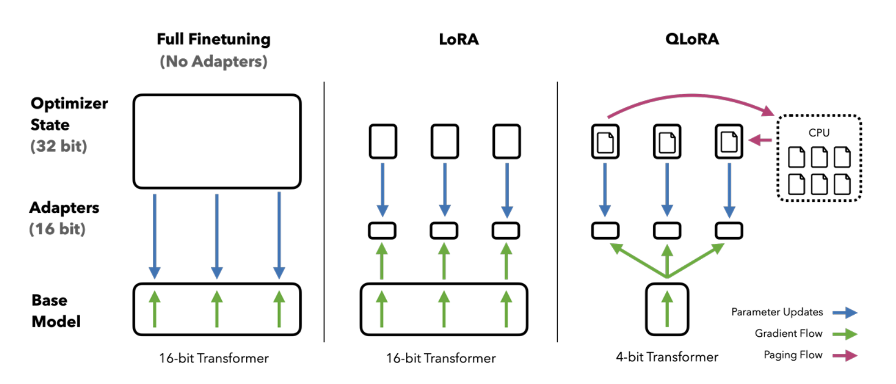
</p>
<p align="center"><em>Figure 1 from <a href="https://arxiv.org/abs/2305.14314">Dettmers et al., 2023</a></em></p>

The result made single-GPU history: the QLoRA authors fine-tuned **LLaMA-65B on a single 48 GB GPU**, a job that needs **~780 GB** the traditional way. 

But there is no free lunch here either, we pay the dequantize-on-the-fly compute tax (typically 10–30% slower per step than BF16 LoRA), and we accept the small NF4 rounding noise in the frozen base.

## From Scratch to `peft`: The Mapping

Everything we hand-built has a direct equivalent in the Hugging Face ecosystem, and because we built the internals ourselves, none of these are magic anymore. The adapter side lives in a library called [`peft`](https://huggingface.co/docs/peft/en/index) (Parameter-Efficient Fine-Tuning):

| What we built by hand | Library equivalent |
|:---|:---|
| `quantize_absmax_int8` / NF4 idea | `BitsAndBytesConfig(load_in_4bit=True, ...)` |
| `LoRALinear` + `apply_lora` | `peft.LoraConfig` + `get_peft_model` |
| Our toy `training loop` | `transformers.Trainer` |
| `W + scaling * (B @ A)` merge | `model.merge_and_unload()` |

Time to see the mapping in action. Let's fine-tune [Qwen2.5-0.5B](https://huggingface.co/Qwen/Qwen2.5-0.5B) on a slice of [OpenAssistant-Guanaco](https://huggingface.co/datasets/timdettmers/openassistant-guanaco) (300 train / 30 eval examples, deliberately tiny so it runs anywhere).

## Loading and Preparing

Step one, load the base in 4-bit, this is the *exact* `bnb_config` from the quantization section, reused verbatim. Step two, one new helper:

```python
from peft import prepare_model_for_kbit_training
from transformers import AutoModelForCausalLM, BitsAndBytesConfig

bnb_config = BitsAndBytesConfig(
    load_in_4bit=True,                      # 1. store weights in 4-bit
    bnb_4bit_quant_type="nf4",              # 2. use NF4, not FP4 (default is fp4!)
    bnb_4bit_use_double_quant=True,         # 3. quantize the quantization constants
    bnb_4bit_compute_dtype=torch.bfloat16,  # 4. dequantize to BF16 for the actual math
)

model = AutoModelForCausalLM.from_pretrained(
    BASE_MODEL,
    quantization_config=bnb_config,
    dtype=torch.bfloat16,          # dtype for the layers that do NOT get quantized
    device_map={"": 0},
)

model = prepare_model_for_kbit_training(
    model,
    use_gradient_checkpointing=True,
    gradient_checkpointing_kwargs={"use_reentrant": False},
)

trainable_before = sum(p.numel() for p in model.parameters() if p.requires_grad)
print("trainable parameters right after prepare_model_for_kbit_training:", trainable_before)
```

**Output:**

```bash
trainable parameters right after prepare_model_for_kbit_training: 0
```

This helper does the unglamorous safety work of training on a quantized base: freezes every quantized weight, casts the few remaining non-quantized bits (like layer norms) to FP32 for numerical stability, and enables gradient checkpointing, the activation-recomputation trick [we met in the distributed training post](https://debnsuma.github.io/my-blog/posts/distributed-training-from-scratch/#solution-1-activation-recomputation). 

Note that at this point **zero** parameters are trainable, the model is fully frozen, waiting for adapters.

## Attaching the Adapter

The model is frozen and waiting, so let's give it its adapters:

```python
from peft import LoraConfig, get_peft_model

lora_config = LoraConfig(
    r=8,                                                    # rank (same as our from-scratch run)
    lora_alpha=16,                                          # alpha = 2r heuristic
    target_modules=["q_proj", "k_proj", "v_proj", "o_proj"],
    lora_dropout=0.05,                                      # dropout on the adapter path only
    task_type="CAUSAL_LM",
)

model = get_peft_model(model, lora_config)
model.print_trainable_parameters()
```

**Output:**

```bash
trainable params: 1,081,344 || all params: 495,114,112 || trainable%: 0.2184
```

Look at that number. **1,081,344**, *exactly* the count we computed with our hand-rolled `apply_lora` a few sections ago, down to the last parameter. 

`peft` is doing precisely what we did, walking the module tree and wrapping the four attention projections with rank-8 adapters. This is my favorite moment in the whole post: the library stopped being a black box.

::: {.callout-note title="Where does `target_modules` come from ?"}
If you don't pass `target_modules`, `peft` looks up a per-architecture default:

```python
from peft.utils import TRANSFORMERS_MODELS_TO_LORA_TARGET_MODULES_MAPPING

print(TRANSFORMERS_MODELS_TO_LORA_TARGET_MODULES_MAPPING["qwen2"])
```

**Output:**

```bash
['q_proj', 'v_proj']
```
That's the *conservative 2021 recipe* (see [Which Layers Should We Adapt ?](#which-layers-should-we-adapt)). For real work, pass `target_modules="all-linear"` and let `peft` wrap every linear layer, including the MLP projections, which is where the capacity that matters lives.
:::

## Training

The training loop is the standard `Trainer`, and every argument in it is a concept we've already earned:

```python
from transformers import Trainer, TrainingArguments

training_args = TrainingArguments(
    output_dir="outputs/qlora-run",
    per_device_train_batch_size=4,
    gradient_accumulation_steps=2,   # effective batch = 8 
    num_train_epochs=1,
    learning_rate=2e-4,              # ~10x a full fine-tuning LR 
    logging_steps=5,
    eval_strategy="epoch",
    bf16=True,                       # compute dtype
)

trainer = Trainer(
    model=model,
    args=training_args,
    train_dataset=train_tokenized,
    eval_dataset=eval_tokenized,
)

result = trainer.train()
print(f"final training loss: {result.training_loss:.4f}")
```

**Output:**

```bash
final training loss: 5.8718
```

::: {.callout-note title="An honest caveat about this run"}
300 examples for one epoch is a *demonstration*, not a fine-tune. If you generate from this model before and after, the outputs are nearly identical.

Loss went down, behavior barely moved. Teaching a model something real takes thousands of examples, which is exactly what we'll do in the final project, where the same recipe, at 2,500 examples, produces a model that beats a 70B on its task.
:::

## Merging

And the final step, the same algebra as our from-scratch merge, one method call:

```python
merged_model = model.merge_and_unload()   # W' = W0 + (alpha/r) * BA, adapters folded in
```

**Output:**

```bash
UserWarning: Merge lora module to 4-bit linear may get different generations due to rounding errors.
```

That warning is worth reading, it's our whole post in one sentence :) 

Merging adds BF16 adapter weights into an NF4-quantized base, so the result must be re-quantized, and the rounding noise can slightly shift generations. In practice, for deployment you merge into a *full-precision* copy of the base weights instead, or skip merging entirely and serve base + adapter separately. 

## The Scoreboard

Time to close the loop we opened with the memory math. Read the table row by row and you can watch each lever land:

- **LoRA** wipes out the **Grads + Optimizer** column
- **Quantization** then shrinks the **Weights** column

And neither touches the other's work:


| Strategy | Weights | Grads + Optimizer | Approx. total (8B) | Fits on |
|:---|---:|---:|---:|:---|
| **Full fine-tuning** (BF16 + Adam) | 16 GB | 112 GB | **~146 GB** | multi-GPU only |
| **+ LoRA** (freeze base, r=16) | 16 GB | ~1 GB | **~25 GB** | one A100 40GB |
| **+ QLoRA** (NF4 base, r=16) | ~4.5 GB | ~1 GB | **~11 GB** | one consumer GPU! |

From "we need a cluster and FSDP" to "my desktop GPU can do it", with two ideas we built from scratch in an afternoon. 

# Introduction to Serverless Fine-Tuning with Crusoe

Now that we've learned the mechanics of LoRA and QLoRA and how they work under the hood, it's time to fine-tune a model that solves a real-world problem. 

In production, though, we may not want to manage all of that ourselves, the GPUs, the training run, the serving stack. It would be great to have a managed service handle the infrastructure so we can focus on the actual problem. 

That's where [Crusoe's serverless fine-tuning](https://www.crusoe.ai/cloud/serverless-fine-tuning) comes in: we can fine-tune open models for our domain or task without provisioning a single GPU, and once we're happy with the training results, deploy the model to a dedicated inference endpoint with [self-serve deployments](https://www.crusoe.ai/resources/blog/self-serve-deployments-dedicated-inference).

I recently joined Crusoe and worked on the serverless fine-tuning service as we built it, so I thought it would be great to share my experience and walk you through how to use it.

# Project: PII Redaction at Scale with Serverless Fine-Tuning

Let's now solve a real problem, with a real model, the way we'd do it in production. At a high level, this is what we'll do:

1. **Build a training set** from a public Hugging Face dataset
2. **Fine-tune Qwen3-8B with LoRA** on Crusoe Serverless Fine-Tuning
3. **Deploy the checkpoint** as a dedicated endpoint
4. **Measure it** against a general-purpose 70B model on entity-level F1

**The problem:** financial documents are full of PII, names, account numbers, addresses, SWIFT codes. We want a model that takes any document and returns strict JSON: the redacted text plus a list of every entity it found.

This is a *behavior* task (exact format, every time), which our mental model says is **exactly what LoRA is for**.

**The model:** [Qwen3-8B](https://huggingface.co/Qwen/Qwen3-8B), the 8B model whose memory bill we computed at the start of this post.

<p align="center">
  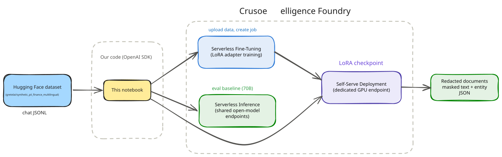
</p>

## The Dataset

We'll use [gretelai's synthetic_pii_finance_multilingual](https://huggingface.co/datasets/gretelai/synthetic_pii_finance_multilingual) dataset from Hugging Face: financial documents with labeled PII spans, fully synthetic, so no actual PII touches our training run.

The preparation script ([`prepare_dataset.py`](https://github.com/debnsuma/fine-tuning-lora/blob/main/02-serverless-fine-tuning-pii-redaction/data/prepare_dataset.py)) converts each document into a chat-format training example. Two functions do the real work:

```python
def redact(text, spans):
    # Replace right to left so earlier span offsets stay valid.
    for s in sorted(spans, key=lambda s: s["start"], reverse=True):
        text = text[: s["start"]] + f"[{s['label'].upper()}]" + text[s["end"] :]
    return text

def to_example(row):
    text = row["generated_text"]
    spans = json.loads(row["pii_spans"])
    target = {
        "redacted_text": redact(text, spans),
        "entities": [{"type": s["label"], "value": text[s["start"] : s["end"]]}
                     for s in sorted(spans, key=lambda s: s["start"])],
    }
    return {"messages": [
        {"role": "system", "content": SYSTEM_PROMPT},
        {"role": "user", "content": text},
        {"role": "assistant", "content": json.dumps(target, ensure_ascii=False)},
    ]}
```

After filtering for quality we get **2,500 train / 150 validation / 100 held-out test** examples covering **29 PII types**.

**Output:**

```bash
9705 of 55940 rows pass the filters (English, quality >= 80, <= 1200 chars, >= 2 spans)
train.jsonl: 2500 examples
validation.jsonl: 150 examples
test.jsonl: 100 examples

29 PII types in the selection. Most common: name (4409), date (4282), street_address (2543), company (2509), email (955), time (650), phone_number (533), bban (161), customer_id (159), swift_bic_code (158)
```

::: {.callout-tip title="Validate before you upload"}
Every training example ends with the **assistant** turn, because that's where the loss is computed, and every assistant message must parse as exactly our target JSON schema. A tiny local `validate_dataset()` pass (valid JSON per line, correct roles, parseable targets) before uploading has saved me from more failed jobs than any other habit. The [repo's `utils.py`](https://github.com/debnsuma/fine-tuning-lora/blob/main/02-serverless-fine-tuning-pii-redaction/utils.py) has the full checker.

The **system prompt baked into the training data must match the one you send at inference time, verbatim**. The model learns the *pairing* of prompt and behavior.

```python
import utils
from pathlib import Path

DATA_DIR = Path("data")
for path in (DATA_DIR / "train.jsonl", DATA_DIR / "validation.jsonl", DATA_DIR / "test.jsonl"):
    utils.validate_dataset(path)
```

**Output:**

```bash
data/train.jsonl: 2500 rows, all checks passed (~1,580,989 tokens, chars/4 heuristic)
data/validation.jsonl: 150 rows, all checks passed (~92,815 tokens, chars/4 heuristic)
data/test.jsonl: 100 rows, all checks passed (~62,292 tokens, chars/4 heuristic)
```
:::

## Setup

The platform is fully compatible with the OpenAI API, so the client is the `openai` SDK pointed at two base URLs:

- *Control plane*: files, jobs, model registry
- *Data plane*: chat completions

```python
import os, httpx
from openai import OpenAI
from dotenv import load_dotenv

load_dotenv()
CRUSOE_API_KEY = os.environ["CRUSOE_API_KEY"]

# Control plane
INTELLIGENCE_BASE_URL = "https://api.intelligence.crusoecloud.com/v1"
# Data plane
INFERENCE_BASE_URL = "https://api.inference.crusoecloud.com/v1"

client = OpenAI(api_key=CRUSOE_API_KEY, base_url=INTELLIGENCE_BASE_URL)
```

Which models can we fine-tune ? Let's ask the registry, using the `models.list()` API:

```python
models = client.models.list().data
fine_tunable = [m for m in models if getattr(m, "fine_tuning_available", False)]

print(f"{len(fine_tunable)} fine-tunable base models available:\n")
print(f"{'Model ID':<52}  HuggingFace name")
print("-" * 92)
for m in sorted(fine_tunable, key=lambda m: m.model_name.lower()):
    print(f"{m.id:<52}  {m.model_name}")
```

**Output:**

```bash
13 fine-tunable base models available:

Model ID                                              HuggingFace name
--------------------------------------------------------------------------------------------
ftmodel-54a373c9-4007-406d-887b-e8a888dccb78          crusoeai/DeepSeek-V4-Flash
model-crusoeai-gpt-oss-120b-bf16-359a43a3             crusoeai/gpt-oss-120b-BF16
model-crusoeai-gpt-oss-20b-bf16-27df53a7              crusoeai/gpt-oss-20b-BF16
model-google-gemma-4-31b-it-b8c649b7                  google/gemma-4-31B-it
model-meta-llama-llama-3-1-8b-instruct-2e441db2       meta-llama/Llama-3.1-8B-Instruct
model-meta-llama-llama-3-3-70b-instruct-49dda8b3      meta-llama/Llama-3.3-70B-Instruct
ftmodel-4c2da1f5-bcb8-4c5c-88cc-9c839a7484f9          nvidia/GLM-5.2-NVFP4
model-qwen-qwen3-235b-a22b-instruct-2507-1b577be0     Qwen/Qwen3-235B-A22B-Instruct-2507
model-qwen-qwen3-8b-2662a271                          Qwen/Qwen3-8B
model-qwen-qwen3-5-2b-9ffa090d                        Qwen/Qwen3.5-2B
ftmodel-d8cb63e4-fe11-44e1-b4d8-628c26a0c2e2          Qwen/Qwen3.5-4B
model-qwen-qwen3-5-9b-2ce94bd8                        Qwen/Qwen3.5-9B
ftmodel-bb55f628-5e73-4541-a0ae-85c5163222fd          Qwen/Qwen3.6-35B-A3B
```

As new models are added this list will grow, so `models.list()` is always the source of truth. Let's pick our base model, `Qwen3-8B`:

```python
BASE_MODEL_NAME = "Qwen/Qwen3-8B"
BASE_MODEL_ID = next(m.id for m in fine_tunable if m.model_name == BASE_MODEL_NAME)
print(f"Base model    :    {BASE_MODEL_NAME}")
print(f"Base model ID :    {BASE_MODEL_ID}")
```

**Output:**

```bash
Base model    :    Qwen/Qwen3-8B
Base model ID :    model-qwen-qwen3-8b-2662a271
```

## Upload and Launch

Next, upload the two dataset files:

```python
train_file = client.files.create(file=open("data/train.jsonl", "rb"), purpose="fine-tune")
val_file   = client.files.create(file=open("data/validation.jsonl", "rb"), purpose="fine-tune")
```
We can now set the hyperparameters and launch the fine-tuning job.

```python
HYPERPARAMETERS = {
    "n_epochs": 2,          
    "batch_size": 16,       
    "learning_rate": 1e-4,  
    "lora_rank": 16,        
    "lora_alpha": 32,       
}

job = client.fine_tuning.jobs.create(
    model=BASE_MODEL_ID,
    training_file=train_file.id,
    validation_file=val_file.id,
    suffix="pii-redaction-qwen",  
    method={
        "type": "supervised",
        "supervised": {"hyperparameters": HYPERPARAMETERS},
    },
)

print(f"Job ID: {job.id}")
print(f"Status: {job.status}")
```

**Output:**

```bash
Job ID: ftjob-588078bcd97544189b51240835ca59fc
Status: validating_files
```
As you can see, we set every hyperparameter explicitly (this post spent a lot of words earning them), but you don't have to. Each of these fields also accepts `"auto"`, and there is real engineering behind that word: no single recipe fine-tunes every architecture well (mixture-of-experts models, hybrid-attention designs, and per-family chat templates each need their own treatment), so the Crusoe team tuned and verified a recipe for every model in the catalog. `"auto"` starts you from those defaults, and you can override any subset, as we did, while the server fills in the rest. 

`lora_rank` and `lora_alpha` are Crusoe extensions to the OpenAI schema, and more dials like `warmup_ratio` and `early_stopping_patience` are there when you want them; the full set lives in the [API reference](https://docs.crusoecloud.com/api/managed-ai/#tag/Fine-tuning/operation/createFineTuningJob). For a workflow-focused walkthrough of the service, see the official [practical guide](https://www.crusoe.ai/resources/blog/a-practical-guide-to-serverless-fine-tuning).

That's it! The job is queued, and you can follow it from the console or the API. 

## Monitoring the Job

A fine-tuning job walks through a little state machine, which we can watch via the events API:

<p align="center">
  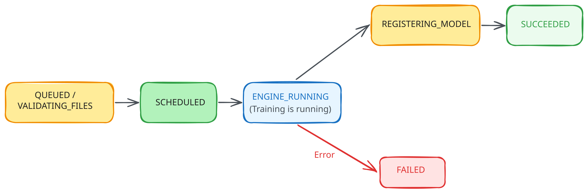
</p>
```python
import time

TERMINAL_STATUSES = {"succeeded", "failed", "cancelled"}

def wait_for_job(job_id, poll_seconds=15):
    last_status, started = None, time.time()
    while True:
        j = client.fine_tuning.jobs.retrieve(job_id)
        if j.status != last_status:
            print(f"[{int(time.time() - started):>4}s] status -> {j.status}")
            last_status = j.status
        if j.status in TERMINAL_STATUSES:
            return j
        time.sleep(poll_seconds)

job = wait_for_job(job.id)
assert job.status == "succeeded", f"Job ended as {job.status}, see events below or the console"
print("\nTraining complete")
```

**Output:**

```bash
[   0s] status -> queued
[  30s] status -> running
[ 413s] status -> succeeded

Training complete
```

Read that timestamp again: **~7 minutes** to fine-tune an 8B model on 2,500 examples for 2 epochs.

And we now know *why* it's that fast: only ~0.5% of the model is trainable, the base never changes.

We can visualize the loss curves while the training job is running, or after it has completed, from the console:

<p align="center">
  
</p>

And checkpoints are first-class citizens, each one is a *deployable model* with its own metrics, we can list them via the API as well:

```python
ckpts = client.fine_tuning.jobs.checkpoints.list(job.id)
for c in ckpts.data:
    m = c.metrics
    print(f"step {c.step_number:>5}  train_loss={m.train_loss:.4f}  valid_loss={m.valid_loss:.4f}")
```

**Output:**

```bash
step   100  train_loss=0.0164  valid_loss=0.0298
step   200  train_loss=0.0153  valid_loss=0.0216
step   300  train_loss=0.0141  valid_loss=0.0204
step   314  train_loss=0.0125  valid_loss=0.0203
```

The last checkpoint, step 314, is the final model, and train and validation loss fall together the whole way. (If validation loss had turned upward, we'd simply deploy an earlier checkpoint, this is exactly why they exist.)

::: {.callout-tip title="Download the adapter"}
Once the job is done, the model is yours to keep: download it, and what you get is just a zip of LoRA adapters (`.safetensors`).

```python
out_dir = Path("outputs")
out_dir.mkdir(exist_ok=True)

# the fine_tuned_model ID registers shortly after the job succeeds
FINE_TUNED_MODEL = job.fine_tuned_model
while FINE_TUNED_MODEL is None:
    time.sleep(5)
    FINE_TUNED_MODEL = client.fine_tuning.jobs.retrieve(job.id).fine_tuned_model

zip_path = out_dir / f"{FINE_TUNED_MODEL}.zip"
with httpx.stream(
    "GET",
    f"{INTELLIGENCE_BASE_URL}/models/{FINE_TUNED_MODEL}/download",
    headers={"Authorization": f"Bearer {CRUSOE_API_KEY}"},
    timeout=300,
) as r:
    r.raise_for_status()
    with open(zip_path, "wb") as f:
        for chunk in r.iter_bytes(8192):
            f.write(chunk)
print(f"Saved {zip_path} ({zip_path.stat().st_size:,} bytes)")
```

**Output:**

```bash
Saved outputs/ftmodel-31e71c5f-3983-49d1-b1de-77e5512c1225.zip (161,510,890 bytes)
```

The entire fine-tune of an 8B model is a ~**162 MB** zip of LoRA adapter weights (rank 16, all layers, plus configs).

You can deploy it on Crusoe, or download it and serve it yourself with vLLM anywhere. No lock-in, it's just the $B$ and $A$ matrices :)
:::

## Deploy and Infer

Let's deploy the model via the [console](https://docs.crusoecloud.com/self-serve-deployments/overview): pick the job (or any checkpoint), choose an optimization profile, set a replica count, and pick a deployment name.

- **Responsiveness**: optimize time-to-first-token, for user-facing apps
- **Throughput**: optimize tokens/sec/dollar, for batch pipelines like ours
- **Balanced**: a blend of the two, the default for general purpose production traffic

<p align="center">
  
</p>

Once the model is deployed we can use the **deployment name**  (`"test-qwen3-8B-ft"`), and perform the inference:

```python
DEPLOYMENT_ALIAS = "test-qwen3-8B-ft"

inference = OpenAI(
    api_key=CRUSOE_API_KEY,
    base_url=INFERENCE_BASE_URL,
)

demo_document = """Subject: Wire transfer confirmation

Hi Suman,

The transfer of $18,400 to Meridian Holdings LLC was initiated on March 3, 2026
from account 4432-889912. Please confirm receipt with our treasury desk at
treasury@meridianholdings.com, or call Daniel Okafor at (415) 555-0173.

Thanks,
Elena Vasquez
Senior Treasury Analyst"""

response = inference.chat.completions.create(
    model=DEPLOYMENT_ALIAS,
    messages=[
        {"role": "system", "content": utils.SYSTEM_PROMPT},
        {"role": "user", "content": demo_document},
    ],
    temperature=0,
)

prediction = utils.parse_prediction(response.choices[0].message.content)
print(prediction["redacted_text"])
print("\nEntities found:")
for e in prediction["entities"]:
    print(f"  {e['type']:<18} {e['value']}")
```

**Output:**

```bash
Subject: Wire transfer confirmation

Hi [NAME],

The transfer of $18,400 to [COMPANY] was initiated on [DATE] from account [ACCOUNT_PIN]. Please confirm receipt with our treasury desk at [EMAIL], or call [NAME] at [PHONE_NUMBER].

Thanks,
[NAME]
Senior Treasury Analyst

Entities found:
  name               Suman
  company            Meridian Holdings LLC
  date               March 3, 2026
  account_pin        4432-889912
  email              treasury@meridianholdings.com
  name               Daniel Okafor
  phone_number       (415) 555-0173
  name               Elena Vasquez
```

## The Payoff: Our 8B Beats a 70B

Does fine-tuning actually buy anything over prompting a big general model ? We run both over the 100 held-out test documents with the identical system prompt and score them at the entity level:

- **Detection**: the model found the PII string, whatever type it assigned. Precision, recall, and F1 over (document, value) pairs.
- **Typed**: the value and its type label both match the reference. This is where format and taxonomy training shows.
- **Bad JSON**: replies that could not be parsed into the output contract at all. In a production redaction pipeline this is the metric that pages someone.

The baseline is **Llama 3.3 70B Instruct** on **Crusoe Serverless Inference** (~9x larger than our fine-tuned Qwen3-8B), which we prompt with the same system message. 

```python
BASELINE_MODEL = "meta-llama/Llama-3.3-70B-Instruct"  # serverless, pay per token
EVAL_N = 100

test_rows = [json.loads(line) for line in open("data/test.jsonl")]

contenders = {
    "Fine-tuned Qwen3 8B": DEPLOYMENT_ALIAS,
    "Llama 3.3 70B (serverless)": BASELINE_MODEL,
}

def predict(model_name, document):
    r = inference.chat.completions.create(
        model=model_name,
        messages=[
            {"role": "system", "content": utils.SYSTEM_PROMPT},
            {"role": "user", "content": document},
        ],
        temperature=0,
        max_tokens=1500,
    )
    return utils.parse_prediction(r.choices[0].message.content)

scores = {label: [] for label in contenders}
parse_failures = {label: 0 for label in contenders}

for row in test_rows[:EVAL_N]:
    document = row["messages"][1]["content"]
    reference = json.loads(row["messages"][2]["content"])["entities"]
    for label, model_name in contenders.items():
        pred = predict(model_name, document)
        if pred is None:
            parse_failures[label] += 1
            pred = {"entities": []}
        scores[label].append(utils.score_entities(reference, pred["entities"]))

summaries = {label: utils.aggregate_scores(rows) for label, rows in scores.items()}
utils.report_eval(summaries, parse_failures, min(EVAL_N, len(test_rows)))
```

**Output:**

```bash
Entity level scores on 100 held-out documents

Model                                    Det P   Det R  Det F1  Typed F1  Bad JSON
----------------------------------------------------------------------------------
Fine-tuned Qwen3 8B                       86%    75%    80%      79%         3
Llama 3.3 70B (serverless)                36%    62%    46%      36%        13
```

<p align="center">
  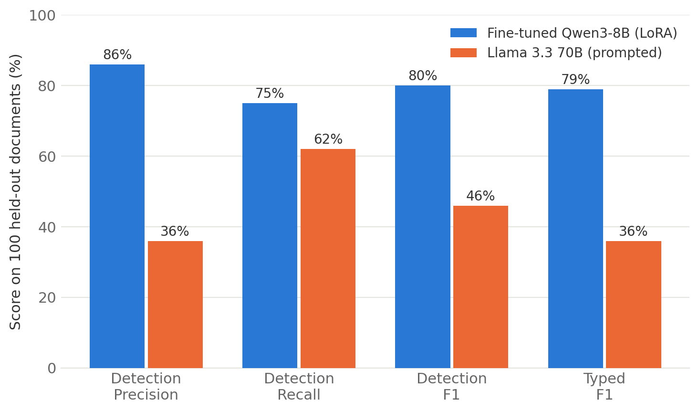
</p>

The gap is bigger than I expected. Looking at individual documents makes it concrete: on one representative example, the fine-tune returns the 6 entities in the reference and nothing else, valid JSON, correct type labels. 

The 70B finds 21 entities in the same document, half of them duplicates or fragments, labels them with type names it made up (`ACCOUNT_NUMBER` where the schema says `account_number`), and across the full test set fails to produce parseable JSON 13 times out of 100.

None of this means the 70B is a worse model. It means it never saw our schema. It's guessing at the output contract from a system prompt, and a system prompt turns out to be a weak way to hold a model to a format across a hundred documents. Two epochs of LoRA on 2,500 examples is a much stronger one: that's the 79% vs 36% typed F1 in the table.

The cost side points the same direction. The fine-tune is ~9x smaller, so each document is cheaper and faster to process, and because it runs on a dedicated deployment, the latency is predictable and the bill is a flat GPU-hour rate rather than per-token, a better fit for a pipeline that redacts documents all day.

# Conclusion

We covered a lot of ground in this post, so let's recap the journey. We started with the uncomfortable arithmetic of full fine-tuning, ~146 GB to fine-tune an 8B model, of which nearly 90% is training overhead rather than the model itself. We attacked the bill from two directions: **quantization** (built an INT8 quantizer by hand, met the outlier problem, and understood why NF4's Gaussian-shaped bins work), and **LoRA** (built a 20-line adapter, trained it, and proved with SVD that the update stayed inside its low-rank box). We stacked them into **QLoRA** and watched `peft` reproduce our hand-rolled parameter count to the digit.

Then we put it to work: **Qwen3-8B fine-tuned into a PII redaction engine in ~7 minutes** on Crusoe's Serverless Fine-Tuning, deployed on a dedicated endpoint, and beating a 70B generalist by 43 typed-F1 points on the task it was trained for, with a 162 MB adapter we can download and take anywhere.

The trade-offs are real and worth restating: LoRA teaches *behaviors*, not *bodies of knowledge*, continued pre-training still wants full fine-tuning and the FSDP machinery from the last post. QLoRA pays a compute tax for its memory savings. And a managed service trades fine-grained control (custom loss functions, exotic architectures) for never thinking about CUDA drivers again, a trade I happily make for the 95% of fine-tunes that are standard SFT.

There's plenty we haven't covered, a proper tour of the LoRA variants (DoRA, PiSSA, VeRA and friends), preference fine-tuning (DPO/RLHF) on top of LoRA, multi-adapter serving, distillation into even smaller models, and I hope to write about those as I learn them :). 

# References

- **Papers**
  - [Measuring the Intrinsic Dimension of Objective Landscapes (Li et al., 2018)](https://arxiv.org/abs/1804.08838)
  - [Intrinsic Dimensionality Explains the Effectiveness of Language Model Fine-Tuning (Aghajanyan et al., 2020)](https://arxiv.org/abs/2012.13255)
  - [LoRA: Low-Rank Adaptation of Large Language Models (Hu et al., 2021)](https://arxiv.org/abs/2106.09685)
  - [LLM.int8(): 8-bit Matrix Multiplication for Transformers at Scale (Dettmers et al., 2022)](https://arxiv.org/abs/2208.07339)
  - [QLoRA: Efficient Finetuning of Quantized LLMs (Dettmers et al., 2023)](https://arxiv.org/abs/2305.14314)
  - [LoRA Learns Less and Forgets Less (Biderman et al., 2024)](https://arxiv.org/abs/2405.09673)
- **Blogs and books**
  - [LoRA Without Regret (Schulman et al., Thinking Machines, 2025)](https://thinkingmachines.ai/blog/lora/)
  - [Build a Large Language Model (From Scratch), Sebastian Raschka](https://www.manning.com/books/build-a-large-language-model-from-scratch)
  - [A Hands-On Guide to Fine-Tuning Large Language Models, Daniel Voigt Godoy](https://leanpub.com/finetuning)
- **Libraries and code**
  - [This post's repo: debnsuma/fine-tuning-lora](https://github.com/debnsuma/fine-tuning-lora)
  - [Hugging Face PEFT](https://huggingface.co/docs/peft) · [bitsandbytes](https://github.com/bitsandbytes-foundation/bitsandbytes) · [Transformers](https://huggingface.co/docs/transformers)
  - [gretelai/synthetic_pii_finance_multilingual dataset](https://huggingface.co/datasets/gretelai/synthetic_pii_finance_multilingual)
- **Crusoe**
  - [Introducing Serverless Fine-Tuning (launch blog)](https://crusoe.ai/resources/blog/crusoe-introduces-serverless-fine-tuning)
  - [Self-Serve Deployments (launch blog)](https://crusoe.ai/resources/blog/crusoe-self-serve-deployments)
  - [Serverless Fine-Tuning docs](https://docs.crusoecloud.com/serverless-fine-tuning/overview) · [Self-Serve Deployments docs](https://docs.crusoecloud.com/self-serve-deployments/overview) · [Fine-tuning API reference](https://docs.crusoecloud.com/api/managed-ai/#tag/Fine-tuning)
- **My previous posts in this series**
  - [From Single GPU to Clusters: A Practical Journey into Distributed Training](https://debnsuma.github.io/my-blog/posts/distributed-training-from-scratch/)
  - [Inside FSDP with PyTorch and Ray](https://debnsuma.github.io/my-blog/posts/fsdp-ray-train/)
