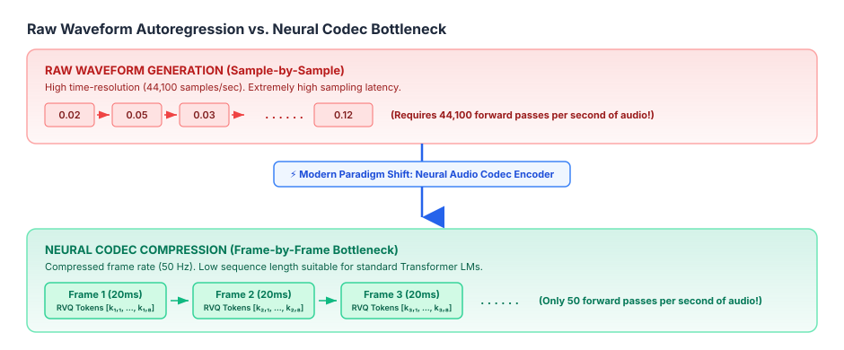
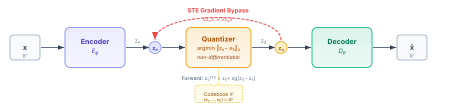
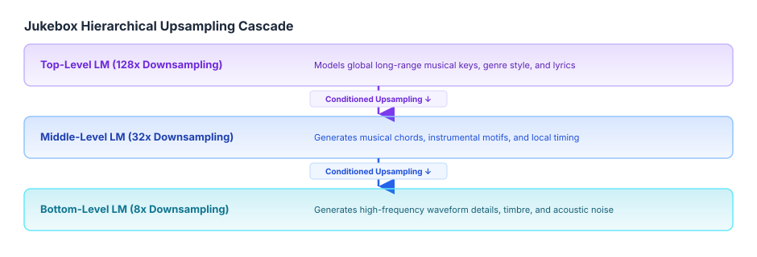
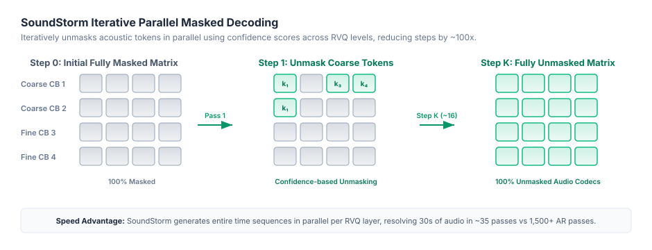
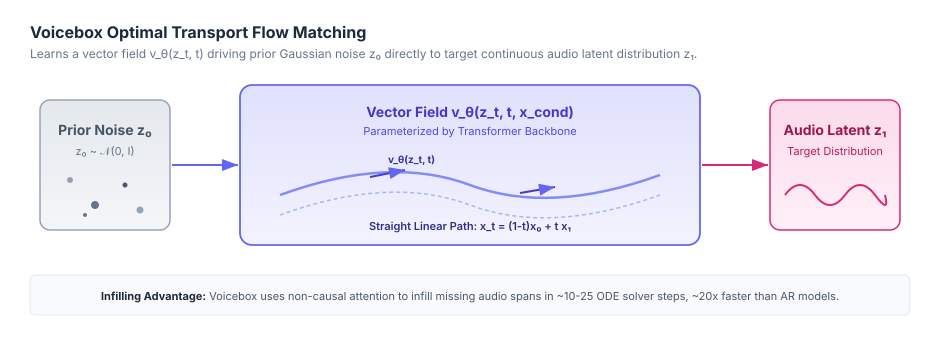

In my [previous post on Vector Quantized VAEs (VQ-VAE)](../vq-vae-audio-encoders/index.qmd), we broke down how neural audio encoders compress continuous high-dimensional waveforms into discrete latent bottlenecks. We derived the discrete ELBO, analyzed rate-distortion trade-offs, explored the Straight-Through Estimator (STE), and examined techniques for mitigating codebook collapse.

That post established the foundational **encoder** side of modern neural audio architectures: how to translate $24\,\text{kHz}$ or $44.1\,\text{kHz}$ raw continuous audio into low-frame-rate discrete tokens without losing acoustic fidelity.

Now, we address the logical next question: **Once we have compressed audio into a discrete sequence of tokens, how do we actually generate them?**

In this post, we build directly upon those neural encoding foundations. We'll trace how Transformers took over audio synthesis—moving from sample-level autoregression to discrete language modeling over neural codec tokens, multi-stream pattern interleaving (like Meta’s MusicGen), non-autoregressive parallel masked decoding (**SoundStorm**), and continuous **Flow Matching** (**Voicebox**).

---

## 1. The High-Dimensional Challenge: Raw Audio vs. Text & Vision

To appreciate why modern audio generation depends so heavily on the neural audio encoders we discussed in the [previous VQ-VAE post](../vq-vae-audio-encoders/index.qmd), it helps to recall why generating raw audio directly is so computationally punishing.

<figure style="text-align: center; margin: 2.5rem auto; max-width: 100%;">
  
  <figcaption style="font-size: 0.85rem; color: #475569; margin-top: 0.75rem; line-height: 1.6; max-width: 90%; margin-left: auto; margin-right: auto;"><strong>Figure 1</strong> — Comparison of raw sample-by-sample waveform generation ($44,100$ samples/sec) vs. Neural Audio Codec frame compression ($50$ frames/sec).</figcaption>
</figure>

### Early Waveform Autoregression: WaveNet & SampleRNN
In 2016, DeepMind introduced **WaveNet** (van den Oord et al.), modeling the joint probability of a raw waveform $x = \{x_1, x_2, \dots, x_T\}$ as a factorization of conditional probabilities:

$$p(x) = \prod_{t=1}^T p(x_t \mid x_1, x_2, \dots, x_{t-1})$$

WaveNet relied on stacked **dilated causal convolutions** to exponentially expand its receptive field without exploding parameter counts. To make the target tractable, continuous 16-bit audio samples were quantized into 256 discrete values using $\mu$-law compression:

$$f(x) = \text{sign}(x) \frac{\ln(1 + \mu |x|)}{\ln(1 + \mu)}, \quad -1 \le x \le 1, \quad \mu = 255$$

While WaveNet produced ground-breaking voice naturalness, it had a massive deployment drawback: generating 1 second of audio required 24,000 sequential forward passes through a deep convolutional network. 

SampleRNN (Mehri et al., 2016) attempted a multi-scale hierarchy of Recurrent Neural Networks, but the fundamental bottleneck remained: **modeling raw audio directly at the waveform sampling rate forces your model to spend most of its capacity on high-frequency phase and local noise rather than long-range musical structure or semantics.**

The solution was the paradigm shift we covered in our [VQ-VAE post](../vq-vae-audio-encoders/index.qmd): **Decouple temporal compression (Encoder) from sequence generation (Decoder/Transformer).**

---

## 2. The Backbone: Neural Audio Codecs & Multi-Stream Tokenization

As we saw in the VQ-VAE post, a standard discrete vector quantizer maps continuous encoder outputs $z_e \in \mathbb{R}^D$ to the nearest entries in a codebook $\mathcal{C} = \{e_1, \dots, e_K\}$.

However, as detailed in our earlier rate-distortion analysis, a single codebook with $K = 1024$ entries ($10\,\text{bits}$) operating at $50\,\text{Hz}$ caps information throughput at just $0.5\,\text{kbps}$. This bitrate ceiling is too restrictive to preserve fine acoustic details like subtle timbre, room reverberation, and high-frequency harmonics.

<figure style="text-align: center; margin: 2.5rem auto; max-width: 100%;">
  
  <figcaption style="font-size: 0.85rem; color: #475569; margin-top: 0.75rem; line-height: 1.6; max-width: 90%; margin-left: auto; margin-right: auto;"><strong>Figure 2</strong> — Neural Audio Codec Autoencoder pipeline mapping continuous raw audio waveforms to discrete latent sequences.</figcaption>
</figure>

### From Single VQ-VAE to Residual Vector Quantization (RVQ)
To expand codebook capacity without triggering the severe codebook collapse dynamics we analyzed in the previous post, modern neural codecs—such as **SoundStream** (Zeghidour et al., 2021), **EnCodec** (Défossez et al., 2022), and **Descript Audio Codec (DAC)** (Kumar et al., 2023)—extend VQ-VAE into **Residual Vector Quantization (RVQ)**.

Instead of quantizing $z_e$ once, RVQ cascades $M$ separate quantizers in series. Each successive quantizer fits the residual error left behind by all preceding quantizers:

$$\begin{aligned}
r_1 &= z_e \\
v_1 &= Q_1(r_1), \quad r_2 = r_1 - v_1 \\
v_2 &= Q_2(r_2), \quad r_3 = r_2 - v_2 \\
&\;\;\vdots \\
v_M &= Q_M(r_M), \quad r_{M+1} = r_M - v_M
\end{aligned}$$

The final quantized latent vector $z_q$ reconstructed by the encoder pipeline is the sum of the quantized residual vectors across all $M$ codebook levels:

$$z_q = \sum_{m=1}^M v_m = \sum_{m=1}^M e^{(m)}_{k_m}$$

Where $k_m \in \{1, \dots, K\}$ is the discrete index selected from the $m$-th codebook $\mathcal{C}_m$.

### Acoustic vs. Semantic Tokens
In modern audio generation, we distinguish between two primary classes of discrete representations:

| Token Type | Source Models | Frame Rate | Information Captured | Primary Use Case |
| :--- | :--- | :--- | :--- | :--- |
| **Semantic Tokens** | HuBERT, w2v-BERT, Whisper | 25 – 50 Hz | Phonemes, spoken content, global musical structure (discards acoustics & speaker identity) | High-level sequence modeling, speech understanding |
| **Acoustic Tokens** | EnCodec, SoundStream, DAC | 50 – 100 Hz | Timbre, prosody, environment, room reverberation, phase reconstruction | High-fidelity audio synthesis & reconstruction |

Decoupling **what is being said** (semantic) from **how it sounds** (acoustic) turned out to be the master key for building robust audio language models.

---

## 3. Paradigm 1: Autoregressive (AR) Audio Transformers

Once the neural encoder transforms audio into discrete token streams, generating audio looks remarkably like natural language processing. But there's a key structural difference: **RVQ gives us a 2D matrix of tokens ($M$ codebooks $\times$ $S$ time steps)** rather than a simple 1D sequence of words.

Let's look at how major papers addressed this multi-stream autoregressive challenge.

---

### 3.1 Jukebox (OpenAI, 2020)
Jukebox (Dhariwal et al.) was one of the earliest large-scale Transformer models for music generation. Building on top of VQ-VAE encoders, it used a 3-level hierarchical architecture that downsampled raw $44.1\,\text{kHz}$ audio by factors of $8\times$, $32\times$, and $128\times$.

<figure style="text-align: center; margin: 2.5rem auto; max-width: 100%;">
  
  <figcaption style="font-size: 0.85rem; color: #475569; margin-top: 0.75rem; line-height: 1.6; max-width: 90%; margin-left: auto; margin-right: auto;"><strong>Figure 3</strong> — OpenAI Jukebox hierarchical upsampling architecture. Top level models long-range song structure; lower levels condition on higher levels to generate acoustic detail.</figcaption>
</figure>

---

### 3.2 VALL-E (Microsoft, 2023): AR + NAR Cascade for Speech Synthesis

Microsoft's **VALL-E** (Wang et al., 2023) demonstrated how neural audio codecs can unlock zero-shot text-to-speech (TTS) language modeling. VALL-E models text phonemes $y$ and an 8-level EnCodec acoustic matrix $C \in \{1, \dots, K\}^{8 \times S}$.

To handle the multi-codebook structure of RVQ without exploding sequence length, VALL-E splits generation into a two-stage hybrid cascade:

1. **Autoregressive (AR) Stage**: A causal Transformer predicts the first codebook level $c_1 = (c_{1,1}, \dots, c_{1,S})$ sequentially given text phonemes $y$ and a short 3-second acoustic prompt $c_{1,:3s}$:
   $$p(c_1 \mid y, c_{1,:3s}) = \prod_{t=1}^S p(c_{1,t} \mid c_{1,<t}, y)$$
2. **Non-Autoregressive (NAR) Stage**: Seven separate non-causal Transformers generate codebook levels $c_2, \dots, c_8$ iteratively. For quantizer level $m \in \{2, \dots, 8\}$, the model predicts $c_m$ in parallel across all time steps $t=1 \dots S$, conditioned on phonemes $y$ and all previous quantizers $c_{<m}$:
   $$p(c_m \mid y, c_{<m}) = \prod_{t=1}^S p(c_{m,t} \mid y, c_{<m})$$

---

### 3.3 MusicGen / AudioCraft (Meta, 2023): Multi-Codebook Delay Pattern Interleaving

While VALL-E requires cascading 8 separate Transformer models (1 AR + 7 NAR), Meta's **MusicGen** (Copet et al., 2023) introduced a breakthrough solution: **Codebook Delay Pattern Interleaving**.

MusicGen generates all $M$ RVQ codebook streams using a **single causal Transformer**.

#### The Codebook Delay Pattern
Instead of predicting $c_{m, t}$ at the exact same timestep $t$, MusicGen introduces a step delay of $m-1$ frames for the $m$-th codebook stream:

$$x_{m, t} = c_{m, t - m + 1}$$

| Time Step | Codebook 1 ($m=1$) | Codebook 2 ($m=2$) | Codebook 3 ($m=3$) | Codebook 4 ($m=4$) |
| :---: | :---: | :---: | :---: | :---: |
| **$t=1$** | $c_{1,1}$ | $\text{PAD}$ | $\text{PAD}$ | $\text{PAD}$ |
| **$t=2$** | $c_{1,2}$ | $c_{2,1}$ | $\text{PAD}$ | $\text{PAD}$ |
| **$t=3$** | $c_{1,3}$ | $c_{2,2}$ | $c_{3,1}$ | $\text{PAD}$ |
| **$t=4$** | $c_{1,4}$ | $c_{2,3}$ | $c_{3,2}$ | $c_{4,1}$ |
| **$t=5$** | $c_{1,5}$ | $c_{2,4}$ | $c_{3,3}$ | $c_{4,2}$ |

By introducing this temporal shift, at step $t$, quantizer $m$ is predicted conditioned on $c_{m-1, t-1}$ (the previous codebook at the same acoustic frame). Thus, a single causal self-attention mechanism can model both intra-frame hierarchical codebook dependencies and inter-frame temporal dependencies simultaneously without any extra parameter overhead or sub-models!

---

### 3.4 PyTorch Implementation: Multi-Codebook Audio Transformer

Here is a complete, standalone PyTorch implementation of a Multi-Codebook Autoregressive Audio Transformer implementing Meta's MusicGen Codebook Delay Pattern Interleaving:

```python
import torch
import torch.nn as nn

class MultiCodebookAudioTransformer(nn.Module):
    """
    Multi-Codebook Autoregressive Audio Generation Transformer (MusicGen style).
    Generates M parallel RVQ token streams using temporal delay pattern interleaving.
    
    Args:
        num_codebooks (int): Number of RVQ codebook levels (M), e.g. 4.
        codebook_size (int): Vocabulary size per codebook (K), e.g. 1024.
        d_model (int): Hidden dimension of the Transformer.
        nhead (int): Number of self-attention heads.
        num_layers (int): Number of Transformer decoder layers.
    """
    def __init__(self, num_codebooks=4, codebook_size=1024, d_model=512, nhead=8, num_layers=6):
        super().__init__()
        self.num_codebooks = num_codebooks
        self.codebook_size = codebook_size
        self.d_model = d_model
        
        # M separate embedding tables for each RVQ level (+1 index reserved for PAD token)
        self.embeddings = nn.ModuleList([
            nn.Embedding(codebook_size + 1, d_model, padding_idx=codebook_size)
            for _ in range(num_codebooks)
        ])
        
        # Sinusoidal / Learnable Positional Embedding
        self.pos_emb = nn.Parameter(torch.zeros(1, 2048, d_model))
        
        # Causal Transformer Decoder
        decoder_layer = nn.TransformerDecoderLayer(
            d_model=d_model,
            nhead=nhead,
            dim_feedforward=d_model * 4,
            activation='gelu',
            batch_first=True
        )
        self.transformer = nn.TransformerDecoder(decoder_layer, num_layers=num_layers)
        
        # M separate prediction heads (one linear projection per RVQ level)
        self.heads = nn.ModuleList([
            nn.Linear(d_model, codebook_size)
            for _ in range(num_codebooks)
        ])

    def apply_delay_pattern(self, tokens):
        """
        Interleaves tokens across codebooks with temporal offset (m - 1).
        tokens: (B, M, S)
        returns: (B, M, S + M - 1)
        """
        B, M, S = tokens.shape
        pad_idx = self.codebook_size
        delayed = torch.full((B, M, S + M - 1), pad_idx, dtype=tokens.dtype, device=tokens.device)
        
        for m in range(M):
            delayed[:, m, m : m + S] = tokens[:, m, :]
            
        return delayed

    def forward(self, tokens):
        """
        Forward pass computing next-token prediction logits.
        tokens: (Batch, Num_Codebooks, Seq_Len)
        """
        B, M, S = tokens.shape
        
        # 1. Apply temporal delay pattern
        delayed = self.apply_delay_pattern(tokens)  # Shape: (B, M, S + M - 1)
        S_delayed = delayed.shape[2]
        
        # 2. Sum embeddings across codebook streams at each time step
        x = torch.zeros((B, S_delayed, self.d_model), device=tokens.device)
        for m in range(M):
            x = x + self.embeddings[m](delayed[:, m, :])
            
        # 3. Add positional embeddings
        x = x + self.pos_emb[:, :S_delayed, :]
        
        # 4. Enforce causal mask for self-attention
        causal_mask = torch.triu(
            torch.full((S_delayed, S_delayed), float('-inf'), device=tokens.device), 
            diagonal=1
        )
        
        # 5. Transformer forward pass
        dummy_memory = torch.zeros((B, 1, self.d_model), device=tokens.device)
        h = self.transformer(tgt=x, memory=dummy_memory, tgt_mask=causal_mask)
        
        # 6. Extract predictions per codebook level
        logits = torch.zeros((B, M, S, self.codebook_size), device=tokens.device)
        for m in range(M):
            h_m = h[:, m : m + S, :]
            logits[:, m, :, :] = self.heads[m](h_m)
            
        return logits


# --- Verification & Inference Check ---
if __name__ == "__main__":
    # Batch = 2, 4 Codebooks (e.g. EnCodec 24kHz), 100 time frames (2 seconds @ 50 Hz)
    B, M, S = 2, 4, 100
    dummy_tokens = torch.randint(0, 1024, (B, M, S))
    
    model = MultiCodebookAudioTransformer(num_codebooks=M, codebook_size=1024)
    logits = model(dummy_tokens)
    
    print("MultiCodebookAudioTransformer forward pass succeeded!")
    print(f"Input Tokens shape:  {dummy_tokens.shape} (B={B}, M={M}, S={S})")
    print(f"Output Logits shape: {logits.shape} (B={B}, M={M}, S={S}, Vocab=1024)")
```

---

## 4. Paradigm 2: Non-Autoregressive (NAR) & Masked Parallel Decoding

### SoundStorm (Google, 2023)
SoundStorm (Borsos et al.) replaced step-by-step autoregression with **Masked Generative Modeling**. Inspired by MaskGIT, SoundStorm generates all $M$ codebook streams in parallel over just **16 to 64 decoding steps** (compared to thousands of AR steps).

<figure style="text-align: center; margin: 2.5rem auto; max-width: 100%;">
  
  <figcaption style="font-size: 0.85rem; color: #475569; margin-top: 0.75rem; line-height: 1.6; max-width: 90%; margin-left: auto; margin-right: auto;"><strong>Figure 4</strong> — SoundStorm parallel masked iterative decoding schedule. RVQ levels are unmasked level-by-level using confidence-based sampling.</figcaption>
</figure>

---

## 5. Paradigm 3: Continuous Latent Transformers (Flow Matching)

### Voicebox (Meta, 2023)
Voicebox (Le et al.) abandoned discrete tokenization altogether for the generation stage. Instead, it applies **Continuous Flow Matching (CFM)** over continuous latent representations.

<figure style="text-align: center; margin: 2.5rem auto; max-width: 100%;">
  
  <figcaption style="font-size: 0.85rem; color: #475569; margin-top: 0.75rem; line-height: 1.6; max-width: 90%; margin-left: auto; margin-right: auto;"><strong>Figure 5</strong> — Continuous Flow Matching in Voicebox. Trajectories map Gaussian noise $x_0 \sim \mathcal{N}(0, I)$ directly to target continuous audio representations $x_1$.</figcaption>
</figure>

---

## 6. Summary Matrix of Audio Generation Paradigms

| Paradigm | Exemplar Models | Quantization | Sampling Steps per Second of Audio | Strengths | Limitations |
| :--- | :--- | :--- | :--- | :--- | :--- |
| **Waveform AR** | WaveNet, SampleRNN | 8-bit $\mu$-law | 24,000 – 44,100 | High voice quality, raw sample control | Extremely slow inference, lacks long-range coherence |
| **Discrete AR** | MusicGen, VALL-E, AudioLM | Single VQ / RVQ | 50 – 300 | Excellent long-range musical structure, rich conditioning | Sequential latency, error accumulation |
| **Masked Parallel (NAR)** | SoundStorm, MaskGIT | RVQ | 16 – 64 | 100x faster than AR, bidirectional context | Requires strict hierarchical sampling schedules |
| **Flow Matching (CFM)** | Voicebox, Stable Audio | Continuous Latents | 10 – 50 | State-of-the-art voice cloning, infilling, zero codebook collapse | Requires ODE solver integration |

---

## Conclusion

Audio generation has evolved from sample-level autoregression to discrete codebook modeling and continuous flow matching. By combining robust neural compression encoders (VQ-VAE / RVQ) with Transformer generation paradigms, modern AI systems can synthesize highly realistic speech and music at low latency.
