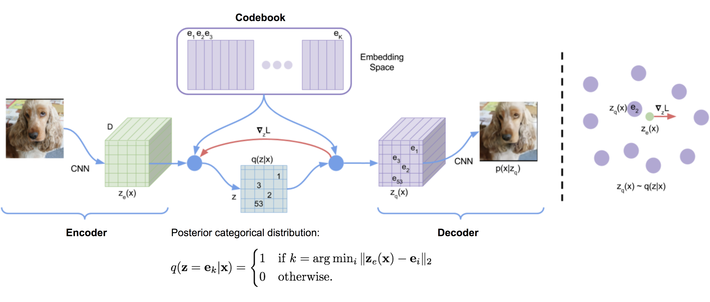
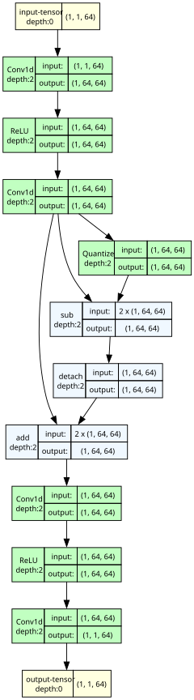

Vector Quantized Variational Autoencoders (VQ-VAE) offer a different approach to representation learning by replacing continuous Gaussian latents with **discrete categorical codes**. Forcing high-dimensional signals, like audio, through a finite codebook bottleneck solves issues like posterior collapse and provides direct control over the rate-distortion tradeoff. This formulation is the basis for many modern neural audio codecs and discrete audio language models.

In this post, we'll walk through the theoretical foundations of VQ-VAE, how gradient estimation works in this setup, and some of the practical challenges encountered during training, such as codebook collapse and capacity degeneration.


## 1. The Foundation: VQ-VAE & Information Bottlenecks

Historically, generative models for high-dimensional signals (like audio waveforms or spectrograms) relied heavily on **continuous latent representations**. Standard Variational Autoencoders (VAEs) mapped inputs to continuous Gaussian distributions $\mathcal{N}(\mu, \sigma^2)$.

However, using continuous representations for audio autoencoding presents some structural challenges:
1. **Posterior Collapse**: When paired with strong autoregressive decoders (like WaveNet), standard VAEs often experience posterior collapse. The decoder models $p_\theta(x \mid z)$ based almost entirely on past audio samples $x_{<t}$ and ignores the latent variable $z$. The encoder posterior $q_\phi(z \mid x)$ then collapses to the prior $p(z) = \mathcal{N}(0, I)$, making the latent space largely uninformative ($\mathcal{D}_{\text{KL}} \to 0$).
2. **Discrete Modeling**: Continuous vectors can't be directly fed into discrete sequence models (like standard Transformers or n-gram models) without some form of quantization.

The **Vector Quantized Variational Autoencoder** (VQ-VAE), introduced by van den Oord et al. in 2017, addresses this by making the latent space **discrete**. By quantizing the continuous encoder output into a sequence of codebook indices, VQ-VAE creates a strict information bottleneck. This helps prevent posterior collapse and translates the audio signal into a sequence of discrete tokens.

---

### 1.1 Variational & Information-Theoretic Derivation

We can understand the VQ-VAE objective by analyzing the Evidence Lower Bound (ELBO).

#### Derivation of the Discrete ELBO
For an input audio signal $x \in \mathbb{R}^T$ and discrete latent variable $z \in \{1, \dots, K\}^S$ (where $S$ is the temporal sequence length of the latents and $K$ is the codebook size), the log marginal likelihood satisfies:

$$\log p_\theta(x) = \log \sum_{z} p_\theta(x, z) = \log \sum_{z} q_\phi(z \mid x) \frac{p_\theta(x, z)}{q_\phi(z \mid x)}$$

Applying Jensen's Inequality ($\log \mathbb{E}[Y] \ge \mathbb{E}[\log Y]$) yields the ELBO:

$$\log p_\theta(x) \ge \mathbb{E}_{q_\phi(z \mid x)} [\log p_\theta(x \mid z)] - \mathcal{D}_{\text{KL}}(q_\phi(z \mid x) \parallel p(z))$$

#### The Deterministic Posterior & Constant KL Divergence
VQ-VAE defines a **deterministic posterior distribution** $q_\phi(z = k \mid x)$. The encoder $E_\phi(x)$ outputs a continuous latent vector $z_e \in \mathbb{R}^D$. The quantization operator maps $z_e$ to the nearest entry $e_k$ in a learned codebook $\mathcal{C} = \{e_1, e_2, \dots, e_K\} \subset \mathbb{R}^D$:

$$q_\phi(z = k \mid x) = \begin{cases} 1 & \text{if } k = \arg\min_{j \in \{1, \dots, K\}} \|E_\phi(x) - e_j\|_2 \\ 0 & \text{otherwise} \end{cases}$$

Assuming a **uniform prior** over the codebook entries, $p(z = k) = \frac{1}{K}$ for all $k \in \{1, \dots, K\}$:

$$\mathcal{D}_{\text{KL}}(q_\phi(z \mid x) \parallel p(z)) = \sum_{k=1}^K q_\phi(z = k \mid x) \log \frac{q_\phi(z = k \mid x)}{p(z = k)}$$

Since $q_\phi(z = k^* \mid x) = 1$ for the winning index $k^*$ and $0$ elsewhere:

$$\mathcal{D}_{\text{KL}}(q_\phi(z \mid x) \parallel p(z)) = 1 \cdot \log \frac{1}{1/K} = \log K$$

Because $\log K$ is a constant determined solely by the codebook size $K$, **the KL divergence term is completely independent of the model parameters $\phi$ and $\theta$**.

Thus, during training, the KL divergence term contributes zero gradient and can be dropped entirely from optimization:

$$\max_{\phi, \theta} \text{ELBO} \iff \max_{\phi, \theta} \mathbb{E}_{q_\phi(z \mid x)} [\log p_\theta(x \mid z)]$$

#### Rate-Distortion Interpretation
From a Rate-Distortion Theory perspective, VQ-VAE optimizes the distortion $D = \mathbb{E}[d(x, \hat{x})]$ subject to a maximum bit-rate constraint $R$. 

For an audio waveform sampled at $f_{\text{sample}}$ Hz downsampled by a temporal factor $M$ (so the frame rate is $f_s = \frac{f_{\text{sample}}}{M}$ frames/sec), the discrete latent space enforces a strict information rate bound:

$$R = f_s \cdot \log_2 K \quad \text{bits per second}$$

For instance, at $f_{\text{sample}} = 24\,\text{kHz}$ with a downsampling factor $M = 320$ ($f_s = 75\,\text{Hz}$) and codebook size $K = 1024$ ($\log_2 1024 = 10\,\text{bits}$):

$$R = 75 \times 10 = 750 \quad \text{bits/sec} = 0.75 \quad \text{kbps}$$

Because $R$ is fixed by architecture, the decoder $p_\theta(x \mid z_q)$ is forced to reconstruct the maximum possible acoustic detail from at most $0.75\,\text{kbps}$ of latent information. This hard capacity ceiling prevents the decoder from ignoring $z_q$.

---

### 1.2 Architecture & Formal Loss Formulation

<figure style="text-align: center; margin: 2.5rem auto; max-width: 100%;">
  
  <figcaption style="font-size: 0.85rem; color: #475569; margin-top: 0.75rem; line-height: 1.6; max-width: 90%; margin-left: auto; margin-right: auto;"><strong>Figure 1</strong> — Original diagram from van den Oord et al. (2017). <strong>Left:</strong> VQ-VAE pipeline — input $x$ is encoded by $E_\phi$, quantized to codebook entry $e_2$, and decoded by $D_\theta$. <strong>Right:</strong> Embedding space geometry — the codebook loss moves $e_2$ toward $z_e(x)$, while the commitment loss prevents $z_e(x)$ from diverging beyond its Voronoi cell.</figcaption>
</figure>

#### Mathematical Pipeline
1. **Encoder**: Maps input $x \in \mathbb{R}^T$ to continuous latents $z_e = E_\phi(x) \in \mathbb{R}^{S \times D}$.
2. **Vector Quantization**: Maps each frame $z_e^{(t)} \in \mathbb{R}^D$ to its nearest codebook entry $z_q^{(t)} \in \mathbb{R}^D$:
   $$k^{(t)} = \arg\min_{k \in \{1, \dots, K\}} \|z_e^{(t)} - e_k\|_2^2, \quad z_q^{(t)} = e_{k^{(t)}}$$
3. **Decoder**: Maps quantized latents $z_q \in \mathbb{R}^{S \times D}$ back to waveform space $\hat{x} = D_\theta(z_q) \in \mathbb{R}^T$.

#### Complete Objective Function
Because the $\arg\min$ operation in quantization is non-differentiable, gradient flow from the decoder to the encoder is blocked. VQ-VAE solves this by decomposing the objective into three explicit loss terms:

$$\mathcal{L}_{\text{VQ-VAE}} = \underbrace{\mathcal{L}_{\text{recon}}(x, \hat{x})}_{\text{Reconstruction Loss}} + \underbrace{\|\text{sg}[z_e] - z_q\|_2^2}_{\text{Codebook Loss}} + \underbrace{\beta \|\text{sg}[z_q] - z_e\|_2^2}_{\text{Commitment Loss}}$$

where $\text{sg}[\cdot]$ is the **stop-gradient operator** (defined as $\text{sg}[x] \equiv x$ during forward pass and $\nabla_x \text{sg}[x] \equiv 0$ during backward pass).

<figure style="text-align: center; margin: 2.5rem auto; max-width: 100%;">
  
  <figcaption style="font-size: 0.85rem; color: #475569; margin-top: 0.75rem; line-height: 1.6; max-width: 90%; margin-left: auto; margin-right: auto;"><strong>Figure 2</strong> — VQ-VAE computational pipeline. The encoder $E_\phi$ maps input $x$ to continuous latents $z_e$. The quantizer selects the nearest codebook entry $z_q$ via $\arg\min$. The decoder $D_\theta$ reconstructs $\hat{x}$. The red dashed arrow shows the STE gradient bypass: $\nabla_{z_e} \mathcal{L} \approx \nabla_{z_q} \mathcal{L}$.</figcaption>
</figure>

#### Physical Breakdown of the Loss Terms
* **Reconstruction Loss $\mathcal{L}_{\text{recon}}(x, \hat{x})$**: Measures how accurately $D_\theta(z_q)$ reproduces $x$. For raw audio waveforms, standard $L_1$ or $L_2$ time-domain losses are usually combined with a Multi-Resolution Spectrogram (MRSTFT) loss. Optimizes both encoder $\phi$ and decoder $\theta$.
* **Codebook Loss $\|\text{sg}[z_e] - z_q\|_2^2$**: Moves the selected codebook vectors $e_{k^*}$ closer to the continuous encoder outputs $z_e$. Since $z_e$ is treated as constant (via $\text{sg}$), this loss updates only the codebook embeddings $\mathcal{C}$.
* **Commitment Loss $\beta \|\text{sg}[z_q] - z_e\|_2^2$**: Prevents the encoder output $z_e(x)$ from fluctuating wildly across codebook entries from iteration to iteration. Scaling factor $\beta$ (typically $0.25$) ensures the encoder commits to a codebook entry without overpowering the reconstruction term.

---

## 2. Gradient Flow & The Straight-Through Estimator (STE)

### 2.1 The Non-Differentiability Problem

Quantization maps continuous vectors $z_e \in \mathbb{R}^D$ to discrete codebook indices $k \in \{1, \dots, K\}$. This operation is piecewise constant:

$$\frac{\partial z_q}{\partial z_e} = 0 \quad \text{almost everywhere}$$

At the boundaries between Voronoi cells, the derivative is undefined (infinite jump). 

If we attempt standard backpropagation, the chain rule yields:

$$\frac{\partial \mathcal{L}_{\text{recon}}}{\partial \phi} = \frac{\partial \mathcal{L}_{\text{recon}}}{\partial \hat{x}} \cdot \frac{\partial \hat{x}}{\partial z_q} \cdot \underbrace{\frac{\partial z_q}{\partial z_e}}_{= 0} \cdot \frac{\partial z_e}{\partial \phi} = 0$$

Without a mechanism to bypass this zero-gradient bottleneck, the encoder weights $\phi$ receive zero feedback and remain frozen at their random initialization.

---

### 2.2 Mathematical Formalism of STE

The **Straight-Through Estimator** (STE), introduced by Bengio et al. (2013), resolves non-differentiability by replacing the true gradient with an identity operator during the backward pass:

$$\text{Forward Pass:} \quad z_q = e_{\arg\min_k \|z_e - e_k\|_2}$$

$$\text{Backward Pass:} \quad \frac{\partial \mathcal{L}}{\partial z_e} \stackrel{\text{def}}{=} \frac{\partial \mathcal{L}}{\partial z_q}$$

In PyTorch, this identity trick is implemented cleanly via `detach()`:

$$z_q = z_e + \text{sg}[z_q - z_e]$$

#### Proof of Equivalence
Let's verify both forward and backward evaluations for $z_q = z_e + \text{sg}[z_q' - z_e]$:

* **Forward Pass**:
  $$z_q = z_e + (z_q' - z_e) = z_q' \quad \checkmark$$
* **Backward Pass**:
  $$\nabla_{z_e} z_q = \nabla_{z_e} \big( z_e + \text{sg}[z_q' - z_e] \big) = \mathbf{I} + \mathbf{0} = \mathbf{I} \quad \checkmark$$

Thus, the gradient of the reconstruction loss bypasses the quantizer unchanged: $\nabla_{z_e} \mathcal{L}_{\text{recon}} = \nabla_{z_q} \mathcal{L}_{\text{recon}}$.

<figure style="text-align: center; margin: 2.5rem auto; max-width: 100%;">
  
  <figcaption style="font-size: 0.85rem; color: #475569; margin-top: 0.75rem; line-height: 1.6; max-width: 90%; margin-left: auto; margin-right: auto;"><strong>Figure 3</strong> — Gradient flow with STE enabled. The green path shows encoder backpropagation bypassing the quantizer via identity gradient mapping.</figcaption>
</figure>

---

## 3. PyTorch Implementation: Research-Grade Vector Quantizer

To help make these concepts concrete, let me show you how to implement a production-grade `VectorQuantizer` in PyTorch.

This self-contained module handles **Straight-Through Estimation (STE)**, **L2 and Cosine (spherical) distance metrics**, **EMA codebook updates with Laplace smoothing**, **perplexity tracking**, and **automatic dead-code re-initialization** to combat codebook collapse.

```python
import torch
import torch.nn as nn
import torch.nn.functional as F

class VectorQuantizer(nn.Module):
    """
    Research-Grade Vector Quantizer supporting:
    1. Straight-Through Estimator (STE)
    2. L2 and Cosine Similarity (Spherical) Distance Metrics
    3. Exponential Moving Average (EMA) Codebook Updates
    4. Perplexity / Codebook Entropy Tracking
    5. Dead-Code Automatic Re-initialization

    Args:
        num_embeddings (int): Size of codebook (K).
        embedding_dim (int): Dimension of latent space (D).
        beta (float): Scaling factor for the commitment loss (default 0.25).
        distance_metric (str): 'l2' or 'cosine' (spherical quantization).
        use_ema (bool): Use EMA codebook updates instead of the gradient codebook loss.
        decay (float): EMA decay rate (gamma).
        epsilon (float): Laplace smoothing constant for numerical stability.
        threshold_dead_limit (float): Cluster-size threshold below which a code is re-initialized.
    """
    def __init__(
        self,
        num_embeddings: int = 1024,
        embedding_dim: int = 128,
        beta: float = 0.25,
        distance_metric: str = "cosine",  # 'l2' or 'cosine'
        use_ema: bool = True,
        decay: float = 0.99,
        epsilon: float = 1e-5,
        threshold_dead_limit: float = 1.0,
    ):
        super().__init__()
        self.num_embeddings = num_embeddings
        self.embedding_dim = embedding_dim
        self.beta = beta
        self.distance_metric = distance_metric
        self.use_ema = use_ema
        self.decay = decay
        self.epsilon = epsilon
        self.threshold_dead_limit = threshold_dead_limit

        # Codebook weights
        self.codebook = nn.Embedding(num_embeddings, embedding_dim)
        if not use_ema:
            self.codebook.weight.data.uniform_(
                -1.0 / num_embeddings, 1.0 / num_embeddings
            )
        else:
            self.codebook.weight.data.normal_()
            # Register buffers for EMA tracking
            self.register_buffer("ema_cluster_size", torch.zeros(num_embeddings))
            self.register_buffer("ema_w", self.codebook.weight.data.clone())

    def forward(self, z_e: torch.Tensor) -> tuple[torch.Tensor, torch.Tensor, torch.Tensor, torch.Tensor]:
        """
        Args:
            z_e (torch.Tensor): Continuous encoder output of shape (B, D, T).
        Returns:
            z_q_st (torch.Tensor): Quantized tensor with STE gradient flow (B, D, T).
            indices (torch.Tensor): Discrete codebook indices (B, T).
            loss (torch.Tensor): Total VQ loss (scalar).
            perplexity (torch.Tensor): Codebook utilization metric (scalar).
        """
        # 1. Reshape z_e from (B, D, T) -> (B*T, D)
        B, D, T = z_e.shape
        z_e_flat = z_e.permute(0, 2, 1).contiguous().view(-1, D)

        # 2. Compute distances between z_e and codebook entries
        if self.distance_metric == "cosine":
            z_e_norm = F.normalize(z_e_flat, dim=-1)
            codebook_norm = F.normalize(self.codebook.weight, dim=-1)
            # Distance = 2 * (1 - cosine_similarity)
            distances = 2.0 * (1.0 - torch.matmul(z_e_norm, codebook_norm.T))
        else:  # L2 distance: ||z_e - e||^2 = ||z_e||^2 - 2<z_e, e> + ||e||^2
            distances = (
                torch.sum(z_e_flat ** 2, dim=1, keepdim=True)
                - 2 * torch.matmul(z_e_flat, self.codebook.weight.T)
                + torch.sum(self.codebook.weight ** 2, dim=1, keepdim=True).T
            )

        # 3. Nearest-neighbor lookup (argmin)
        indices = torch.argmin(distances, dim=1)  # (B*T,)
        encodings = F.one_hot(indices, self.num_embeddings).float()  # (B*T, K)
        z_q_flat = self.codebook(indices)  # (B*T, D)

        # 4. Perplexity / codebook entropy tracking
        perplexity = compute_perplexity(encodings)

        # 5. Codebook updates: EMA vs gradient loss
        if self.training and self.use_ema:
            with torch.no_grad():
                # Update EMA cluster sizes with Laplace smoothing
                n_total = torch.sum(encodings, dim=0)
                self.ema_cluster_size.data.mul_(self.decay).add_(
                    n_total, alpha=1 - self.decay
                )

                # Update EMA embedding sums
                dw = torch.matmul(encodings.T, z_e_flat)
                self.ema_w.data.mul_(self.decay).add_(dw, alpha=1 - self.decay)

                # Laplace-smoothed centroid calculation
                n = torch.sum(self.ema_cluster_size)
                smoothed_cluster_size = (
                    (self.ema_cluster_size + self.epsilon)
                    / (n + self.num_embeddings * self.epsilon)
                    * n
                )

                # Update codebook weights
                updated_weight = self.ema_w / smoothed_cluster_size.unsqueeze(1)
                self.codebook.weight.data.copy_(updated_weight)

                # Dead-code re-initialization check
                dead_indices = (
                    self.ema_cluster_size < self.threshold_dead_limit
                ).nonzero()
                if len(dead_indices) > 0:
                    random_samples = z_e_flat[
                        torch.randint(0, z_e_flat.size(0), (len(dead_indices),))
                    ]
                    self.codebook.weight.data[dead_indices.squeeze(1)] = random_samples
                    self.ema_w.data[dead_indices.squeeze(1)] = random_samples

        # 6. Loss calculation
        recon_z_q = z_q_flat.view(B, T, D).permute(0, 2, 1).contiguous()

        if self.use_ema:
            # EMA removes the codebook loss; only the commitment loss remains
            commitment_loss = F.mse_loss(recon_z_q.detach(), z_e)
            vq_loss = self.beta * commitment_loss
        else:
            codebook_loss = F.mse_loss(recon_z_q, z_e.detach())
            commitment_loss = F.mse_loss(recon_z_q.detach(), z_e)
            vq_loss = codebook_loss + self.beta * commitment_loss

        # 7. Straight-Through Estimator (STE)
        # Forward pass uses recon_z_q; backward pass flows directly to z_e
        z_q_st = z_e + (recon_z_q - z_e).detach()
        indices_out = indices.view(B, T)

        return z_q_st, indices_out, vq_loss, perplexity


def compute_perplexity(encodings: torch.Tensor) -> torch.Tensor:
    """
    Computes codebook utilization perplexity from one-hot encodings.

    Perplexity = exp(H(p)) = exp(-sum_k p_k * log(p_k)), where p_k is the
    average assignment probability of codebook entry k. It ranges from 1
    (all frames assigned to a single entry) to K (uniform utilization).

    Args:
        encodings (torch.Tensor): One-hot tensor of shape [N, K].
    Returns:
        perplexity (torch.Tensor): Scalar codebook utilization metric.
    """
    avg_probs = torch.mean(encodings, dim=0)
    perplexity = torch.exp(-torch.sum(avg_probs * torch.log(avg_probs + 1e-10)))
    return perplexity


if __name__ == "__main__":
    # Quick sanity test
    torch.manual_seed(42)
    B, D, T, K = 2, 64, 32, 16
    vq = VectorQuantizer(num_embeddings=K, embedding_dim=D)

    z_e = torch.randn(B, D, T, requires_grad=True)
    z_q, indices, loss, perplexity = vq(z_e)

    print(f"z_q shape     : {z_q.shape}")          # [2, 64, 32]
    print(f"indices shape : {indices.shape}")      # [2, 32]
    print(f"VQ loss       : {loss.item():.6f}")
    print(f"Perplexity    : {perplexity.item():.2f} / {K}")

    # Verify STE: gradient must flow back through z_e (not zero)
    loss.backward()
    grad_norm = z_e.grad.norm().item()
    print(f"z_e grad norm : {grad_norm:.6f} (STE bypass working)")
    assert grad_norm > 0, "STE failed: no gradient reached z_e"
```

---

## 4. Summary & Further Reading

In this post, we derived the discrete ELBO for VQ-VAE, established why the KL divergence term is constant under a uniform prior, derived the rate-distortion bottleneck bound, and implemented a research-grade `VectorQuantizer` in PyTorch with STE, EMA codebook updates, L2/cosine distance metrics, perplexity tracking, and automatic dead-code re-initialization.

In the next post, we will explore how Transformers generate sequences over these quantized discrete audio codebook tokens using autoregressive sequence modeling, masked parallel decoding, and continuous flow matching.
